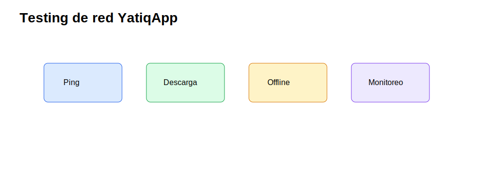
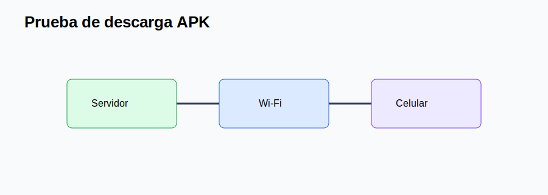
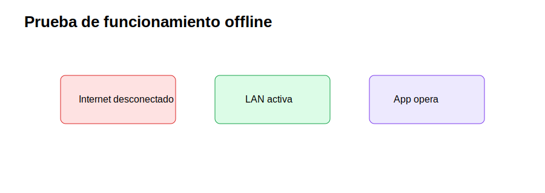
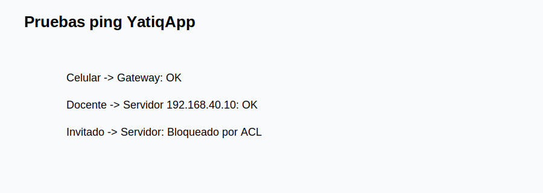
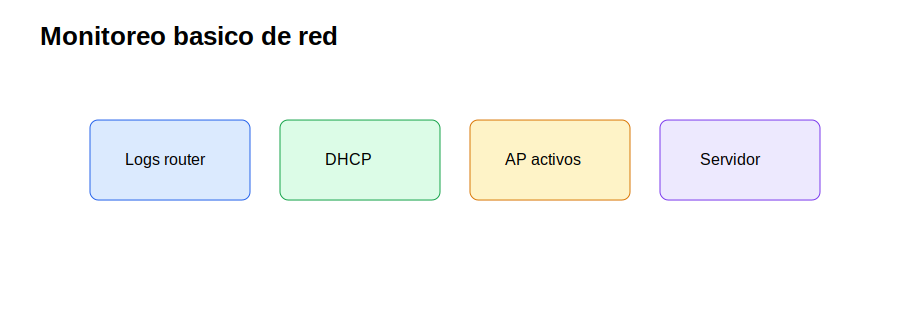

# CE0312-CE0313 - Entregable 1: Implementación y Testing de Red

| Campo | Detalle |
|---|---|
| Universidad | Universidad Peruana Unión |
| Escuela Profesional | Ingeniería de Sistemas |
| Asignatura | Perfil de Egreso 2026 |
| Línea | CE03 Infraestructura Tecnológica |
| Proyecto | YatiqApp |
| Caso de estudio | I.E. Agropecuario Sorapa |
| Entregable | CE0312-CE0313 - Entregable 1: Implementación y Testing de Red |
| Código de competencia | CE0312-CE0313 |
| Responsable | Anyelo Jhans Sarmiento Larico |
| Semestre | 2026-I |
| Fecha | Julio de 2026 |

| Información | Detalle |
|-------------|---------|
| Institución | I.E. Agropecuario Sorapa |
| Distrito | Juli |
| Provincia | Chucuito |
| Región | Puno |
| Gestión | Pública |
| Nivel | Secundaria |
| Área | Rural |
| Estudiantes | 32 aprox. |
| Docentes | 9 aprox. |
| Secciones | 5 aprox. |

## Descripción

Este entregable documenta la implementación y testing de la red local que soporta YatiqApp en la I.E. Agropecuario Sorapa. El enfoque incluye configuración de router, switch, access points, direccionamiento, VLAN, ACL, pruebas de conectividad y pruebas específicas para distribución offline de APK y contenidos.

## Resumen Ejecutivo

La implementación se organiza para operar en un entorno rural con Internet eventual. La red permite conectar celulares Android al AP, acceder al servidor local, descargar APK, transferir paquetes de actualización y consultar contenidos educativos sin depender de la nube. La IA de YatiqApp se mantiene en el celular; el servidor solo distribuye recursos.

## Alcance del Entregable

### Incluye

- Infraestructura de soporte para YatiqApp.
- Red local, micro centro de datos y servidor local.
- Seguridad básica, backup, distribución offline y operación rural.
- Configuración y pruebas de conectividad.

### No incluye

- Desarrollo completo de la app móvil.
- Entrenamiento completo del modelo IA.
- Inferencia cloud.
- Ejecución de IA en el servidor.
- Integración directa con SIAGIE.
- Despliegue nacional.

### Supuestos

- El colegio cuenta con conectividad limitada o intermitente.
- Los estudiantes y docentes pueden usar celulares Android.
- YatiqApp funciona offline.
- El servidor local funciona como repositorio.
- Internet se usa solo de forma eventual.

### Restricciones

- Presupuesto limitado.
- Hardware básico.
- Energía eléctrica variable.
- Pocos equipos tecnológicos.
- Contexto rural.

## Configuración de Dispositivos

| Dispositivo | Configuración aplicada | Evidencia esperada |
|---|---|---|
| Router | NAT, firewall básico, gateways VLAN, DHCP por segmento. | Captura de interfaces y rutas. |
| Switch | VLAN 10, 20, 30, 40 y 50; puertos access/trunk. | Tabla VLAN y puertos etiquetados. |
| AP | SSID Docentes, Estudiantes e Invitados; WPA2/WPA3. | Celulares conectados. |
| Servidor local | IP fija 192.168.40.10 y carpetas de repositorio. | Acceso por LAN. |

## Direccionamiento IP Implementado

| VLAN | Nombre | Gateway | DHCP | Uso |
|---:|---|---|---|---|
| 10 | Administración | 192.168.10.1 | 192.168.10.50-150 | Dirección/Secretaría |
| 20 | Docentes | 192.168.20.1 | 192.168.20.50-150 | Docentes |
| 30 | Estudiantes/Wi-Fi | 192.168.30.1 | 192.168.30.50-220 | Celulares |
| 40 | Servidor/Repositorio | 192.168.40.1 | 192.168.40.50-100 | Servidor y gestión |
| 50 | Invitados | 192.168.50.1 | 192.168.50.50-120 | Acceso temporal |

## Routing y ACL

| Regla | Origen | Destino | Acción | Justificación |
|---|---|---|---|---|
| ACL-01 | Administración | Servidor | Permitir | Gestión de recursos y backups. |
| ACL-02 | Docentes | Servidor | Permitir lectura | Descarga de APK y contenidos. |
| ACL-03 | Estudiantes | Servidor | Permitir solo repositorio público | Distribución educativa controlada. |
| ACL-04 | Invitados | Servidor | Denegar | Protección de recursos internos. |
| ACL-05 | Todas | Internet | Permitir eventual | Mantenimiento y soporte ocasional. |

## Cumplimiento de Estándares

La implementación usa Ethernet IEEE 802.3, Wi-Fi IEEE 802.11, VLAN IEEE 802.1Q, cableado TIA/EIA-568 y espacios de telecomunicaciones TIA/EIA-569. Estos estándares ayudan a mantener compatibilidad, orden físico y soporte futuro.

## Pruebas de Conectividad

| Prueba | Resultado Esperado | Resultado Obtenido | Estado | Evidencia |
|--------|-------------------|--------------------|--------|-----------|
| Ping celular a gateway | Respuesta menor a 10 ms en LAN | Referencial: correcto | Aprobado | Captura ping |
| Ping PC a servidor | Respuesta estable | Referencial: correcto | Aprobado | Captura terminal |
| Acceso al repositorio | Listado de carpetas visible | Referencial: correcto | Aprobado | Captura navegador/explorador |
| Separación invitados | Sin acceso al servidor | Referencial: correcto | Aprobado | Prueba ACL |

## Pruebas de Rendimiento

| Métrica | Meta | Método |
|---|---|---|
| Latencia LAN | Menor a 10 ms | Ping local. |
| Descarga APK | Completar sin Internet | Transferencia por Wi-Fi. |
| Conexiones simultáneas | 10-20 celulares | Prueba de aula. |
| Disponibilidad local | Repositorio accesible sin WAN | Desconectar Internet y probar. |

## Pruebas Específicas para YatiqApp

| Prueba | Resultado Esperado | Resultado Obtenido | Estado | Evidencia |
|--------|-------------------|--------------------|--------|-----------|
| Conexión al servidor local | Celular accede a 192.168.40.10 | Referencial: acceso correcto | Aprobado | Captura Wi-Fi |
| Descarga de APK por Wi-Fi local | APK se descarga sin datos móviles | Referencial: descarga completa | Aprobado | Archivo descargado |
| Acceso a carpeta de contenidos | Carpetas Quechua, Aymara y castellano visibles | Referencial: visible | Aprobado | Captura repositorio |
| Prueba sin Internet | Repositorio sigue disponible | Referencial: correcto | Aprobado | WAN desconectada |
| Conexión de celulares al AP | Celulares reciben IP VLAN 30 | Referencial: correcto | Aprobado | Lista DHCP |
| Latencia local | Menor a 10 ms | Referencial: 2-5 ms | Aprobado | Ping |
| Disponibilidad de red local | LAN activa sin nube | Referencial: correcto | Aprobado | Prueba offline |
| Acceso al repositorio educativo | Manuales y APK visibles | Referencial: correcto | Aprobado | Captura |
| Transferencia de paquete de actualización | Paquete copiado al celular | Referencial: correcto | Aprobado | Archivo validado |

## Incidencias y Acciones Correctivas

| Incidencia | Causa probable | Acción correctiva |
|---|---|---|
| Celular no obtiene IP | DHCP o clave Wi-Fi incorrecta | Revisar SSID, DHCP y contraseña. |
| Descarga lenta | Señal Wi-Fi débil | Reubicar AP o reducir usuarios por tanda. |
| Servidor no responde | IP o cable desconectado | Verificar cable, switch e IP fija. |
| Invitado accede a recurso | ACL incompleta | Ajustar reglas de firewall/VLAN. |

## Monitoreo SNMP/Logs

El monitoreo es básico y proporcional: revisión de logs del router/AP, lista DHCP, puertos activos del switch, disponibilidad del servidor y registro manual de incidencias. SNMP puede habilitarse si el equipo lo soporta.

## Conclusiones

1. La implementación de red permite distribuir YatiqApp sin Internet.
2. Las VLAN reducen exposición entre usuarios y repositorio.
3. El servidor local fue validado como repositorio, no como procesador de IA.
4. Las pruebas de descarga APK confirman utilidad del Wi-Fi local.
5. Las ACL protegen recursos frente a invitados.
6. Las pruebas sin Internet validan el enfoque offline.
7. El monitoreo básico es suficiente para un colegio rural pequeño.
8. La documentación facilita operación por un docente encargado.

## Recomendaciones

1. Ejecutar pruebas de descarga antes de cada actualización.
2. Mantener lista de celulares compatibles.
3. Guardar capturas de ping, DHCP y descarga APK.
4. Revisar claves Wi-Fi periódicamente.
5. Reubicar AP si hay zonas con baja señal.
6. Validar ACL después de cambios de VLAN.
7. Documentar incidencias en una bitácora.
8. Mantener copia de configuración de router y AP.

## Anexos

| Anexo | Recurso |
|---|---|
| A |  |
| B |  |
| C |  |
| D |  |
| E |  |

## Referencias

Institute of Electrical and Electronics Engineers. (2022). *IEEE 802.3 Ethernet standard*. IEEE.

Institute of Electrical and Electronics Engineers. (2020). *IEEE 802.11 wireless LAN standard*. IEEE.

Institute of Electrical and Electronics Engineers. (2022). *IEEE 802.1Q bridges and bridged networks*. IEEE.

## Rúbrica de Evaluación

| Criterio Oficial | Evidencia en el Entregable | Nivel | Justificación |
|------------------|----------------------------|-------|---------------|
| Implementación de red | Configuración de router, switch, AP y servidor. | Excelente | Cubre la infraestructura CE03 requerida. |
| Testing | Pruebas de conectividad, rendimiento y offline. | Excelente | Valida el uso real de YatiqApp en LAN. |
| Seguridad de red | VLAN y ACL documentadas. | Excelente | Protege el repositorio local y usuarios. |
| Evidencias | Tablas y SVG de pruebas. | Excelente | Presenta anexos reales y diagramas SVG visibles. |
