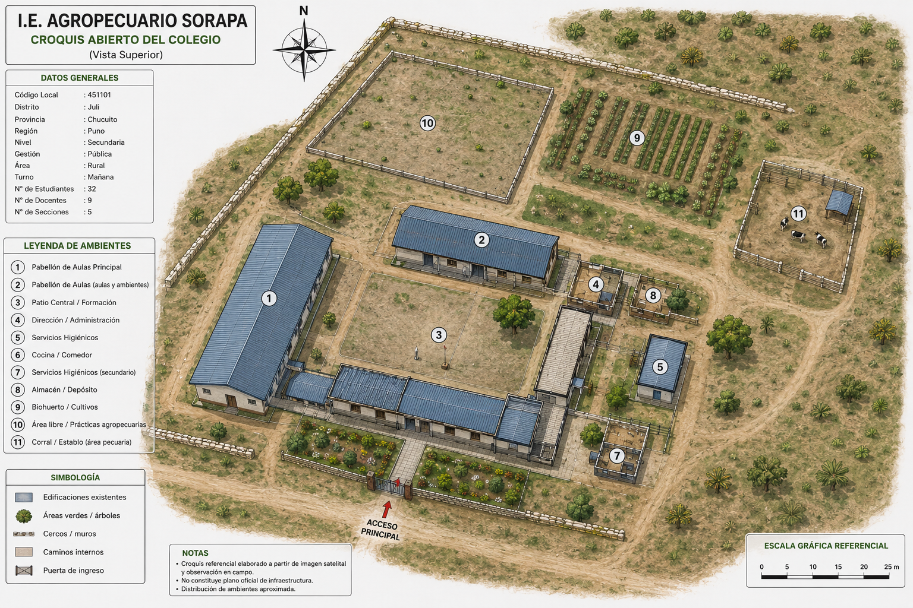
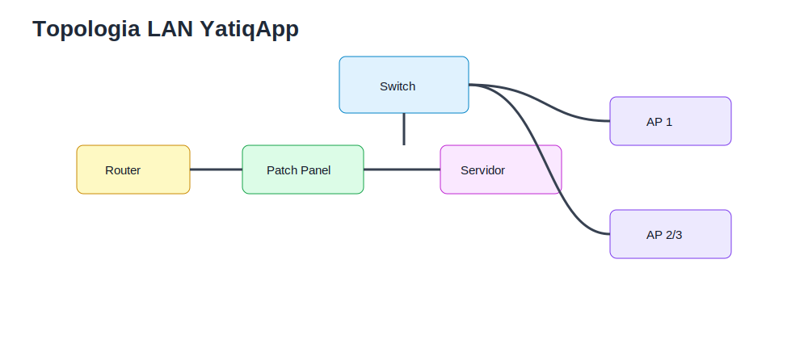
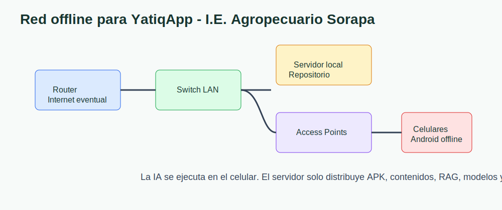
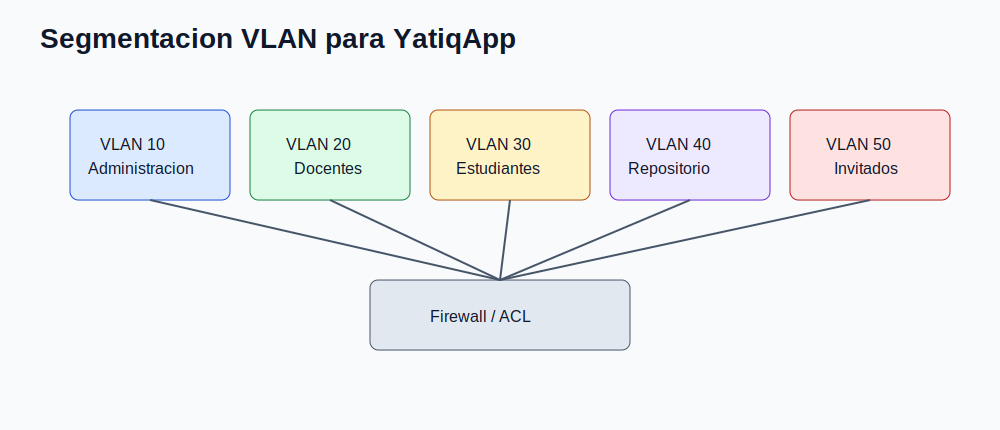
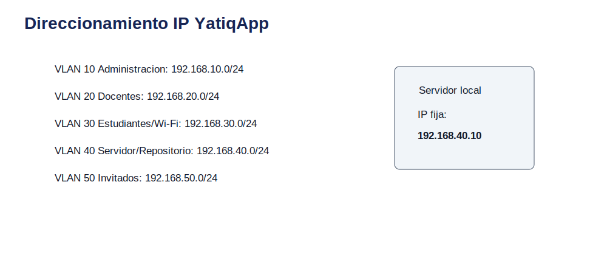

# CE0311 - Entregable 1: Diseño de Red

| Campo | Detalle |
|---|---|
| Universidad | Universidad Peruana Unión |
| Escuela Profesional | Ingeniería de Sistemas |
| Asignatura | Perfil de Egreso 2026 |
| Línea | CE03 Infraestructura Tecnológica |
| Proyecto | YatiqApp |
| Caso de estudio | I.E. Agropecuario Sorapa |
| Entregable | CE0311 - Entregable 1: Diseño de Red |
| Código de competencia | CE0311 |
| Responsable | Anyelo Jhans Sarmiento Larico |
| Semestre | 2026-I |
| Fecha | Julio de 2026 |

| Información | Detalle |
|-------------|---------|
| Institución | I.E. Agropecuario Sorapa |
| Distrito | Juli |
| Provincia | Chucuito |
| Región | Puno |
| Gestión | Pública |
| Nivel | Secundaria |
| Área | Rural |
| Estudiantes | 32 aprox. |
| Docentes | 9 aprox. |
| Secciones | 5 aprox. |

## Descripción

Este entregable presenta el diseño de red local para la I.E. Agropecuario Sorapa como infraestructura tecnológica de soporte para YatiqApp. El propósito es disponer de una LAN sencilla, segura y mantenible que permita conectividad interna, distribución offline de la APK, acceso local a recursos educativos, administración del repositorio escolar y operación en un contexto rural con Internet limitado o intermitente.

YatiqApp funciona offline en celulares Android. La IA se ejecuta en el celular; el servidor local no procesa IA ni reemplaza la arquitectura On-Device. Dentro de CE03, la red cumple una función de soporte: comunica router, switch, servidor local, access points, docentes, estudiantes y administración para distribuir recursos, respaldar contenidos y operar aunque no exista Internet.

## Resumen Ejecutivo

La propuesta considera una topología estrella extendida con router, switch gigabit 16/24 puertos, patch panel, rack mural, UPS, servidor local como repositorio, disco externo para backup y 2 o 3 access points. La red se diseña para un colegio público rural pequeño, por lo que evita soluciones empresariales sobredimensionadas como clústeres, SAN, múltiples enlaces redundantes o servicios cloud obligatorios.

El diseño segmenta la LAN mediante VLAN para separar administración, docentes, estudiantes/Wi-Fi, servidor/repositorio e invitados. Se usa direccionamiento privado por subredes /24, fácil de documentar y administrar. No se implementa DMZ porque el colegio no publica servicios hacia Internet y YatiqApp conserva funcionamiento offline.

## Alcance del Entregable

### Incluye

- Infraestructura de soporte para YatiqApp.
- Red local LAN cableada e inalámbrica.
- Micro centro de datos como punto de comunicaciones.
- Servidor local como repositorio.
- Seguridad de red mediante VLAN, firewall básico y control de acceso.
- Backup mediante servidor local y disco externo.
- Distribución offline de APK, contenidos, modelos optimizados y recursos RAG.
- Operación rural con Internet eventual.

### No incluye

- Desarrollo completo de la app móvil.
- Entrenamiento completo del modelo IA.
- Inferencia cloud.
- Ejecución de IA en el servidor.
- Integración directa con SIAGIE.
- Despliegue nacional.

### Supuestos

- El colegio cuenta con conectividad limitada o intermitente.
- Los estudiantes y docentes pueden usar celulares Android.
- YatiqApp funciona offline.
- El servidor local funciona como repositorio.
- Internet se usa solo de forma eventual para mantenimiento, descarga de actualizaciones o soporte.

### Restricciones

- Presupuesto limitado.
- Hardware básico.
- Energía eléctrica variable.
- Pocos equipos tecnológicos.
- Contexto rural.

## Levantamiento de Requerimientos

| Tipo | Requerimiento | Prioridad | Justificación |
|---|---|---|---|
| Técnico | Conectar router, switch, servidor y AP en una LAN administrable. | Alta | Es la base para distribuir YatiqApp y recursos educativos. |
| Técnico | Soportar Wi-Fi para celulares Android. | Alta | Los usuarios finales acceden desde dispositivos móviles. |
| Técnico | Separar tráfico por VLAN. | Alta | Reduce riesgos entre administración, estudiantes y servidor. |
| Técnico | Mantener funcionamiento local sin Internet. | Alta | El colegio opera en zona rural con conectividad variable. |
| Académico | Acceder a contenidos Quechua, Aymara y castellano. | Alta | YatiqApp tiene enfoque bilingüe e intercultural. |
| Académico | Distribuir APK y actualizaciones desde el servidor local. | Alta | Evita depender de tiendas o nube durante clases. |
| Administrativo | Proteger documentos institucionales y backups. | Alta | El servidor también conserva evidencias y respaldos. |
| Administrativo | Facilitar mantenimiento por docente encargado o responsable TIC. | Media | La solución debe ser sostenible localmente. |

## Inventario Tecnológico Existente

| Equipo | Cantidad | Uso en la red |
|---|---:|---|
| Router | 1 | Puerta de enlace e Internet eventual. |
| Switch Gigabit 16/24 puertos | 1 | Interconexión LAN. |
| Patch Panel | 1 | Ordenamiento del cableado. |
| Rack mural | 1 | Protección física de equipos. |
| UPS | 1 | Continuidad eléctrica básica. |
| Computadora servidor | 1 | Repositorio local de YatiqApp, contenidos y backups. |
| Disco duro externo | 1 | Copias de seguridad. |
| Access Point Wi-Fi | 2 o 3 | Conexión de celulares y equipos docentes. |

## Diseño de Topología Física

La topología física centraliza los equipos en el rack mural del micro centro de datos. El router se conecta al switch; el switch distribuye enlaces hacia patch panel, servidor local y access points. Los celulares Android acceden por Wi-Fi local para descargar APK, paquetes de actualización y contenidos educativos.

## Diseño de Topología Lógica

La topología lógica separa funciones para proteger recursos y ordenar el tráfico. El servidor/repositorio queda en una VLAN propia; administración y docentes tienen acceso controlado; estudiantes usan Wi-Fi aislado para recursos educativos.

## Segmentación VLAN

| VLAN | Nombre | Red |
|------|--------|-----|
| 10 | Administración | 192.168.10.0/24 |
| 20 | Docentes | 192.168.20.0/24 |
| 30 | Estudiantes/Wi-Fi | 192.168.30.0/24 |
| 40 | Servidor/Repositorio | 192.168.40.0/24 |
| 50 | Invitados | 192.168.50.0/24 |

## Direccionamiento IP y Subnetting

| VLAN | Gateway | Rango DHCP sugerido | Reservas |
|---:|---|---|---|
| 10 | 192.168.10.1 | 192.168.10.50-192.168.10.150 | Dirección y Secretaría. |
| 20 | 192.168.20.1 | 192.168.20.50-192.168.20.150 | Docentes. |
| 30 | 192.168.30.1 | 192.168.30.50-192.168.30.220 | Celulares de estudiantes. |
| 40 | 192.168.40.1 | 192.168.40.50-192.168.40.100 | Servidor local en IP fija 192.168.40.10. |
| 50 | 192.168.50.1 | 192.168.50.50-192.168.50.120 | Invitados temporales. |

Se usan subredes /24 por claridad administrativa. Aunque la cantidad de usuarios es pequeña, el patrón facilita soporte, documentación y crecimiento moderado.

## DMZ

No se implementa DMZ porque el colegio no publica servicios hacia Internet. YatiqApp funciona offline y el servidor local solo actúa como repositorio interno de APK, contenidos, modelos optimizados para distribución, recursos RAG, manuales, evidencias, backups y actualizaciones. Publicar servicios agregaría riesgo y complejidad sin necesidad pedagógica.

## Redundancia y Disponibilidad

| Elemento | Medida realista | Beneficio |
|---|---|---|
| Energía | UPS para router, switch y servidor. | Permite continuidad breve y apagado seguro. |
| Configuración | Backup de router, switch y AP. | Reduce tiempo de recuperación. |
| Wi-Fi | 2 o 3 access points. | Mejora cobertura y continuidad básica. |
| Datos | Copia en servidor y disco externo. | Protege contenidos y evidencias. |
| Operación | Manual de red y etiquetado. | Facilita mantenimiento local. |

## Cumplimiento de Estándares

| Estándar | Aplicación |
|---|---|
| IEEE 802.3 | Ethernet cableado en switch y servidor. |
| IEEE 802.11 | Wi-Fi local para celulares Android. |
| IEEE 802.1Q | Segmentación VLAN. |
| TIA/EIA-568 | Cableado estructurado y terminación. |
| TIA/EIA-569 | Canalizaciones y espacio de telecomunicaciones. |
| ISO/IEC 11801 | Cableado genérico y orden físico. |

## Relación del Diseño de Red con YatiqApp

| Necesidad de YatiqApp | Soporte desde la Red |
|----------------------|----------------------|
| Funcionamiento offline | Wi-Fi local y contenidos embebidos en celulares |
| Distribución de APK | Servidor local como repositorio |
| Actualización de contenidos | Red LAN y sincronización eventual |
| Uso en celulares | Access Points Wi-Fi |
| Seguridad de recursos | VLAN, firewall y control de acceso |
| Respaldo | Servidor local y disco externo |
| Acceso sin Internet | Red local independiente de la nube |

La red LAN permite compartir recursos, distribuir la APK y administrar contenidos. Sin embargo, YatiqApp sigue funcionando aunque no exista Internet porque la app, los contenidos principales y la inferencia de IA se ejecutan en el celular Android.

## Conclusiones

1. El diseño de red responde a la realidad de una institución pública rural pequeña.
2. La topología estrella extendida facilita mantenimiento y diagnóstico.
3. La LAN permite distribuir YatiqApp sin depender de Internet.
4. La segmentación VLAN protege administración, docentes, estudiantes y repositorio.
5. El servidor local cumple función de repositorio, no de procesamiento de IA.
6. El direccionamiento /24 facilita documentación y soporte.
7. La ausencia de DMZ es técnicamente adecuada porque no se publican servicios.
8. El uso de estándares mejora orden, interoperabilidad y sostenibilidad.

## Recomendaciones

1. Etiquetar puertos de switch, patch panel y puntos de red.
2. Asignar IP fija al servidor local de YatiqApp.
3. Separar SSID docente, estudiantil e invitados.
4. Mantener claves Wi-Fi bajo control institucional.
5. Respaldar configuraciones de router, switch y AP.
6. Probar descarga local de APK antes de cada jornada de actualización.
7. Revisar cobertura Wi-Fi en aulas y patio antes del piloto.
8. Documentar cambios de VLAN, IP y contraseñas.

## Anexos

| Anexo | Recurso | Relación |
|---|---|---|
| A |  | Funcionamiento local sin Internet. |
| B |  | Diseño físico lógico de red. |
| C |  | Separación por VLAN. |
| D |  | Plan IP y subredes. |
| E |  | Distribución offline. |

## Referencias

Institute of Electrical and Electronics Engineers. (2022). *IEEE 802.3 Ethernet standard*. IEEE.

Institute of Electrical and Electronics Engineers. (2020). *IEEE 802.11 wireless LAN standard*. IEEE.

Institute of Electrical and Electronics Engineers. (2022). *IEEE 802.1Q bridges and bridged networks*. IEEE.

International Organization for Standardization. (2017). *ISO/IEC 11801 information technology: Generic cabling for customer premises*. ISO.

Telecommunications Industry Association. (2018). *ANSI/TIA-568 structured cabling standard*. TIA.

Telecommunications Industry Association. (2019). *ANSI/TIA-569 telecommunications pathways and spaces*. TIA.

## Rúbrica de Evaluación

| Criterio Oficial | Evidencia en el Entregable | Nivel | Justificación |
|------------------|----------------------------|-------|---------------|
| Diseño de red | Topología física, lógica, VLAN, IP y subnetting. | Excelente | La propuesta es completa, realista y alineada a CE03. |
| Soporte a YatiqApp | Tabla de relación, flujo APK y enfoque offline. | Excelente | La red soporta distribución y operación sin atribuir IA al servidor. |
| Seguridad y disponibilidad | VLAN, firewall básico, UPS, backups y control Wi-Fi. | Excelente | Los controles son proporcionales al colegio rural. |
| Estándares | IEEE, TIA/EIA e ISO/IEC aplicados al caso. | Excelente | Las normas se relacionan con decisiones concretas del diseño. |
