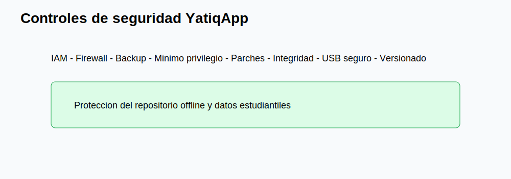
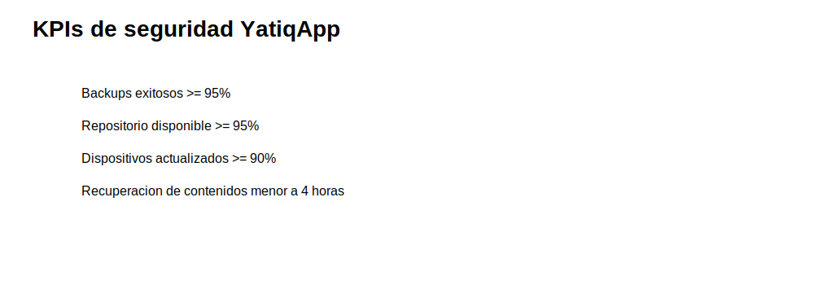
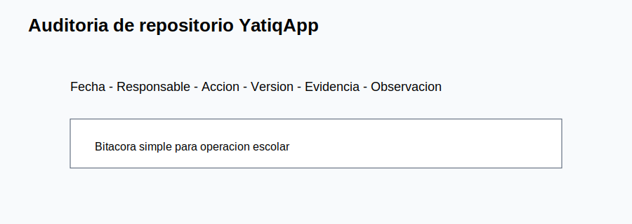
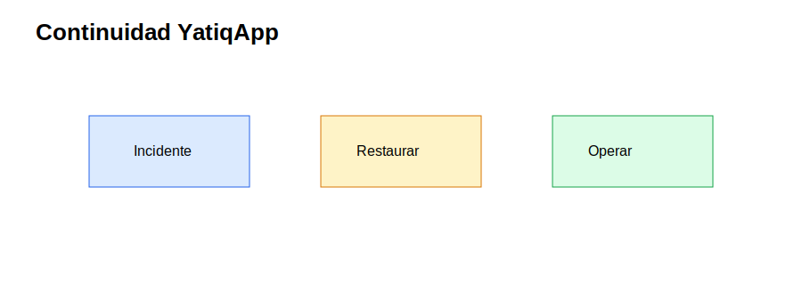
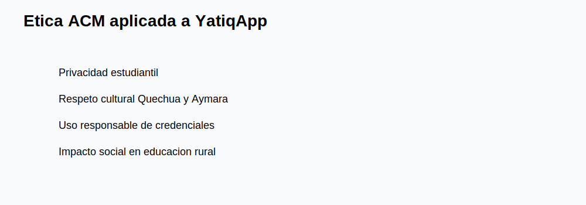

# CE0322-CE0324 - Entregable 2: Implementación, Monitoreo y Ética de Seguridad

| Campo | Detalle |
|---|---|
| Universidad | Universidad Peruana Unión |
| Escuela Profesional | Ingeniería de Sistemas |
| Asignatura | Perfil de Egreso 2026 |
| Línea | CE03 Infraestructura Tecnológica |
| Proyecto | YatiqApp |
| Caso de estudio | I.E. Agropecuario Sorapa |
| Entregable | CE0322-CE0324 - Entregable 2: Implementación, Monitoreo y Ética de Seguridad |
| Código de competencia | CE0322-CE0324 |
| Responsable | Anyelo Jhans Sarmiento Larico |
| Semestre | 2026-I |
| Fecha | Julio de 2026 |

| Información | Detalle |
|-------------|---------|
| Institución | I.E. Agropecuario Sorapa |
| Distrito | Juli |
| Provincia | Chucuito |
| Región | Puno |
| Gestión | Pública |
| Nivel | Secundaria |
| Área | Rural |
| Estudiantes | 32 aprox. |
| Docentes | 9 aprox. |
| Secciones | 5 aprox. |

## Descripción

Este entregable documenta controles técnicos, monitoreo, mejora continua y ética ACM para proteger la infraestructura offline de YatiqApp en la I.E. Agropecuario Sorapa.

## Resumen Ejecutivo

La implementación de seguridad incluye IAM básico, cifrado cuando el equipo lo permita, firewall, backups, mínimo privilegio, gestión de parches, continuidad, KPIs, auditoría, evaluación de vulnerabilidades y controles específicos para YatiqApp. La solución protege APK, contenidos Quechua/Aymara/castellano, recursos RAG, modelos optimizados para distribución, manuales y evidencias.

## Alcance del Entregable

### Incluye

- Infraestructura de soporte para YatiqApp.
- Red local, micro centro de datos, servidor local, seguridad y backup.
- Distribución offline y operación rural.
- Monitoreo, auditoría, continuidad y ética.

### No incluye

- Desarrollo completo de la app móvil.
- Entrenamiento completo del modelo IA.
- Inferencia cloud.
- Ejecución de IA en el servidor.
- Integración directa con SIAGIE.
- Despliegue nacional.

### Supuestos

- El colegio cuenta con conectividad limitada o intermitente.
- Los estudiantes y docentes pueden usar celulares Android.
- YatiqApp funciona offline.
- El servidor local funciona como repositorio.
- Internet se usa solo de forma eventual.

### Restricciones

- Presupuesto limitado.
- Hardware básico.
- Energía eléctrica variable.
- Pocos equipos tecnológicos.
- Contexto rural.

## Controles Técnicos Implementados

| Control | Implementación | Evidencia |
|---|---|---|
| IAM | Usuarios por rol en servidor y repositorio. | Lista de cuentas autorizadas. |
| Cifrado | Disco externo protegido cuando sea posible. | Registro de configuración. |
| Firewall | Reglas para VLAN, invitados y servidor. | Captura de ACL. |
| Backup | Copia semanal a disco externo. | Bitácora de backup. |
| Mínimo privilegio | Docentes en lectura para contenidos validados. | Permisos de carpetas. |
| Parches | Revisión mensual de SO, router y AP. | Registro de mantenimiento. |

## Controles de Seguridad para YatiqApp

| Control | Aplicación |
|---|---|
| Control de acceso al repositorio APK | Solo responsable TIC escribe nuevas versiones. |
| Permisos sobre carpetas de contenidos | Docentes consultan; responsable autorizado actualiza. |
| Backup de contenidos educativos | Copia a disco externo semanal. |
| Verificación de integridad de archivos | Checksum para APK y paquetes. |
| Protección de datos estudiantiles | Evidencias anonimizadas y acceso restringido. |
| Políticas de uso de dispositivos | Celulares autorizados para pruebas y descarga. |
| Actualización segura de paquetes | Versionado, fecha y responsable. |
| Registro de accesos | Bitácora manual o logs del servidor. |
| Control de versiones de APK | Carpeta por versión y archivo de control. |
| Control de USB/MicroSD | Escaneo previo y medios identificados. |

## KPIs de Seguridad

| KPI | Fórmula | Meta | Frecuencia | Responsable |
|-----|---------|------|------------|-------------|
| Porcentaje de backups exitosos | Backups correctos / backups programados x 100 | >= 95% | Semanal | Responsable TIC |
| Disponibilidad del repositorio local | Horas disponible / horas escolares x 100 | >= 95% | Semanal | Responsable TIC |
| Incidentes de acceso | Número de incidentes reportados | 0 críticos | Mensual | Dirección |
| Dispositivos actualizados | Celulares con versión vigente / celulares revisados x 100 | >= 90% | Por campaña | Docentes |
| Tiempo de recuperación de contenidos | Horas hasta restaurar | < 4 horas | Por incidente | Responsable TIC |
| Archivos verificados | Archivos con checksum / archivos críticos x 100 | >= 90% | Por actualización | Responsable TIC |
| Versiones APK controladas | Versiones registradas / versiones publicadas x 100 | 100% | Por versión | Responsable TIC |
| Accesos no autorizados bloqueados | Intentos bloqueados / intentos detectados x 100 | 100% | Mensual | Responsable TIC |

## Registro y Auditoría

La auditoría se realiza con bitácoras simples: fecha, responsable, acción, carpeta afectada, versión, medio usado y observación. En equipos que lo permitan, se complementa con logs del router, AP y servidor.

## Evaluación de Vulnerabilidades

| Vulnerabilidad | Revisión | Mejora |
|---|---|---|
| Contraseñas débiles | Validar longitud y cambio. | Política semestral. |
| USB sin escaneo | Revisar origen de medio. | Medios autorizados. |
| Backups no probados | Restaurar muestra mensual. | Registro de recuperación. |
| Versiones antiguas | Comparar carpeta de APK. | Lista de versión vigente. |
| Permisos amplios | Revisar carpetas. | Lectura por defecto. |

## Plan de Continuidad

| Escenario | Acción |
|---|---|
| Falla del servidor | Usar disco externo y PC temporal como repositorio. |
| Corte eléctrico | UPS y apagado seguro. |
| Corrupción de contenidos | Restaurar última versión validada. |
| APK incorrecta | Retirar versión y publicar versión aprobada. |

## Ética ACM

La aplicación de ACM exige confidencialidad de datos estudiantiles, protección de contenidos Quechua y Aymara, respeto cultural, no manipulación indebida de información educativa, uso responsable de credenciales e identificación del impacto social de decisiones técnicas. En Sorapa, una mala configuración puede afectar acceso a recursos de estudiantes rurales; por ello, cada control debe priorizar seguridad, equidad y sostenibilidad.

## Conclusiones

1. Los controles implementados protegen el repositorio offline de YatiqApp.
2. El mínimo privilegio reduce cambios no autorizados en contenidos.
3. Los KPIs permiten medir seguridad sin herramientas empresariales.
4. La bitácora de accesos mejora trazabilidad.
5. La continuidad depende de backups probados y operación simple.
6. La ética ACM fortalece privacidad y respeto cultural.
7. El control de USB/MicroSD es clave en distribución offline.
8. La seguridad mantiene al servidor como repositorio, no como IA.

## Recomendaciones

1. Revisar KPIs mensualmente en Dirección.
2. Probar restauración de contenidos cada mes.
3. Mantener checksum de APK y paquetes.
4. Usar cuentas separadas para escritura y lectura.
5. Capacitar a docentes sobre USB/MicroSD seguro.
6. Registrar cada actualización de YatiqApp.
7. Evitar almacenar datos personales innecesarios.
8. Bloquear o cambiar credenciales ante incidentes.

## Anexos

| Anexo | Recurso |
|---|---|
| A |  |
| B |  |
| C |  |
| D |  |
| E |  |

## Referencias

Association for Computing Machinery. (2018). *ACM code of ethics and professional conduct*. ACM.

Congreso de la República del Perú. (2011). *Ley N.º 29733, Ley de Protección de Datos Personales*.

International Organization for Standardization. (2022). *ISO/IEC 27001:2022 Information security management systems*. ISO.

International Organization for Standardization. (2022). *ISO/IEC 27002:2022 Information security controls*. ISO.

National Institute of Standards and Technology. (2024). *The NIST cybersecurity framework 2.0*. U.S. Department of Commerce.

## Rúbrica de Evaluación

| Criterio Oficial | Evidencia en el Entregable | Nivel | Justificación |
|------------------|----------------------------|-------|---------------|
| Controles implementados | IAM, firewall, backup, parches y mínimo privilegio. | Excelente | Controles aplicables al contexto rural. |
| Monitoreo y mejora | KPIs, auditoría y evaluación de vulnerabilidades. | Excelente | Permite seguimiento sin plataforma empresarial. |
| Seguridad YatiqApp | Control de APK, contenidos, RAG, USB y versiones. | Excelente | Protege distribución offline. |
| Ética ACM | Privacidad, cultura, credenciales e impacto social. | Excelente | Integra responsabilidad técnica y social. |
