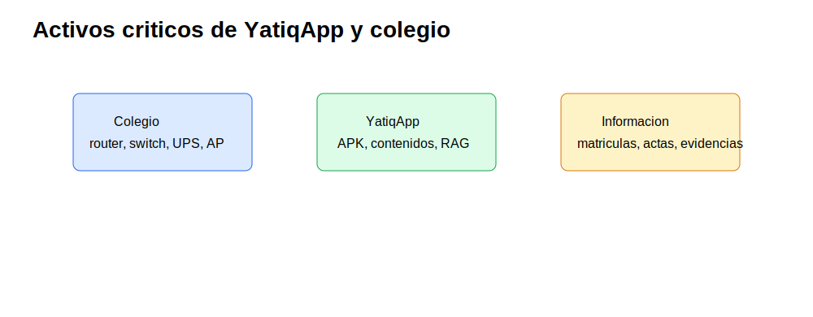
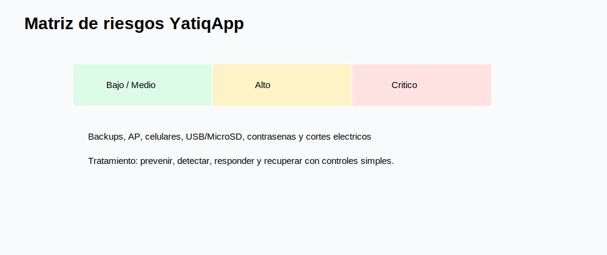
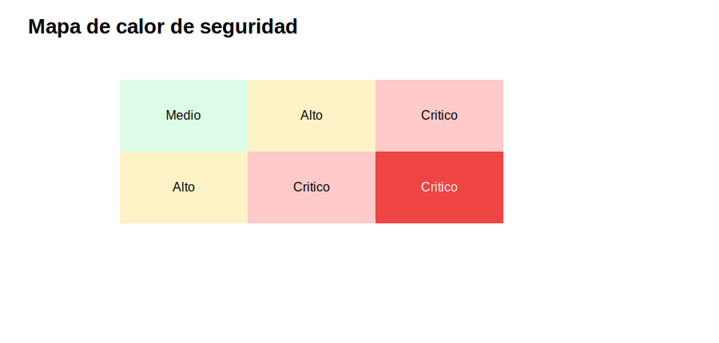
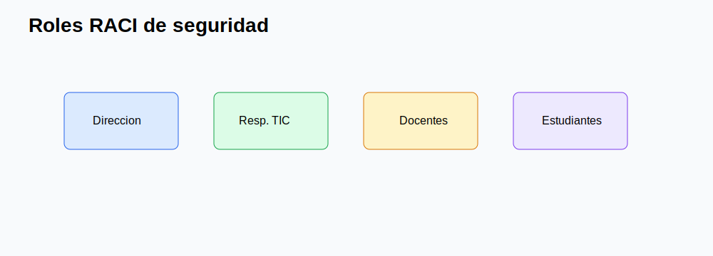
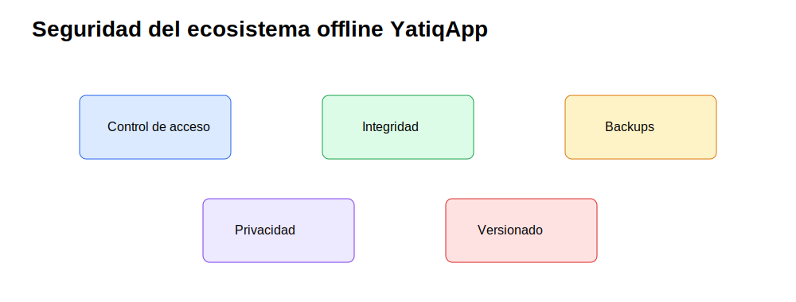

# CE0321 - Entregable 2: Planificación de Seguridad

| Campo | Detalle |
|---|---|
| Universidad | Universidad Peruana Unión |
| Escuela Profesional | Ingeniería de Sistemas |
| Asignatura | Perfil de Egreso 2026 |
| Línea | CE03 Infraestructura Tecnológica |
| Proyecto | YatiqApp |
| Caso de estudio | I.E. Agropecuario Sorapa |
| Entregable | CE0321 - Entregable 2: Planificación de Seguridad |
| Código de competencia | CE0321 |
| Responsable | Anyelo Jhans Sarmiento Larico |
| Semestre | 2026-I |
| Fecha | Julio de 2026 |

| Información | Detalle |
|-------------|---------|
| Institución | I.E. Agropecuario Sorapa |
| Distrito | Juli |
| Provincia | Chucuito |
| Región | Puno |
| Gestión | Pública |
| Nivel | Secundaria |
| Área | Rural |
| Estudiantes | 32 aprox. |
| Docentes | 9 aprox. |
| Secciones | 5 aprox. |

## Descripción

Este documento planifica la seguridad de la infraestructura tecnológica de soporte para YatiqApp en la I.E. Agropecuario Sorapa. El enfoque protege activos del colegio y activos propios del ecosistema offline: APK, contenidos Quechua, Aymara y castellano, recursos RAG, modelos optimizados para distribución, manuales, evidencias y backups.

## Resumen Ejecutivo

La seguridad propuesta se basa en ISO/IEC 27001, ISO/IEC 27002, ISO/IEC 27005, NIST Cybersecurity Framework, Ley N.º 29733 y Código de Ética ACM. La solución es proporcional a una institución rural: contraseñas robustas, control de acceso, VLAN, firewall básico, verificación de integridad, backup, protección de USB/MicroSD, registros y responsabilidades claras.

El servidor local no ejecuta IA. Solo almacena y distribuye recursos para que los celulares Android usen YatiqApp offline. La seguridad debe conservar integridad de la APK, privacidad de estudiantes, trazabilidad de versiones y disponibilidad de contenidos educativos bilingües.

## Alcance del Entregable

### Incluye

- Infraestructura de soporte para YatiqApp.
- Red local y micro centro de datos.
- Servidor local, seguridad, backup y distribución offline.
- Protección de activos educativos y administrativos.
- Operación rural con controles sostenibles.

### No incluye

- Desarrollo completo de la app móvil.
- Entrenamiento completo del modelo IA.
- Inferencia cloud.
- Ejecución de IA en el servidor.
- Integración directa con SIAGIE.
- Despliegue nacional.

### Supuestos

- El colegio cuenta con conectividad limitada o intermitente.
- Los estudiantes y docentes pueden usar celulares Android.
- YatiqApp funciona offline.
- El servidor local funciona como repositorio.
- Internet se usa solo de forma eventual.

### Restricciones

- Presupuesto limitado.
- Hardware básico.
- Energía eléctrica variable.
- Pocos equipos tecnológicos.
- Contexto rural.

## Identificación y Clasificación de Activos Críticos

| Grupo | Activos |
|---|---|
| Colegio | Router, switch, servidor local, disco externo, UPS, access point, documentación institucional, matrículas, actas e inventario. |
| YatiqApp | APK, contenidos Quechua, contenidos Aymara, contenidos castellano, modelos optimizados para distribución, base RAG, manuales docentes, evidencias del piloto, backups y dispositivos móviles. |

| Activo | Clasificación | Confidencialidad | Integridad | Disponibilidad |
|---|---|---|---|---|
| Matrículas y actas | Información sensible | Alta | Alta | Media |
| APK de YatiqApp | Software educativo | Media | Alta | Alta |
| Contenidos Quechua/Aymara/Castellano | Recurso educativo | Media | Alta | Alta |
| Recursos RAG | Base de conocimiento | Media | Alta | Alta |
| Modelos optimizados para distribución | Paquete técnico | Media | Alta | Media |
| Servidor local | Infraestructura | Alta | Alta | Alta |
| Disco externo | Respaldo | Alta | Alta | Media |
| Celulares Android | Dispositivo usuario | Media | Media | Alta |

## Análisis de Riesgos ISO 27005 / NIST

| Riesgo | Activo afectado | Amenaza | Vulnerabilidad | Impacto | Probabilidad | Nivel | Control existente | Mejora propuesta | Responsable |
|---|---|---|---|---|---|---|---|---|---|
| Pérdida de APK actualizada | APK | Eliminación accidental | Sin control de versiones | Alto | Media | Alto | Copia local | Repositorio por versiones y checksum | Responsable TIC |
| Corrupción de contenidos | Contenidos | Copia incompleta | Sin verificación | Alto | Media | Alto | Carpetas locales | Hash y validación docente | Responsable TIC |
| Pérdida de backup | Disco externo | Extravio | Custodia informal | Alto | Media | Alto | Disco disponible | Bitácora y almacenamiento bajo llave | Dirección |
| Acceso no autorizado al servidor | Servidor | Credenciales robadas | Contraseña débil | Alto | Media | Alto | Usuario local | Mínimo privilegio y cambio periódico | Responsable TIC |
| Fallo de AP durante distribución | AP | Falla técnica | Equipo único por zona | Medio | Media | Medio | AP instalado | Prueba previa y AP alterno | Responsable TIC |
| Celular no compatible | Dispositivos móviles | Limitación técnica | Android antiguo | Medio | Media | Medio | Prueba manual | Lista de requisitos mínimos | Docente encargado |
| Falta de almacenamiento en celulares | Celulares | Espacio insuficiente | Sin revisión previa | Medio | Alta | Alto | Aviso verbal | Checklist antes de instalación | Docentes |
| Malware en USB/MicroSD | Servidor/celulares | Archivo infectado | Medios sin control | Alto | Media | Alto | Antivirus básico | Escaneo y medios autorizados | Responsable TIC |
| Uso de versión antigua | APK | Desactualización | Sin trazabilidad | Medio | Alta | Alto | Nombre de archivo | Registro de versión instalada | Docentes |
| Modificación no autorizada de recursos | Contenidos | Manipulación | Permisos amplios | Alto | Media | Alto | Carpeta compartida | Permisos de solo lectura y aprobación | Dirección |
| Robo del servidor | Servidor | Hurto | Acceso físico débil | Alto | Baja | Medio | Ambiente cerrado | Rack/puerta con llave e inventario | Dirección |
| Corte eléctrico | Router/switch/servidor | Interrupción | Energía variable | Alto | Alta | Crítico | UPS | Apagado seguro y revisión mensual | Responsable TIC |
| Falla del disco externo | Backups | Daño físico | Un solo medio | Alto | Media | Alto | Disco externo | Segundo ciclo de copia y prueba de restauración | Dirección |
| Eliminación accidental | Recursos | Error humano | Sin permisos finos | Medio | Media | Medio | Carpetas | Papelera, backup y permisos por rol | Responsable TIC |
| Contraseña débil | Servidor/AP/router | Acceso indebido | Claves simples | Alto | Alta | Crítico | Claves locales | Política de 10+ caracteres y cambio semestral | Dirección |

## Políticas de Seguridad

| Política | Aplicación | Responsable |
|---|---|---|
| Control de accesos | Usuarios diferenciados en servidor, router y AP. | Responsable TIC |
| Contraseñas | Claves robustas, no compartidas y cambio semestral. | Dirección |
| Backup | Copia semanal de contenidos, evidencias y documentos. | Responsable TIC |
| Uso de USB/MicroSD | Solo medios autorizados y escaneados. | Docentes y TIC |
| Integridad de APK | Validar versión, fecha y checksum. | Responsable TIC |
| Privacidad | Minimizar datos estudiantiles y proteger evidencias. | Dirección |
| Versionado | Carpetas por versión para APK, RAG y contenidos. | Responsable TIC |
| Wi-Fi | SSID separados y contraseña por grupo. | Responsable TIC |

## Roles y Responsabilidades

| Actividad | Dirección | Responsable TIC | Docentes | Estudiantes |
|---|---|---|---|---|
| Aprobar políticas | A | C | I | I |
| Administrar servidor | A | R | I | I |
| Validar contenidos | C | C | R | I |
| Distribuir APK | I | R | R | C |
| Ejecutar backups | A | R | C | I |
| Reportar incidentes | A | R | R | R |

## Seguridad del Ecosistema Offline de YatiqApp

La protección del ecosistema offline se centra en conservar recursos educativos, controlar versiones y evitar manipulación no autorizada. El servidor local mantiene carpetas de APK, contenidos, modelos, RAG, manuales, evidencias, backups y actualizaciones. Los docentes descargan o copian paquetes validados por Wi-Fi local, USB o MicroSD autorizada.

Los contenidos Quechua y Aymara requieren respeto cultural, trazabilidad de cambios y validación docente. La APK debe conservar integridad mediante nombre de versión, fecha, responsable y checksum. Los backups deben guardarse en disco externo y probarse de manera periódica. Los datos estudiantiles deben minimizarse y no exponerse en carpetas públicas.

## Ética ACM

La seguridad debe proteger a estudiantes y comunidad educativa. Según ACM, las decisiones técnicas deben evitar daño, respetar privacidad, ser honestas sobre limitaciones y reconocer el impacto social. En Sorapa, esto implica no manipular información educativa, no exponer datos de menores, respetar contenidos Quechua y Aymara, usar credenciales responsablemente y proponer controles sostenibles para una escuela rural.

## Conclusiones

1. La seguridad CE03 debe proteger infraestructura, contenidos y operación offline.
2. El servidor local es repositorio, no motor de IA.
3. La integridad de APK y contenidos es crítica para evitar versiones incorrectas.
4. Los riesgos más altos son corte eléctrico, contraseña débil y pérdida de backup.
5. El uso de USB/MicroSD exige controles por malware e integridad.
6. La privacidad estudiantil requiere minimización y control de evidencias.
7. El versionado facilita mantenimiento y auditoría escolar.
8. La ética ACM aporta criterios de respeto cultural y responsabilidad social.

## Recomendaciones

1. Implementar bitácora de versiones para APK, contenidos y RAG.
2. Verificar checksum antes de distribuir paquetes.
3. Guardar backups bajo llave y probar restauración.
4. Separar permisos de lectura y escritura en el repositorio.
5. Escanear USB/MicroSD antes de copiar archivos.
6. Cambiar claves Wi-Fi y de servidor de forma semestral.
7. Capacitar a docentes sobre privacidad y uso responsable.
8. Documentar incidentes, correcciones y responsables.

## Anexos

| Anexo | Recurso | Relación |
|---|---|---|
| A |  | Controles del ecosistema offline. |
| B |  | Priorización de riesgos. |
| C |  | Clasificación de activos. |
| D |  | Vista de criticidad. |
| E |  | Responsabilidades. |

## Referencias

Association for Computing Machinery. (2018). *ACM code of ethics and professional conduct*. ACM.

Congreso de la República del Perú. (2011). *Ley N.º 29733, Ley de Protección de Datos Personales*.

International Organization for Standardization. (2022). *ISO/IEC 27001:2022 Information security management systems*. ISO.

International Organization for Standardization. (2022). *ISO/IEC 27002:2022 Information security controls*. ISO.

International Organization for Standardization. (2022). *ISO/IEC 27005:2022 Guidance on managing information security risks*. ISO.

National Institute of Standards and Technology. (2024). *The NIST cybersecurity framework 2.0*. U.S. Department of Commerce.

## Rúbrica de Evaluación

| Criterio Oficial | Evidencia en el Entregable | Nivel | Justificación |
|------------------|----------------------------|-------|---------------|
| Identificación de activos | Activos del colegio y de YatiqApp clasificados. | Excelente | Incluye información, hardware, software, repositorio y móviles. |
| Análisis de riesgos | Matriz con 15 riesgos y controles. | Excelente | Usa criterios ISO/NIST y riesgos propios del modo offline. |
| Políticas de seguridad | Políticas de acceso, backup, USB, privacidad y versionado. | Excelente | Son aplicables con hardware básico de colegio rural. |
| Ética profesional | Sección ACM aplicada a estudiantes y lenguas originarias. | Excelente | Vincula técnica, privacidad, cultura e impacto social. |
