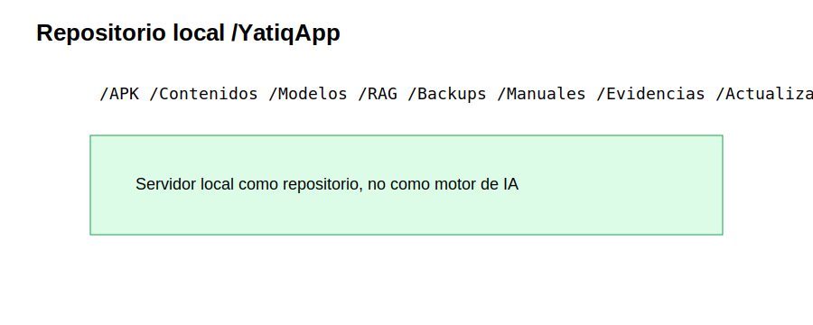
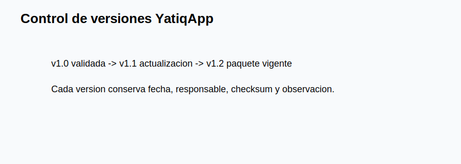
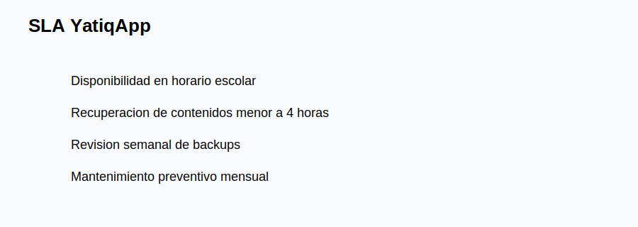
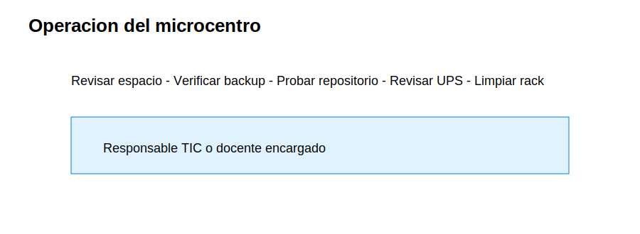
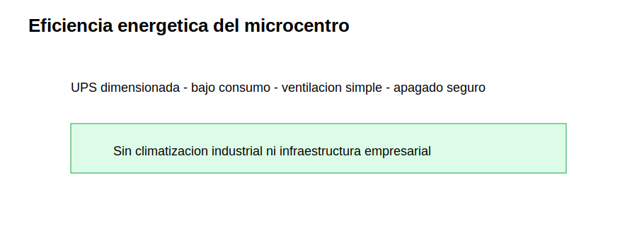
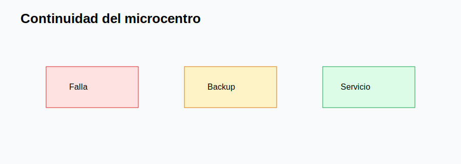

# CE0332-CE0333 - Entregable 3: Implementación y Control de Centro de Datos

| Campo | Detalle |
|---|---|
| Universidad | Universidad Peruana Unión |
| Escuela Profesional | Ingeniería de Sistemas |
| Asignatura | Perfil de Egreso 2026 |
| Línea | CE03 Infraestructura Tecnológica |
| Proyecto | YatiqApp |
| Caso de estudio | I.E. Agropecuario Sorapa |
| Entregable | CE0332-CE0333 - Entregable 3: Implementación y Control de Centro de Datos |
| Código de competencia | CE0332-CE0333 |
| Responsable | Anyelo Jhans Sarmiento Larico |
| Semestre | 2026-I |
| Fecha | Julio de 2026 |


| Información | Detalle |
|-------------|---------|
| Institución | I.E. Agropecuario Sorapa |
| Distrito | Juli |
| Provincia | Chucuito |
| Región | Puno |
| Gestión | Pública |
| Nivel | Secundaria |
| Área | Rural |
| Estudiantes | 32 aprox. |
| Docentes | 9 aprox. |
| Secciones | 5 aprox. |

## Descripción

Este entregable documenta la implementación y control operativo del micro centro de datos que soporta YatiqApp en la I.E. Agropecuario Sorapa. El centro no ejecuta IA ni aloja nube; administra repositorio, backups, versiones, continuidad y monitoreo básico para operación offline.

## Resumen Ejecutivo

La implementación organiza rack mural, router, switch, patch panel, UPS, servidor local, disco externo y AP. El servidor mantiene la estructura `/YatiqApp` para APK, contenidos, modelos optimizados, RAG, backups, manuales, evidencias y actualizaciones. El SLA es realista: disponibilidad en horario escolar, recuperación de contenidos en menos de 4 horas, revisión semanal de backups y mantenimiento preventivo mensual.

## Alcance del Entregable

### Incluye

- Infraestructura de soporte para YatiqApp.
- Micro centro de datos, servidor local y repositorio.
- Seguridad, backup, distribución offline y operación rural.
- SLA, monitoreo, eficiencia energética y continuidad.

### No incluye

- Desarrollo completo de la app móvil.
- Entrenamiento completo del modelo IA.
- Inferencia cloud.
- Ejecución de IA en el servidor.
- Integración directa con SIAGIE.
- Despliegue nacional.

### Supuestos

- El colegio cuenta con conectividad limitada o intermitente.
- Los estudiantes y docentes pueden usar celulares Android.
- YatiqApp funciona offline.
- El servidor local funciona como repositorio.
- Internet se usa solo de forma eventual.

### Restricciones

- Presupuesto limitado.
- Hardware básico.
- Energía eléctrica variable.
- Pocos equipos tecnológicos.
- Contexto rural.

## Instalación Física del Micro Centro de Datos

| Elemento | Implementación | Control |
|---|---|---|
| Rack mural | Router, switch y patch panel organizados. | Etiquetado y llave. |
| UPS | Alimenta equipos críticos. | Prueba mensual. |
| Servidor local | Conectado por Ethernet al switch. | IP fija y acceso restringido. |
| Disco externo | Conectado solo para backup. | Custodia bajo llave. |
| AP | Ubicados para cobertura escolar. | Prueba de señal. |

## Configuración del Servidor Local

```text
/YatiqApp
  /APK
  /Contenidos
    /Quechua
    /Aymara
    /Castellano
  /Modelos
  /RAG
  /Backups
  /Manuales
  /Evidencias
  /Actualizaciones
```



## Servicios Implementados

| Servicio | Función | Observación |
|---|---|---|
| Carpeta compartida APK | Distribuir instalador Android. | Versionado y checksum. |
| Carpeta contenidos | Recursos Quechua, Aymara y castellano. | Validación docente. |
| Carpeta modelos | Modelos optimizados para distribución. | No se ejecutan en servidor. |
| Carpeta RAG | Recursos de base de conocimiento. | Uso por paquete local. |
| Backup | Copias del repositorio. | Disco externo. |
| Manuales | Guías docentes y técnicas. | Acceso de lectura. |

## Repositorio Local de YatiqApp

El repositorio permite actualización offline, recuperación de contenidos, control de versiones y distribución local. Los celulares descargan o reciben paquetes desde la LAN; después, YatiqApp opera en el dispositivo Android sin Internet.



## Almacenamiento y Backup

| Tipo | Frecuencia | Medio | Responsable |
|---|---|---|---|
| Backup de APK y contenidos | Semanal | Disco externo | Responsable TIC |
| Backup de evidencias | Semanal | Disco externo | Docente encargado |
| Copia mensual | Mensual | Disco externo bajo llave | Dirección |
| Prueba de restauración | Mensual | Carpeta temporal | Responsable TIC |

## SLA Realista

| Compromiso | Meta | Responsable |
|---|---|---|
| Disponibilidad | Horario escolar | Responsable TIC o docente encargado |
| Recuperación de contenidos | Menos de 4 horas | Responsable TIC |
| Revisión de backups | Semanal | Responsable TIC |
| Mantenimiento preventivo | Mensual | Dirección y TIC |
| Soporte de actualización | Por campaña | Docentes |



## Monitoreo y Procedimientos Operativos

| Procedimiento | Frecuencia | Evidencia |
|---|---|---|
| Revisar espacio en disco | Semanal | Captura o registro. |
| Verificar backup | Semanal | Bitácora. |
| Probar acceso al repositorio | Semanal | Ping/acceso carpeta. |
| Revisar UPS | Mensual | Registro de prueba. |
| Limpiar rack | Mensual | Registro de mantenimiento. |
| Actualizar paquetes | Según versión | Acta de actualización. |



## Eficiencia Energética

El micro centro usa equipos de bajo consumo, apagado seguro fuera de horario si corresponde, UPS dimensionada a la carga real y mantenimiento de ventilación. No requiere climatización industrial.



## Control de Operación y Continuidad

La continuidad se basa en copias verificadas, estructura ordenada, responsable definido, procedimientos simples y repositorio recuperable en una PC temporal si falla el servidor.



## Conclusiones

1. El micro centro implementado sostiene operación offline de YatiqApp.
2. El servidor local funciona como repositorio y no ejecuta IA.
3. La estructura `/YatiqApp` ordena APK, contenidos, RAG y backups.
4. El SLA es realista para horario escolar rural.
5. Los backups semanales protegen recursos educativos.
6. El control de versiones evita distribuir paquetes incorrectos.
7. La eficiencia energética se logra con equipos básicos y UPS.
8. Los procedimientos reducen dependencia de soporte externo.

## Recomendaciones

1. Mantener la estructura de carpetas sin cambios improvisados.
2. Registrar toda versión nueva de APK y contenidos.
3. Probar restauración antes de borrar versiones antiguas.
4. Conectar disco externo solo durante backup.
5. Mantener manual impreso de recuperación.
6. Revisar UPS y ventilación cada mes.
7. Evitar servicios innecesarios en el servidor.
8. Actualizar paquetes durante horarios planificados.

## Anexos

| Anexo | Recurso |
|---|---|
| A |  |
| B |  |
| C |  |
| D |  |
| E |  |
| F |  |

## Referencias

International Organization for Standardization. (2022). *ISO/IEC 27002:2022 Information security controls*. ISO.

Telecommunications Industry Association. (2019). *ANSI/TIA-569 telecommunications pathways and spaces*. TIA.

Android Developers. (2026). *Android Developers documentation*. Google.

SQLite Consortium. (2026). *SQLite documentation*. SQLite.

## Rúbrica de Evaluación

| Criterio Oficial | Evidencia en el Entregable | Nivel | Justificación |
|------------------|----------------------------|-------|---------------|
| Implementación de micro centro | Rack, UPS, servidor, disco y AP documentados. | Excelente | Es proporcional y operativo para Sorapa. |
| Operación de repositorio | Estructura `/YatiqApp`, versiones y backups. | Excelente | Soporta distribución offline de la app. |
| SLA y continuidad | Metas de horario escolar y recuperación. | Excelente | Define controles realistas y medibles. |
| Control y monitoreo | Procedimientos, eficiencia y anexos SVG. | Excelente | Facilita operación por responsable local. |
