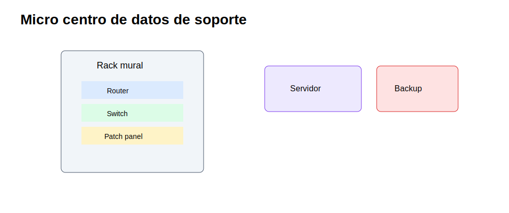
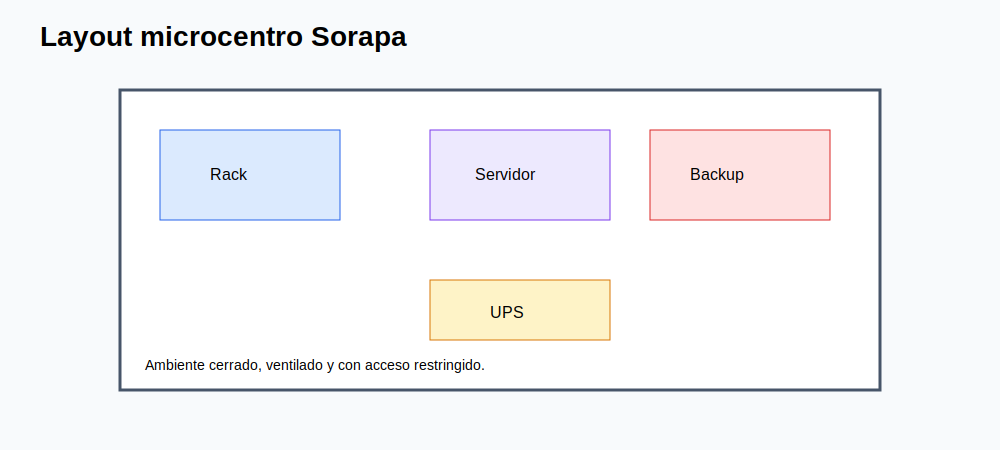
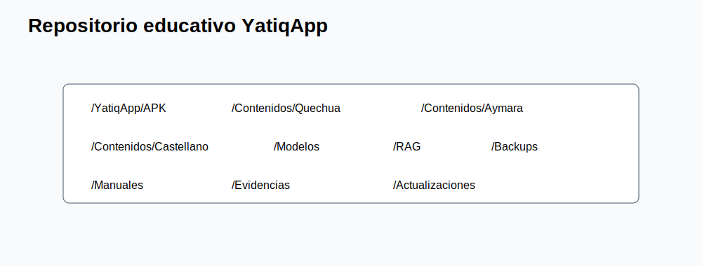
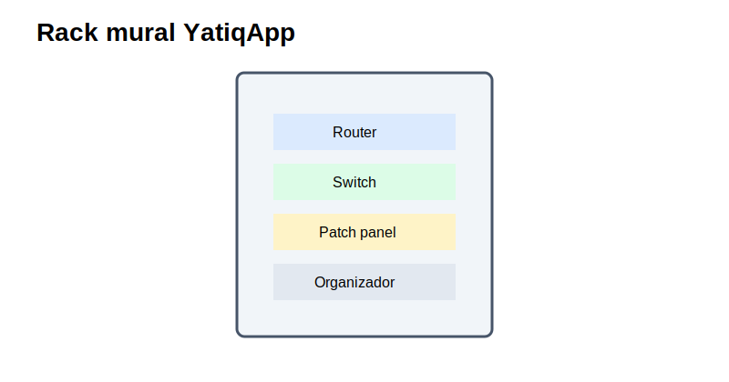
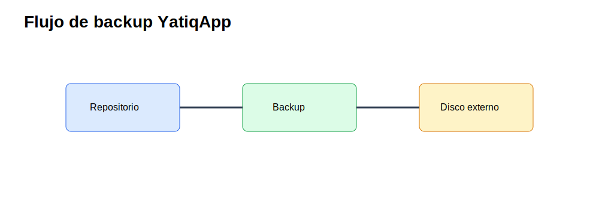

# CE0331 - Entregable 3: Diseño de Centro de Datos

| Campo | Detalle |
|---|---|
| Universidad | Universidad Peruana Unión |
| Escuela Profesional | Ingeniería de Sistemas |
| Asignatura | Perfil de Egreso 2026 |
| Línea | CE03 Infraestructura Tecnológica |
| Proyecto | YatiqApp |
| Caso de estudio | I.E. Agropecuario Sorapa |
| Entregable | CE0331 - Entregable 3: Diseño de Centro de Datos |
| Código de competencia | CE0331 |
| Responsable | Anyelo Jhans Sarmiento Larico |
| Semestre | 2026-I |
| Fecha | Julio de 2026 |

| Información | Detalle |
|-------------|---------|
| Institución | I.E. Agropecuario Sorapa |
| Distrito | Juli |
| Provincia | Chucuito |
| Región | Puno |
| Gestión | Pública |
| Nivel | Secundaria |
| Área | Rural |
| Estudiantes | 32 aprox. |
| Docentes | 9 aprox. |
| Secciones | 5 aprox. |

## Descripción

Este entregable diseña un micro centro de datos de soporte para YatiqApp en la I.E. Agropecuario Sorapa. No es un Data Center empresarial, no aloja servicios cloud, no depende de Internet y no ejecuta IA. Su función es organizar infraestructura básica para administrar recursos, respaldar contenidos, distribuir paquetes localmente y sostener operación offline.

## Resumen Ejecutivo

El micro centro de datos se compone de rack mural, router, switch, patch panel, UPS, computadora servidor, disco externo y access points. El diseño corresponde a una arquitectura Tier I básica: un solo camino de energía y red, mantenimiento programado y disponibilidad suficiente para horario escolar. La propuesta evita SAN, clústeres, servidores blade o soluciones 24/7 empresariales.

## Alcance del Entregable

### Incluye

- Infraestructura de soporte para YatiqApp.
- Red local, micro centro de datos y servidor local.
- Seguridad física y lógica básica.
- Backup, distribución offline y operación rural.
- Repositorio educativo para APK, contenidos, modelos, RAG, manuales y evidencias.

### No incluye

- Desarrollo completo de la app móvil.
- Entrenamiento completo del modelo IA.
- Inferencia cloud.
- Ejecución de IA en el servidor.
- Integración directa con SIAGIE.
- Despliegue nacional.

### Supuestos

- El colegio cuenta con conectividad limitada o intermitente.
- Los estudiantes y docentes pueden usar celulares Android.
- YatiqApp funciona offline.
- El servidor local funciona como repositorio.
- Internet se usa solo de forma eventual.

### Restricciones

- Presupuesto limitado.
- Hardware básico.
- Energía eléctrica variable.
- Pocos equipos tecnológicos.
- Contexto rural.

## Descripción del Micro Centro de Datos

El micro centro de datos se ubica preferentemente en Dirección o Administración, en un espacio cerrado y ventilado. Centraliza equipos de red, energía y almacenamiento para facilitar mantenimiento, seguridad y trazabilidad.

## Arquitectura Tier I

| Criterio | Aplicación en Sorapa |
|---|---|
| Camino único de energía | UPS alimenta router, switch y servidor. |
| Camino único de red | Router y switch central distribuyen la LAN. |
| Mantenimiento | Se realiza fuera de momentos críticos de clase. |
| Redundancia | Básica, mediante backup y procedimientos. |
| Disponibilidad | Orientada a horario escolar, no a 24/7 empresarial. |

## Justificación de Micro Centro de Datos

La institución requiere un espacio de soporte, no un centro de datos empresarial. El micro centro permite alojar el repositorio local de YatiqApp, resguardar evidencias del piloto, conservar backups, ordenar cableado, proteger equipos y distribuir actualizaciones por LAN/Wi-Fi sin depender de Internet.

## Layout Físico y Equipamiento Existente

| Componente | Función dentro de YatiqApp |
|-----------|-----------------------------|
| Servidor local | Repositorio de APK, contenidos, modelos, RAG, manuales y backups |
| Disco externo | Copias de seguridad |
| Router | Internet eventual |
| Switch | Interconexión LAN |
| Access Point | Distribución local a celulares |
| UPS | Continuidad eléctrica básica |
| Rack mural | Organización y protección física |
| Patch Panel | Ordenamiento del cableado |

## Dimensionamiento Básico

| Recurso | Dimensionamiento realista |
|---|---|
| Servidor local | PC con SSD 512 GB o 1 TB, 8-16 GB RAM y Ethernet gigabit. |
| Disco externo | 1-2 TB para copias semanales y mensuales. |
| Red | Switch gigabit 16/24 puertos. |
| Wi-Fi | 2 o 3 AP para aulas y administración. |
| Energía | UPS 1000-1500 VA para apagado seguro. |

## Almacenamiento

El almacenamiento conserva paquetes de instalación, contenidos bilingües, recursos RAG, modelos optimizados para distribución, manuales, evidencias y backups. El servidor no realiza inferencia: solo almacena y distribuye archivos.

## Servidor Local como Repositorio Educativo

| Carpeta | Contenido | Control |
|---|---|---|
| `/YatiqApp/APK` | Instaladores versionados. | Checksum y fecha. |
| `/YatiqApp/Contenidos` | Quechua, Aymara y castellano. | Validación docente. |
| `/YatiqApp/Modelos` | Modelos optimizados para distribución. | Solo lectura para usuarios. |
| `/YatiqApp/RAG` | Recursos de recuperación local. | Versionado. |
| `/YatiqApp/Manuales` | Guías docentes y técnicas. | Actualización controlada. |
| `/YatiqApp/Evidencias` | Evidencias del piloto. | Privacidad y permisos. |
| `/YatiqApp/Backups` | Copias locales. | Copia a disco externo. |

## Energía, UPS y Ventilación

La UPS protege cortes breves y permite apagar el servidor de forma segura. La ventilación debe ser natural o con ventilador de bajo consumo, evitando humedad, polvo excesivo y exposición directa al sol.

## Seguridad Física

- Rack mural cerrado.
- Puerta con llave.
- Acceso solo a Dirección y responsable TIC.
- Bitácora de ingreso.
- Disco externo bajo custodia.
- Extintor cercano si está disponible.

## Monitoreo Básico

| Elemento | Indicador | Frecuencia |
|---|---|---|
| UPS | Estado de batería y carga. | Mensual |
| Servidor | Espacio disponible y temperatura percibida. | Semanal |
| Disco externo | Resultado de backup. | Semanal |
| AP | Conexión y cobertura. | Mensual |
| Switch | Puertos activos y cableado. | Mensual |

## Relación con YatiqApp

El micro centro de datos permite que YatiqApp se distribuya y mantenga en un entorno rural. El servidor almacena APK, contenidos, modelos optimizados, RAG, manuales, evidencias y backups; los AP permiten descargar paquetes en celulares; la LAN mantiene acceso interno incluso sin Internet; y el disco externo protege recursos ante fallas.

## Conclusiones

1. El diseño corresponde a un micro centro de datos escolar, no empresarial.
2. La arquitectura Tier I es suficiente para horario escolar y recursos limitados.
3. El servidor local es repositorio, no ejecutor de IA.
4. El repositorio mejora distribución offline de YatiqApp.
5. La UPS reduce riesgo por cortes eléctricos.
6. El disco externo permite recuperación de contenidos y evidencias.
7. El rack mural mejora orden, seguridad y mantenimiento.
8. La operación no depende de cloud ni de Internet permanente.

## Recomendaciones

1. Ubicar el micro centro en ambiente cerrado y ventilado.
2. Asignar responsable de llaves, backups y bitácora.
3. Mantener estructura `/YatiqApp` por carpetas y versiones.
4. Verificar restauración de backups cada mes.
5. Limpiar rack y equipos periódicamente.
6. No instalar servicios innecesarios en el servidor.
7. Evitar almacenar datos personales sin necesidad pedagógica.
8. Programar mantenimiento preventivo mensual.

## Anexos

| Anexo | Recurso | Relación |
|---|---|---|
| A |  | Vista general. |
| B |  | Carpetas del servidor. |
| C |  | Respaldo a disco externo. |
| D |  | Organización física. |
| E |  | Distribución del espacio. |

## Referencias

International Organization for Standardization. (2017). *ISO/IEC 11801 information technology: Generic cabling for customer premises*. ISO.

International Organization for Standardization. (2022). *ISO/IEC 27002:2022 Information security controls*. ISO.

Telecommunications Industry Association. (2019). *ANSI/TIA-569 telecommunications pathways and spaces*. TIA.

SQLite Consortium. (2026). *SQLite documentation*. SQLite.

Android Developers. (2026). *Android Developers documentation*. Google.

## Rúbrica de Evaluación

| Criterio Oficial | Evidencia en el Entregable | Nivel | Justificación |
|------------------|----------------------------|-------|---------------|
| Diseño de centro de datos | Micro centro, layout, Tier I y equipamiento. | Excelente | El diseño es realista para colegio rural. |
| Soporte a YatiqApp | Repositorio, backups y distribución local. | Excelente | Aclara que el servidor no ejecuta IA. |
| Seguridad y continuidad | UPS, rack, bitácora, backups y monitoreo. | Excelente | Controla riesgos principales sin sobredimensionar. |
| Documentación visual | Cinco SVG anexados y explicados. | Excelente | Los anexos son reales y enlazados correctamente. |
