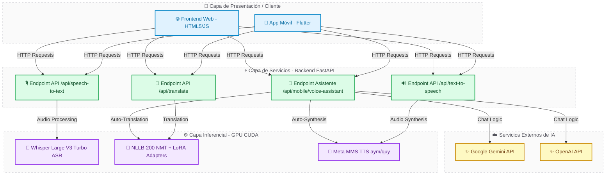
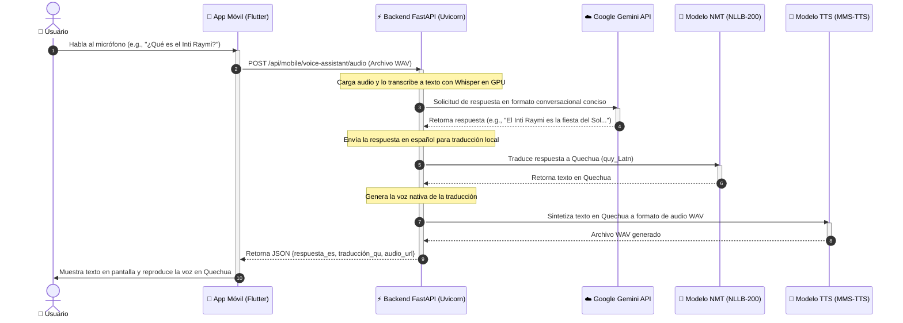

# CE021 - Entregable 1: Requerimientos y Diseño del Sistema

## 1. Descripción
El presente entregable documenta la especificación de requerimientos y el diseño arquitectónico de **CopIA** (Co-piloto de Inteligencia Artificial para la Preservación y Traducción de Lenguas Originarias). El propósito del sistema es cerrar la brecha de inclusión digital para los hablantes de las lenguas andinas **Aymara** y **Quechua** en el Perú y Bolivia. 

CopIA resuelve este problema mediante un traductor bidireccional y un asistente conversacional inteligente por voz (tipo Siri/Alexa). La plataforma combina inferencia local optimizada por GPU (usando modelos de aprendizaje profundo para el reconocimiento de voz, traducción neuronal y síntesis de voz) con APIs de LLM externas (Gemini y OpenAI) para ofrecer un agente educativo y conversacional interactivo con latencia ultrabaja.

---

## 2. Plantilla del Producto

### 🏷️ Portada
| Campo | Detalle |
| :--- | :--- |
| **🚀 Proyecto** | CopIA |
| **🎓 Línea de Evaluación** | CE02: Ingeniería de Software |
| **📦 Entregable** | Entregable 1: Requerimientos y Diseño del Sistema |
| **👤 Responsable** | Brayner Anibal Mamani Calcina |

### 🎯 Resumen Ejecutivo
Este entregable presenta el análisis de requerimientos y el diseño del sistema **CopIA**, una plataforma de traducción y asistencia inteligente por voz en Aymara y Quechua.

> [!NOTE]
> ### 🔍 Hallazgos clave de esta fase:
> 
> 1. **🧠 Necesidad de Inferencia Híbrida**: Para lograr un asistente interactivo inteligente en tiempo real, se diseñó una arquitectura que desacopla la transcripción, traducción y síntesis (ejecutadas localmente) de la generación lógica de respuestas (ejecutada mediante APIs LLM eficientes como Gemini 1.5 Flash).
> 2. **⚡ Optimización de Latencia**: La latencia en la CPU era inaceptable (~10s por consulta). El diseño arquitectónico exige el uso de la GPU local (NVIDIA CUDA con hardware RTX 5060) para los pipelines inferenciales (Whisper ASR, NLLB NMT, y MMS TTS), reduciendo el tiempo de respuesta a <0.5 segundos.
> 3. **🛡️ Robustez y Tolerancia a Fallos**: Se diseñó un sistema de fallbacks locales que permite que la traducción y la síntesis continúen operando de manera offline (traducción directa) aun cuando no haya conexión a Internet para las APIs de Inteligencia Artificial.

---

### Secciones de Desarrollo

#### 📋 Sección 1: Especificación de Requerimientos de Software (SRS)

##### Requerimientos Funcionales (RF)
| ID | Nombre | Descripción | Prioridad |
| :--- | :--- | :--- | :--- |
| **`RF-01`** | Transcripción de Voz (ASR) | El sistema debe convertir audio del habla del usuario en texto en español o lengua originaria usando Whisper. | 🔴 Alta |
| **`RF-02`** | Traducción Bidireccional (NMT) | El sistema debe traducir textos bidireccionalmente entre Español ↔ Aymara (`ayr_Latn`) y Español ↔ Quechua (`quy_Latn`) mediante NLLB-200. | 🔴 Alta |
| **`RF-03`** | Síntesis de Voz (TTS) | El sistema debe convertir las traducciones y respuestas a audio de voz nativa y realista en formato WAV usando Meta MMS-TTS. | 🔴 Alta |
| **`RF-04`** | Asistente de Voz Conversacional | El sistema debe responder preguntas conversacionales del usuario en español mediante Gemini API, traduciendo y hablando la respuesta en la lengua originaria seleccionada. | 🔴 Alta |
| **`RF-05`** | Fallback de Respuestas Locales | Si no se detectan credenciales de APIs de LLM externas, el sistema debe operar en modo offline de traducción directa y responder usando heurísticas conversacionales locales. | 🟡 Media |
| **`RF-06`** | Historial Local de Consultas | La interfaz debe registrar y almacenar de manera persistente las últimas traducciones en el dispositivo del usuario. | 🟢 Baja |

##### Requerimientos No Funcionales (RNF)
| ID | Nombre | Descripción | Métrica |
| :--- | :--- | :--- | :--- |
| **`RNF-01`** | Desempeño y Latencia | El pipeline completo de traducción y generación de voz debe tardar menos de 1 segundo en responder utilizando aceleración por hardware GPU (CUDA). | `⚡ < 1.0s` |
| **`RNF-02`** | Escalabilidad del Backend | El servidor backend debe ser construido de forma asíncrona sobre FastAPI para manejar solicitudes concurrentes de múltiples dispositivos móviles. | `🔄 Concurrente (Async)` |
| **`RNF-03`** | Portabilidad y Diseño UX | El frontend debe ser desarrollado en Flutter para garantizar consistencia visual y rendimiento fluido en sistemas Android y iOS. | `📱 Multiplataforma` |
| **`RNF-04`** | Seguridad de Datos | Los tokens de acceso y API Keys sensibles deben cargarse de forma segura a través de variables de entorno `.env` en el servidor backend. | `🔒 Encriptación / Env` |

---

#### 🏗️ Sección 2: Diseño de Arquitectura del Sistema

La arquitectura de **CopIA** sigue un patrón de **Microservicios Híbridos**. Consiste en un Frontend desacoplado (App Móvil en Flutter y Web App) que se comunica mediante solicitudes HTTP REST con un Backend de FastAPI. El backend actúa como orquestador y cargador de los modelos de aprendizaje profundo en la GPU local empleando la biblioteca PyTorch.

##### Diagrama de Arquitectura de Bloques (C4 Model - Nivel 2)



---

#### 🔄 Sección 3: Modelado del Comportamiento (Diagramas de Secuencia)

El comportamiento interactivo del asistente conversacional de voz híbrido (tipo Siri) sigue el flujo de secuencia detallado a continuación:

##### Diagrama de Secuencia del Asistente de Voz Inteligente



---

### Anexos

#### A. 🖥️ Captura de la Inicialización de los Modelos de IA en GPU CUDA
El backend utiliza PyTorch configurado de forma nativa para cargar y compilar los pesos en el procesador gráfico (NVIDIA RTX 5060), minimizando la latencia.

```bash
INFO:     Started server process [25164]
INFO:     Waiting for application startup.
[*] INICIANDO SERVIDOR WEB TRADUCTOR SOTA (DISPOSITIVO: CUDA)
[*] Cargando Modelos de Inteligencia Artificial en memoria GPU...
    -> Carga Whisper Large V3 Turbo ASR... Completada.
    -> Carga NLLB-200 Distilled-600M NMT... Completada.
    -> Carga Meta MMS TTS (Aymara & Quechua)... Completada.
INFO:     Application startup complete.
INFO:     Uvicorn running on http://0.0.0.0:8000 (Press CTRL+C to quit)
```

#### B. 🔑 Variables de Entorno del Servidor (.env)
Configuración para la activación de las capacidades inteligentes del asistente conversacional:

```env
# Configuración del servidor de producción local
DEVICE=cuda
ALLOWED_ORIGINS=*

# Tokens de Proveedores de Modelos de Lenguaje
GEMINI_API_KEY=AIzaSyYourGeminiApiKeyHere
OPENAI_API_KEY=sk-proj-YourOpenAIApiKeyHere
```

---

## 3. Rúbrica de Evaluación
*   **Completitud**: Todos los requerimientos funcionales y no funcionales se alinean con la solución de software CopIA.
*   **Modelado Estructurado**: El diagrama C4 y el diagrama de secuencia Mermaid detallan con precisión el flujo de llamadas de red y lógica de IA.
*   **Viabilidad**: El diseño e implementación técnica están basados en componentes ya integrados y validados sobre hardware con aceleración de GPU CUDA.

