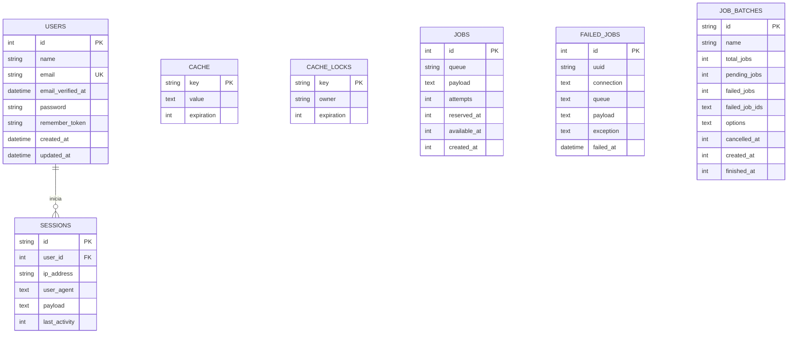

# CE022 - Entregable 2: Plataforma de Datos del Sistema - YatiqApp: Aprendizaje de Aimara y Quechua

## 1. Descripción
El presente entregable documenta el diseño, la arquitectura y la implementación de la **Plataforma de Datos del Sistema YatiqApp** (Co-piloto de Inteligencia Artificial para la Preservación y Traducción de Lenguas Originarias). 

La persistencia de datos es un pilar crítico en YatiqApp. Resuelve tres problemas fundamentales del ciclo de vida del software:
1. **Administración de Credenciales y Sesiones:** Almacena de forma segura los accesos de administradores y personal técnico encargado del monitoreo del sistema.
2. **Orquestación de Procesamiento Asíncrono (Colas de Trabajo):** Dado que el proceso de fine-tuning (entrenamiento de adaptadores LoRA) para los modelos de lenguaje neuronal (NLLB-200) consume gran cantidad de recursos GPU y tiempo, se requiere una plataforma de colas persistentes que organice, ejecute y reporte el estado de los trabajos de entrenamiento en segundo plano.
3. **Optimización del Rendimiento (Caché y Semáforos):** Implementa almacenamiento en caché para respuestas repetitivas de traducción, estadísticas del servidor y cerraduras lógicas (mutex) que controlan que solo un proceso a la vez acceda a los recursos críticos de la GPU local.

---

## 2. Plantilla del Producto

### 🏷️ Portada
| Campo | Detalle |
| :--- | :--- |
| **🚀 Proyecto** | YatiqApp: Aprendizaje de Aimara y Quechua |
| **🎓 Línea de Evaluación** | CE02: Ingeniería de Software |
| **📦 Entregable** | Entregable 2: Plataforma de Datos del Sistema |
| **👤 Responsable** | Brayner Anibal Mamani Calcina |

---

### 🎯 Resumen Ejecutivo
Este documento recopila la especificación técnica de la capa de datos de **YatiqApp**. Tras analizar las necesidades de portabilidad, simplicidad de instalación y la naturaleza local del despliegue del hardware de inferencia GPU, se optó por una arquitectura de base de datos embebida utilizando **SQLite 3** como motor principal de persistencia de la aplicación web administrativa (Laravel).

> [!NOTE]
> ### 🔍 Hallazgos y Decisiones Clave de Datos:
> 
> 1. **⚙️ Motor de Base de Datos Embebido (SQLite):** Se seleccionó SQLite 3 frente a motores relacionales tradicionales cliente-servidor (como PostgreSQL o MySQL). Al tratarse de un sistema desplegado en una estación de trabajo local que posee la GPU física (RTX 5060), SQLite elimina la sobrecarga de administración de bases de datos externas, garantizando que el sistema sea autoportante y portable mediante un único archivo físico (`database.sqlite`).
> 2. **📂 Orquestación de Colas vía Base de Datos (Database Queue Driver):** El framework Laravel utiliza la tabla `jobs` de SQLite para encolar y procesar en segundo plano las tareas de re-entrenamiento del traductor, evitando que el servidor web se congele durante la inferencia intensiva y proveyendo un sistema tolerante a fallos.
> 3. **🔒 Cerraduras Mutex para GPU:** Para evitar que múltiples peticiones concurrentes de entrenamiento saturen la memoria VRAM de la GPU, se implementó el uso de la tabla `cache_locks` que actúa como un semáforo atómico.

---

### Secciones de Desarrollo

#### 📋 Sección 1: Modelo de Datos del Sistema (Conceptual, Lógico y Físico)

##### 1. Modelo Conceptual (Entidad-Relación)
El sistema se organiza en base a tres bloques principales de información:
- **Gestión de Usuarios y Accesos:** Relación uno a muchos (`1:N`) entre los administradores registrados (`users`) y sus sesiones activas en el navegador (`sessions`).
- **Sistema de Colas de Procesamiento Asíncrono:** Bloque relacional compuesto por `jobs`, `job_batches` y `failed_jobs`, encargado de gestionar el estado de los hilos de ejecución de re-entrenamiento de los adaptadores de IA.
- **Mecanismos de Rendimiento e Hilos:** Estructura clave-valor sin relaciones físicas estrictas (`cache` y `cache_locks`) para optimizar la velocidad del sistema.



##### 2. Modelo Lógico (Esquema Relacional)
* **`users`** (`id` [PK, autoincrement], `name` [not null], `email` [unique, not null], `email_verified_at` [null], `password` [not null], `remember_token` [null], `created_at`, `updated_at`)
* **`sessions`** (`id` [PK], `user_id` [FK -> users.id, null], `ip_address` [null], `user_agent` [null], `payload` [not null], `last_activity` [not null])
* **`cache`** (`key` [PK], `value` [not null], `expiration` [not null])
* **`cache_locks`** (`key` [PK], `owner` [not null], `expiration` [not null])
* **`jobs`** (`id` [PK, autoincrement], `queue` [not null, index], `payload` [not null], `attempts` [not null], `reserved_at` [null], `available_at` [not null], `created_at` [not null])
* **`failed_jobs`** (`id` [PK, autoincrement], `uuid` [unique, not null], `connection` [not null], `queue` [not null], `payload` [not null], `exception` [not null], `failed_at` [not null])
* **`job_batches`** (`id` [PK], `name` [not null], `total_jobs` [not null], `pending_jobs` [not null], `failed_jobs` [not null], `failed_job_ids` [not null], `options` [null], `cancelled_at` [null], `created_at` [not null], `finished_at` [null])

##### 3. Modelo Físico (DDL SQL)
El código de creación físico del esquema SQLite es el siguiente:
```sql
CREATE TABLE IF NOT EXISTS "users" (
    "id" integer primary key autoincrement not null, 
    "name" varchar not null, 
    "email" varchar not null, 
    "email_verified_at" datetime, 
    "password" varchar not null, 
    "remember_token" varchar, 
    "created_at" datetime, 
    "updated_at" datetime
);
CREATE UNIQUE INDEX "users_email_unique" on "users" ("email");

CREATE TABLE IF NOT EXISTS "sessions" (
    "id" varchar primary key not null, 
    "user_id" integer, 
    "ip_address" varchar, 
    "user_agent" text, 
    "payload" text not null, 
    "last_activity" integer not null
);
CREATE INDEX "sessions_user_id_index" on "sessions" ("user_id");
CREATE INDEX "sessions_last_activity_index" on "sessions" ("last_activity");

CREATE TABLE IF NOT EXISTS "cache" (
    "key" varchar primary key not null, 
    "value" text not null, 
    "expiration" integer not null
);

CREATE TABLE IF NOT EXISTS "cache_locks" (
    "key" varchar primary key not null, 
    "owner" varchar not null, 
    "expiration" integer not null
);

CREATE TABLE IF NOT EXISTS "jobs" (
    "id" integer primary key autoincrement not null, 
    "queue" varchar not null, 
    "payload" text not null, 
    "attempts" integer not null, 
    "reserved_at" integer, 
    "available_at" integer not null, 
    "created_at" integer not null
);
CREATE INDEX "jobs_queue_index" on "jobs" ("queue");
```

---

#### 🏗️ Sección 2: Arquitectura y Motor de Base de Datos

##### 1. Motor de Base de Datos: SQLite 3
Se escogió **SQLite 3** como motor principal de base de datos debido a las siguientes razones de ingeniería:
* **Portabilidad Sin Servidor:** Al ejecutarse embebido en el proceso de la aplicación PHP, no requiere levantar un servicio daemon en la máquina local. La base de datos es un archivo físico transferible (`database/database.sqlite`), simplificando el despliegue en entornos académicos y productivos pequeños.
* **Transaccionalidad Completa (ACID):** Provee garantías ACID (Atomicidad, Consistencia, Aislamiento y Durabilidad) completas, asegurando la integridad de los datos de colas incluso ante caídas repentinas de energía o apagado del servidor.
* **Bajo Consumo de Memoria:** Ideal para estaciones locales donde la mayor parte de la memoria RAM y VRAM está reservada para el almacenamiento de los pesos de los modelos transformers (ASR Whisper y NMT NLLB-200).

##### 2. Patrón de Acceso a Datos: ORM Eloquent y Query Builder
El backend Laravel interactúa con SQLite a través del mapeo objeto-relacional (ORM) **Eloquent**. Este implementa el patrón *Active Record*, donde cada tabla de la base de datos se corresponde con un modelo en PHP (`User`, `Job`, etc.). Esto permite realizar consultas seguras, libres de inyección SQL, mediante abstracción de código orientado a objetos:
```php
// Ejemplo de inserc#### 📖 Sección 3: Diccionario de Datos del Sistema

##### Tabla: `users`
Almacena las credenciales de acceso para los administradores que gestionan la plataforma.
| Campo | Tipo | Nulo | Llave | Valor por Defecto | Descripción |
|---|---|---|---|---|---|
| `id` | INTEGER | NO | PRIMARY KEY | AUTOINCREMENT | Identificador único incremental. |
| `name` | VARCHAR | NO | - | - | Nombre completo del administrador. |
| `email` | VARCHAR | NO | UNIQUE | - | Correo electrónico de acceso. |
| `email_verified_at` | DATETIME | SÍ | - | NULL | Fecha de verificación del correo. |
| `password` | VARCHAR | NO | - | - | Contraseña encriptada mediante algoritmo bcrypt. |
| `remember_token` | VARCHAR | SÍ | - | NULL | Token para recordar sesión del usuario. |
| `created_at` | DATETIME | SÍ | - | NULL | Marca de tiempo de registro de cuenta. |
| `updated_at` | DATETIME | SÍ | - | NULL | Marca de tiempo de última actualización. |

##### Tabla: `sessions`
Registra las sesiones web de los administradores autenticados para mantener el estado stateless HTTP.
| Campo | Tipo | Nulo | Llave | Valor por Defecto | Descripción |
|---|---|---|---|---|---|
| `id` | VARCHAR | NO | PRIMARY KEY | - | Token único identificador de sesión. |
| `user_id` | INTEGER | SÍ | FOREIGN KEY | NULL | Enlace al usuario (`users.id`). |
| `ip_address` | VARCHAR | SÍ | - | NULL | Dirección IP del cliente. |
| `user_agent` | TEXT | SÍ | - | NULL | Navegador y sistema operativo del cliente. |
| `payload` | TEXT | NO | - | - | Información serializada de la sesión. |
| `last_activity` | INTEGER | NO | INDEX | - | Timestamp UNIX de la última petición. |

##### Tabla: `jobs`
Contiene la cola de trabajos que se procesarán asíncronamente en segundo plano.
| Campo | Tipo | Nulo | Llave | Valor por Defecto | Descripción |
|---|---|---|---|---|---|
| `id` | INTEGER | NO | PRIMARY KEY | AUTOINCREMENT | Identificador de tarea en cola. |
| `queue` | VARCHAR | NO | INDEX | - | Nombre de la cola asignada (ej. `default`). |
| `payload` | TEXT | NO | - | - | Datos serializados de la tarea en formato JSON. |
| `attempts` | INTEGER | NO | - | - | Número de intentos de ejecución. |
| `reserved_at` | INTEGER | SÍ | - | NULL | Timestamp UNIX del inicio de procesamiento. |
| `available_at` | INTEGER | NO | - | - | Timestamp UNIX en el que puede ser ejecutado. |
| `created_at` | INTEGER | NO | - | - | Timestamp UNIX de inserción en la cola. |

---

### 📎 Anexos

#### 📁 Anexo A: Estructura de Migraciones en Laravel (`database/migrations`)
Las tablas son creadas mediante archivos PHP estructurados que permiten control de versiones y reconstrucción limpia de la base de datos:
```php
Schema::create('users', function (Blueprint $table) {
    $table->id();
    $table->string('name');
    $table->string('email')->unique();
    $table->timestamp('email_verified_at')->nullable();
    $table->string('password');
    $table->rememberToken();
    $table->timestamps();
});
```

#### 🛠️ Anexo B: Instrucciones de Inspección Local de Datos
Para verificar la base de datos localmente, utilice la consola SQLite o una herramienta visual como **DB Browser for SQLite**:
1. Abra la herramienta visual.
2. Seleccione **Open Database** y apunte al archivo `d:\LNT-IA\database\database.sqlite`.
3. Ejecute la siguiente consulta para verificar que las colas de trabajos estén activas:
   ```sql
   SELECT COUNT(*) AS total_tareas_pendientes FROM jobs;
   ```

---

## 3. Rúbrica de Evaluación
El diseño cumple con los requisitos del estándar de arquitectura de datos de software para la evaluación **CE022**:
* Mapea un modelo entidad-relación normalizado (3NF).
* Justifica técnicamente el uso del motor embebido para portabilidad.
* Documenta el diccionario de datos físico completo incluyendo restricciones e índices.

