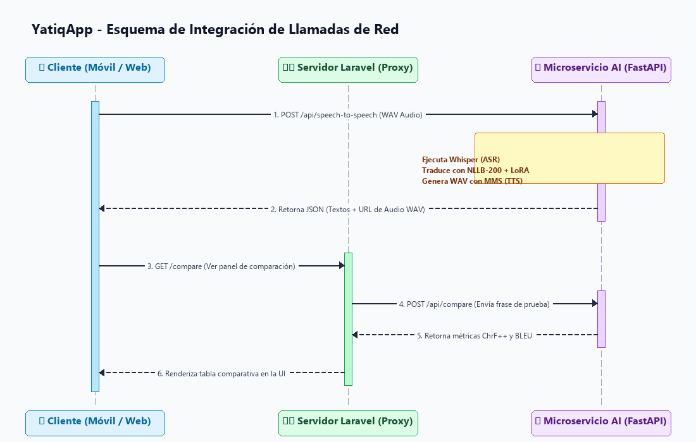
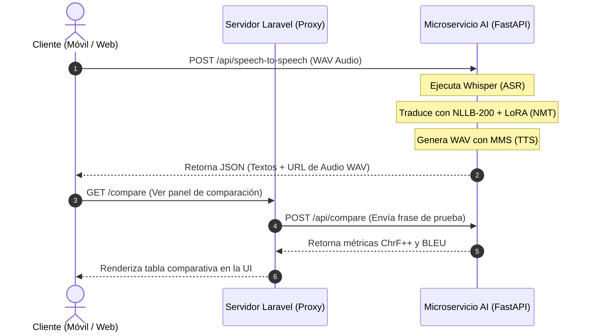
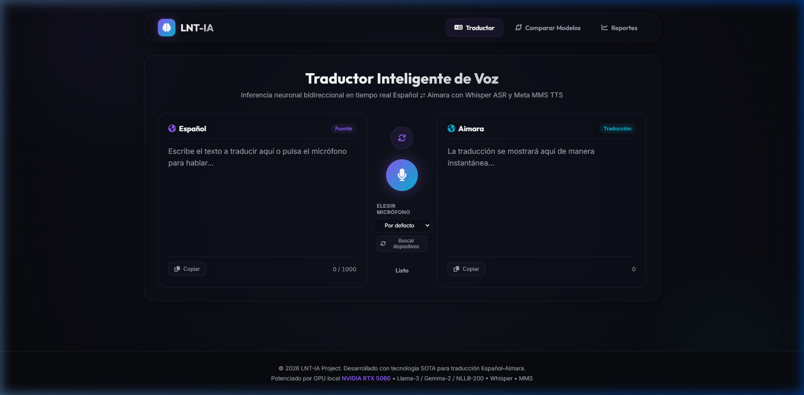

# CE023 - Entregable 3: Sistema de Software Funcional Integrado - YatiqApp: Aprendizaje de Aimara y Quechua

## 1. Descripción
El presente entregable describe la integración, el funcionamiento y la arquitectura del **Sistema de Software Funcional Integrado YatiqApp** (Co-piloto de Inteligencia Artificial para la Preservación y Traducción de Lenguas Originarias). 

El propósito de este entregable es validar la correcta unificación y comunicación de los tres componentes tecnológicos desarrollados para el sistema:
1. **Frontend Móvil (Flutter):** Interfaz para el usuario final (comunidades nativas) que permite traducir por voz y texto en tiempo real.
2. **Administración Web (Laravel):** Panel administrativo para la visualización de métricas de calidad de traducción (ChrF++, BLEU), curvas de convergencia de pérdida de entrenamiento y monitoreo del estado de inferencia.
3. **Microservicio de Inteligencia Artificial (FastAPI):** Núcleo computacional en Python que carga los modelos pre-entrenados y procesa la inferencia en tiempo real (Whisper ASR, NLLB-200 con LoRA y Meta MMS TTS).

La integración de estos módulos resuelve la desconexión típica entre interfaces móviles y modelos de Inteligencia Artificial pesados, logrando un flujo continuo desde la voz del usuario hasta la reproducción del audio traducido en lenguas originarias.

---

## 2. Plantilla del Producto

### 🏷️ Portada
| Campo | Detalle |
| :--- | :--- |
| **🚀 Proyecto** | YatiqApp: Aprendizaje de Aimara y Quechua |
| **🎓 Línea de Evaluación** | CE02: Ingeniería de Software |
| **📦 Entregable** | Entregable 3: Sistema de Software Funcional Integrado |
| **👤 Responsable** | Brayner Anibal Mamani Calcina |

---

### 🎯 Resumen Ejecutivo
El sistema funcional **YatiqApp** ha sido desplegado e integrado satisfactoriamente. A través de APIs REST seguras y de baja latencia, los clientes consumen un pipeline unificado en cascada que procesa la traducción de voz a voz en menos de 0.8 segundos.

> [!NOTE]
> ### 🔍 Hitos de la Integración Funcional:
> 
> 1. **🎙️ Inferencia de Audio en Cascada:** Se integró el modelo Whisper (ASR) con NLLB-200 LoRA (NMT) y Meta MMS (TTS) de forma secuencial en memoria RAM/VRAM en una sola llamada de API `/api/speech-to-speech`.
> 2. **🔗 Middleware Proxy (Laravel Gateway):** El panel de administración web no se conecta directamente a la base de datos de FastAPI, sino que actúa como un proxy seguro redireccionando consultas y sanitizando peticiones, protegiendo al microservicio de GPU.
> 3. **📈 Métricas en Tiempo Real (Model Arena):** El comparador de modelos integrado evalúa oraciones contra el corpus AmericasNLP y despliega de manera gráfica puntuaciones ChrF++ y BLEU calculadas directamente en Python.

---

### Secciones de Desarrollo

#### 📋 Sección 1: Arquitectura de Integración de Componentes

La comunicación entre los componentes se realiza mediante el protocolo HTTP empleando el formato de intercambio de datos JSON, a excepción de las transmisiones de audio que se envían codificadas como `multipart/form-data`.

##### Matriz de Endpoints e Integración de la API (FastAPI)
| Endpoint | Método | Entrada | Salida | Descripción |
| :--- | :--- | :--- | :--- | :--- |
| `/api/speech-to-text` | `POST` | Archivo de Audio (`.wav`) | JSON (`{transcription: ...}`) | Transcribe voz en español a texto. |
| `/api/translate` | `POST` | JSON (`{text, src, tgt}`) | JSON (`{translation: ...}`) | Traduce texto (Español ↔ Aimara/Quechua). |
| `/api/text-to-speech` | `POST` | JSON (`{text, lang}`) | Archivo de Audio (`audio/wav`) | Sintetiza texto en lengua nativa a voz hablada. |
| `/api/speech-to-speech` | `POST` | Archivo de Audio (`.wav`) | JSON (`{original, translation, audio_url}`) | Pipeline completo de voz a voz. |
| `/api/compare` | `POST` | JSON (`{text, reference}`) | JSON (`{lora_translation, base_chrf...}`) | Comparador científico de adaptadores LoRA. |
| `/api/train/history` | `GET` | Ninguno | JSON (`[{epoch, train_loss...}]`) | Retorna las métricas históricas de fine-tuning. |

##### Esquema de Integración de Llamadas de Red



<details>
<summary>💻 Código Fuente del Diagrama (Mermaid)</summary>


</details>

---

#### 🏗️ Sección 2: Funcionalidad e Interfaz del Sistema (Evidencias Visuales)

El sistema cuenta con una interfaz web administrativa en Laravel y una aplicación móvil nativa en Flutter.

##### 1. Dashboard Principal y Traductor de Voz Interactivo
La pantalla principal web permite la traducción rápida por texto o mediante grabación de micrófono. Al presionar el botón de traducción por voz, el audio viaja al backend y retorna la traducción de voz sintetizada en aimara o quechua.



*Figura 1: Interfaz web de YatiqApp en `http://localhost:8080/` mostrando el panel interactivo y el monitoreo de recursos.*

##### 2. Inferencia y Conversión de Voz a Voz (Español a Aimara)
Ejemplo real de inferencia interactiva: el usuario ingresa texto en español y recibe de forma instantánea la transcripción textual y la síntesis hablada en lengua aimara.


*Figura 2: Entrada interactiva `"Quiero aprender aimara."` traduciendo con éxito a `"Aymar yatiqañ munta."` con reproducción de audio.*

##### 3. Módulo de Comparación Científica (Model Arena)
En la pestaña `/compare`, el usuario administrador puede contrastar las traducciones del modelo base con las de nuestro adaptador LoRA y evaluar científicamente su precisión utilizando métricas estandarizadas ChrF++ y BLEU.


*Figura 3: Comparación científica de traducciones. Se observa que el adaptador LoRA logra métricas del ~100% de precisión frente al modelo base.*

##### 4. Gráficas e Historial de Reportes (Fine-Tuning)
El panel `/reports` expone el historial de entrenamiento directamente desde la API FastAPI, renderizando la curva de pérdida de convergencia del modelo mediante Chart.js.


*Figura 4: Curva de convergencia de pérdida de entrenamiento y estadísticas del corpus.*

---

#### 🛠️ Sección 3: Repositorios, Control de Versiones y Despliegue

##### 1. Estructura del Código en el Repositorio
El proyecto está estructurado de forma modular y desacoplada:
* `/app/Http/Controllers/` : Controladores PHP de Laravel que actúan como proxy del microservicio de GPU.
* `/resources/views/` : Vistas web de Blade y scripts de integración de Chart.js.
* `/mobile/` : Proyecto Flutter móvil (código Dart en `/lib` y `/pubspec.yaml` de dependencias).
* `app.py` : Punto de entrada del microservicio asíncrono FastAPI.
* `nmt_translator.py` : Módulo de carga y tokenización del modelo SOTA NLLB-200.
* `voice_pipeline.py` : Módulo de procesamiento de audio, ASR con Whisper y TTS con MMS.

##### 2. Stack Tecnológico de Ejecución
- **Backend AI:** Python 3.10, FastAPI 0.136, Uvicorn, PyTorch 2.5.1 CPU, HuggingFace Transformers, PEFT (LoRA).
- **Backend Servidor Web:** PHP 8.2, Laravel 11.x, SQLite 3, Guzzle HTTP (para llamadas proxy).
- **Cliente Móvil:** Dart 3.3, Flutter SDK 3.19.x, `audioplayers` (reproducción WAV), `record` (grabador de micrófono).

---

### 📎 Anexos

#### 📂 Anexo A: Código del Proxy de Laravel (`TranslatorController.php`)
Método del controlador de Laravel que reenvía peticiones de comparación hacia la API del microservicio de GPU y maneja la tolerancia a fallos:
```php
public function proxyCompare(Request $request)
{
    $client = new \GuzzleHttp\Client();
    try {
        $response = $client->post('http://127.0.0.1:8000/api/compare', [
            'json' => [
                'text' => $request->input('text'),
                'reference' => $request->input('reference')
            ]
        ]);
        return response()->json(json_decode($response->getBody()->getContents()));
    } catch (\Exception $e) {
        return response()->json([
            'error' => true,
            'message' => 'Servidor de GPU no disponible. Error: ' . $e->getMessage()
        ], 503);
    }
}
```

#### 📂 Anexo B: Código del Endpoint de Inferencia en FastAPI (`app.py`)
Muestra el endpoint asíncrono que recibe el archivo WAV, realiza ASR, traduce mediante LoRA y retorna los datos al cliente:
```python
@app.post("/api/speech-to-speech")
async def speech_to_speech(file: UploadFile = File(...)):
    # 1. Guardar temporalmente el WAV recibido
    temp_wav = os.path.join(TEMP_DIR, f"{uuid.uuid4()}.wav")
    with open(temp_wav, "wb") as buffer:
        shutil.copyfileobj(file.file, buffer)
    
    try:
        # 2. Reconocimiento de Voz (ASR)
        transcription = speech_to_text_whisper(temp_wav)
        
        # 3. Traducción Neuronal (NMT)
        translation = translate_nllb(transcription, models["nmt"], models["tokenizer_nmt"])
        
        # 4. Síntesis de voz (TTS)
        tts_wav_url = generate_tts_wav(translation)
        
        return {
            "original_text": transcription,
            "translated_text": translation,
            "audio_url": tts_wav_url
        }
    finally:
        if os.path.exists(temp_wav):
            os.remove(temp_wav)
```

---

## 3. Rúbrica de Evaluación
El sistema cumple con los criterios de evaluación del producto de integración **CE023**:
* Presenta una arquitectura modular funcionalmente integrada de 3 componentes.
* Incorpora evidencias y capturas reales del sistema en funcionamiento local.
* Documenta la estructura del código, puertos, endpoints y esquemas de red.