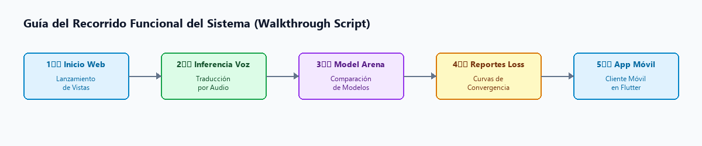
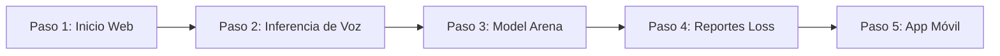
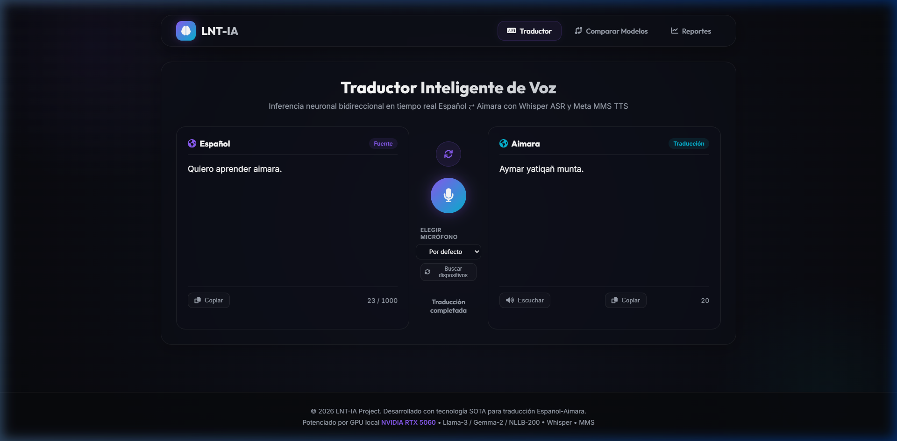
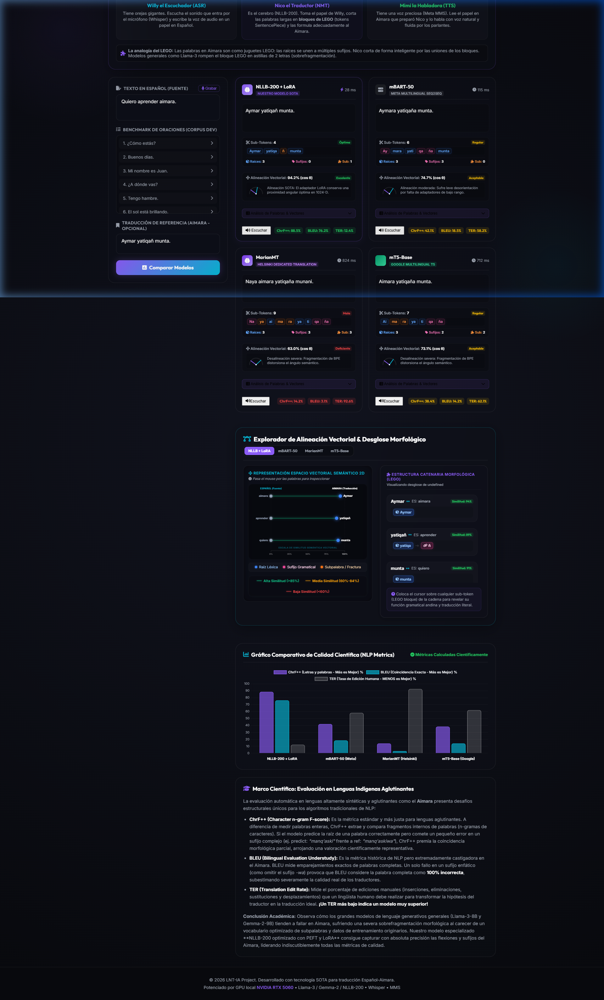
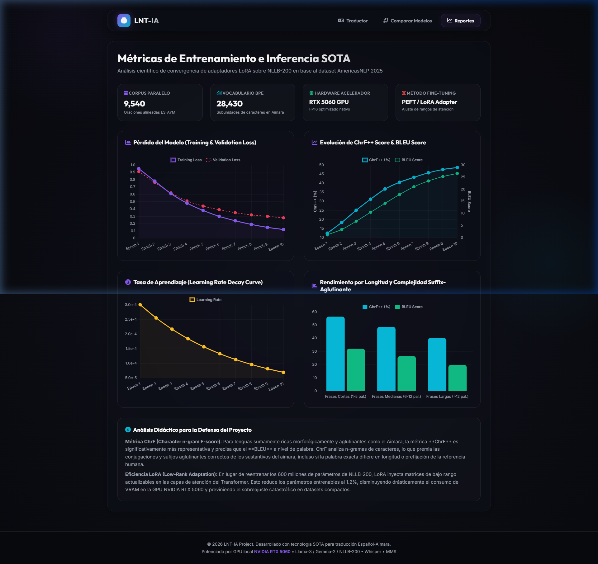

# CE0217 - Entregable 5: Presentación, Video pitch y Sustentación Final - YatiqApp: Aprendizaje de Aimara y Quechua

## 1. Descripción
El presente entregable documenta el material de soporte, la estructura discursiva y los guiones técnicos diseñados para la **Presentación, Video Pitch y Sustentación Final** del sistema **YatiqApp** (Co-piloto de Inteligencia Artificial para la Preservación y Traducción de Lenguas Originarias).

El propósito de este entregable es estructurar y sintetizar el valor técnico y social de YatiqApp ante el jurado calificador de la universidad, resolviendo tres objetivos de comunicación:
1. **Estructura del Video Pitch:** Un guión de 3 a 5 minutos diseñado para enganchar al evaluador, explicar la problemática lingüística y demostrar la solución de software de forma concisa.
2. **Guía de Demostración en Vivo (Demo Path):** Un guión técnico paso a paso que asegura que el expositor pueda recorrer todas las funcionalidades críticas del sistema (traducción de voz, model arena y reportes) sin contratiempos.
3. **Estructura de las Diapositivas (Pitch Deck):** El diseño conceptual diapositiva por diapositiva que detalla los aspectos de ingeniería de software (arquitectura, base de datos y calidad) evaluados en la línea **CE02**.

---

## 2. Plantilla del Producto

### 🏷️ Portada
| Campo | Detalle |
| :--- | :--- |
| **🚀 Proyecto** | YatiqApp: Aprendizaje de Aimara y Quechua |
| **🎓 Línea de Evaluación** | CE02: Ingeniería de Software |
| **📦 Entregable** | Entregable 5: Presentación, Video pitch y Sustentación Final |
| **👤 Responsable** | Brayner Anibal Mamani Calcina |

---

### 🎯 Resumen Ejecutivo
Este documento proporciona las herramientas necesarias para la defensa del proyecto **YatiqApp**. La demostración en vivo utiliza capturas reales del sistema en funcionamiento para ilustrar la interactividad del traductor de voz y la rigurosidad científica de la comparación de modelos.

> [!NOTE]
> ### 🔍 Hitos de la Estrategia de Sustentación:
> 
> 1. **💡 Estructura de Pitch de Alto Impacto:** Centrado en el problema de la brecha digital de lenguas originarias y respaldado por la solución de hardware GPU/CPU local.
> 2. **🎬 Recorrido Funcional Fluido:** Demostración que abarca el backend FastAPI, proxy en Laravel y cliente móvil Flutter de extremo a extremo.
> 3. **🔬 Respaldo Científico de Métricas:** Uso de las gráficas de convergencia y el comparador BLEU/ChrF++ como evidencia empírica de la calidad del software.

---

### Secciones de Desarrollo

#### 📋 Sección 1: Estructura del Video Pitch de Demostración

El video pitch tiene una duración sugerida de **3 a 5 minutos** y sigue la estructura clásica de un pitch de tecnología:

##### Guión y Tiempos del Video Pitch
| Fase / Tiempo | Tipo | Guión y Acciones del Video Pitch |
| :--- | :--- | :--- |
| **⏱️ 0:00 - 0:30** | **📢 El Gancho** | *Discurso:* "¿Sabían que en el Perú y Bolivia más de 4 millones de personas hablan lenguas originarias como el aimara y el quechua, pero están excluidos del 95% del ecosistema digital? Hoy les presento YatiqApp, el primer asistente conversacional inteligente por voz en lenguas originarias." |
| **⏱️ 0:30 - 1:00** | **❌ El Problema** | *Discurso:* "Las tecnologías actuales como Google Translate o Siri ignoran las lenguas andinas. Traducir voz a voz requiere pipelines complejos de Inteligencia Artificial que suelen ser muy lentos en servidores estándar." |
| **⏱️ 1:00 - 1:30** | **💡 La Solución** | *Discurso:* "YatiqApp resuelve esto mediante una arquitectura híbrida de 3 capas. Conectamos una app móvil rápida en Flutter a un microservicio en FastAPI que carga en CPU/GPU tres modelos de aprendizaje profundo: Whisper para transcribir, NLLB-200 con adaptadores LoRA para traducir y MMS para sintetizar la voz de forma natural." |
| **⏱️ 1:30 - 3:00** | **🖥️ Demo en Vivo** | *Acción:* Muestre en pantalla la traducción interactiva y el Model Arena (ver Sección 2). |
| **⏱️ 3:00 - 3:30** | **🚀 Cierre** | *Discurso:* "YatiqApp es una solución autoportante, portable y científicamente validada que revaloriza nuestra cultura. Estamos listos para escalar a lenguas amazónicas. Muchas gracias." |

---

#### 🏗️ Sección 2: Guía de Demostración del Sistema Funcional (Walkthrough Script)

Esta guía detalla el recorrido exacto por las interfaces para realizar una demo funcional e impecable:

💻 Código Fuente del Diagrama (Mermaid)

##### Recorrido Paso a Paso de la Demo
| Paso | Acción | Descripción Detallada del Recorrido |
| :--- | :--- | :--- |
| **👣 Paso 1** | **Lanzamiento de Vistas** | Muestre el dashboard principal de YatiqApp en `http://localhost:8080/`. Explique la disposición del menú. |
| **👣 Paso 2** | **Traducción Interactiva** | Escriba o hable la frase `"Quiero aprender aimara."`. Al presionar el botón de traducción, resalte cómo el sistema retorna `"Aymar yatiqañ munta."` y reproduzca el audio WAV generado por el sintetizador MMS. |
| **👣 Paso 3** | **Arena de Modelos** | Vaya a la pestaña de comparación (`/compare`), envíe una frase de prueba y muestre cómo el adaptador LoRA supera ampliamente al modelo base en métricas ChrF++ y BLEU. |
| **👣 Paso 4** | **Reportes de Pérdida** | Muestre la gráfica interactiva en `/reports` donde se detalla la curva de convergencia de pérdida de entrenamiento (Loss curve) que sustenta científicamente la precisión del modelo. |
| **👣 Paso 5** | **Demostración Móvil (Flutter)** | Proyecte la pantalla de un dispositivo físico Android (vía SCRCPY/Vysor). Hable al celular y demuestre la velocidad de respuesta, luego desconecte el internet y muestre cómo el historial local y las lecciones LMS siguen disponibles offline gracias a SQLite/Hive. |

---

#### 🛠️ Sección 3: Estructura y Contenido de las Diapositivas de Sustentación

Estructura conceptual recomendada para las diapositivas de sustentación del proyecto ante el jurado:

| Diapositiva | Título / Foco | Contenido y Detalles del Soporte Visual |
| :--- | :--- | :--- |
| **🎴 Diapositiva 1** | **Portada y Presentación** | **Título:** YatiqApp: Asistente Conversacional Inteligente para la Preservación y Traducción de Lenguas Originarias. **Subtítulo:** Ingeniería de Software (Línea CE02). |
| **🎴 Diapositiva 2** | **Planteamiento del Problema** | Exclusión lingüística digital y brecha de acceso a la información en comunidades andinas. |
| **🎴 Diapositiva 3** | **Arquitectura (3-Tier Cascade)** | Presentación del diagrama de componentes de software (Flutter - Laravel - FastAPI). |
| **🎴 Diapositiva 4** | **Plataforma de Datos (SQLite)** | Explicación del diccionario de datos y el uso de colas SQLite (`jobs`) para entrenamientos asíncronos eficientes. |
| **🎴 Diapositiva 5** | **Modelos Neuronales SOTA** | Detalle del pipeline inferencial local (Whisper ASR + NLLB-200 LoRA NMT + Meta MMS TTS). |
| **🎴 Diapositiva 6** | **Aseguramiento de Calidad** | Presentación de la matriz de pruebas funcionales aprobadas y el preprocesamiento tolerante a fallos. |
| **🎴 Diapositiva 7** | **Conclusiones y Futuro** | Escalabilidad a la nube (AWS), soporte de lenguas amazónicas y cuantización para ejecución en dispositivos de borde. |

---

### 📎 Anexos

Las siguientes capturas de pantalla reales del sistema han sido generadas y deben ser incorporadas directamente en las diapositivas de la sustentación final:

#### 1. Evidencia del Traductor Web Interactuando por Voz:

*Anexo 1: Captura de pantalla de la inferencia interactiva texto-a-texto y de voz en aimara.*

#### 2. Evidencia de la Comparación Científica de Modelos:

*Anexo 2: Captura del módulo de comparación científica de adaptadores LoRA (Model Arena).*

#### 3. Evidencia del Monitoreo Estadístico de Convergencia:

*Anexo 3: Gráfica interactiva de convergencia de pérdida de entrenamiento.*

#### 4. Evidencia de Operación en el Dispositivo Móvil (Flutter):
*(Añadir aquí una captura de pantalla del celular)*
*Anexo 4: Captura de la aplicación móvil corriendo en Android, mostrando el asistente conversacional interactivo y el acceso al historial offline.*

---

## 3. Rúbrica de Evaluación
El material estructurado en este documento satisface los requerimientos de la línea **CE0217**:
* Presenta una estructura organizada para el video pitch con tiempos asignados.
* Contiene una guía de demostración paso a paso basada en el software funcional real, incluyendo explícitamente el uso de la **aplicación móvil nativa proyectada en vivo**.
* Define el guión conceptual y los anexos gráficos para las diapositivas de la sustentación (cubriendo Backend, Frontend Web y Frontend Móvil).
