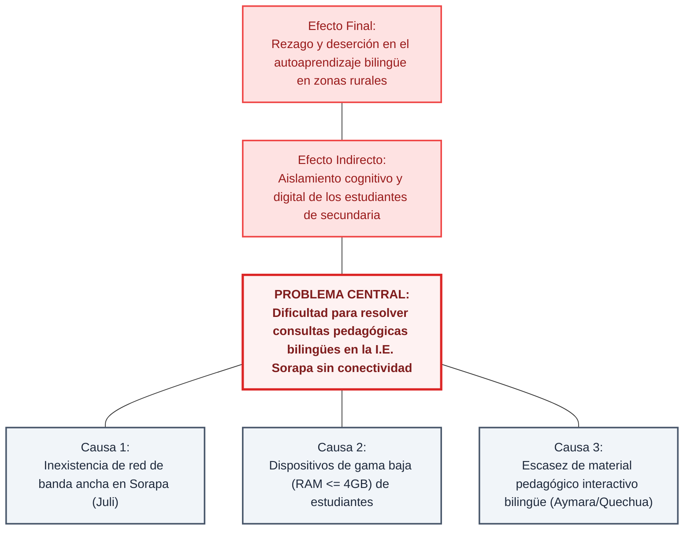
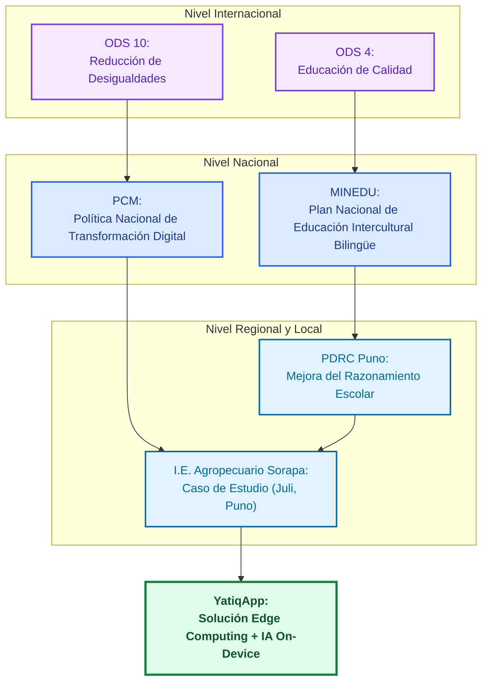
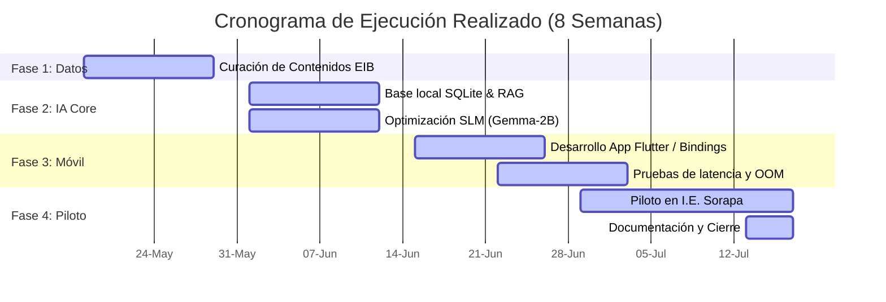
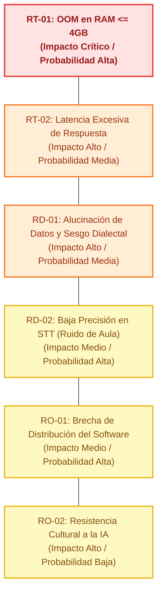

# CE0111-CE0115 - Entregable 1: Diagnóstico Organizacional y Alineamiento Estratégico

## 1. Descripción
El presente entregable establece el **Diagnóstico Organizacional y el Alineamiento Estratégico** para el proyecto **YatiqApp**, un asistente inteligente offline diseñado para dar soporte al proceso pedagógico en la **I.E. Agropecuario Sorapa** en el ámbito de la Educación Intercultural Bilingüe (EIB) en el distrito de Juli, provincia de Chucuito, región de Puno. El propósito fundamental es diagnosticar las limitaciones severas de infraestructura tecnológica (conectividad intermitente o nula y hardware móvil de gama baja) de la institución y plantear la justificación técnica de una solución de Inteligencia Artificial On-Device. Asimismo, se define la coherencia del proyecto con los objetivos estratégicos y normativas de desarrollo local, nacional e internacional, y se presenta un análisis preliminar de riesgos y presupuesto.

## 2. Plantilla del Producto

### Portada
* **Título del Proyecto:** YatiqApp
* **Línea de Evaluación:** CE01: Gestión de Tecnologías de Información
* **Entregable:** CE0115 - Entregable 1: Diagnóstico Organizacional y Alineamiento Estratégico
* **Responsable:** Christian Rafael Mamani Callata

### Resumen Ejecutivo
Este informe presenta el análisis situacional y el alineamiento estratégico del proyecto **YatiqApp** en la Educación Intercultural Bilingüe (EIB) de la región Puno, tomando como caso de estudio la **I.E. Agropecuario Sorapa** (nivel secundaria, distrito de Juli). Al identificar restricciones severas de conectividad a internet (banda ancha ausente o inestable) y limitaciones de hardware final (dispositivos de gama baja/media con RAM <= 4 GB), se sustenta técnicamente la inviabilidad de arquitecturas cliente-servidor tradicionales dependientes de APIs en la nube.

En respuesta, se propone una arquitectura de Inteligencia Artificial en el borde (On-Device AI) mediante la optimización y cuantización a 4 bits de Modelos de Lenguaje Pequeños (SLMs) como Gemma-2B o Phi-3-mini, integrados con un sistema RAG (Generación Aumentada por Recuperación) embebido en una base de datos SQLite vectorial local, además de interfaces de voz locales (STT/TTS).

El proyecto demuestra un claro alineamiento estratégico con el ODS 4 (Educación de Calidad), la Política Nacional de Transformación Digital (PCM), el Plan Nacional de EIB (MINEDU) y el Plan de Desarrollo Regional Concertado (PDRC) Puno. Con una inversión inicial estimada de S/. 3,500.00 para el desarrollo del prototipo, que aprovecha la infraestructura de red local preexistente en la escuela (micro centro de datos y servidor local de CE03), la propuesta se proyecta como una alternativa de bajo costo que reutiliza celulares disponibles, software libre y contenidos educativos existentes, anulando costos operativos recurrentes de conectividad e infraestructura cloud.

### Secciones de Desarrollo

#### I. Diagnóstico Organizacional

##### 1.1. Identificación de la Organización y Ámbito de Intervención
El presente proyecto se circunscribe en el ámbito de la Educación Intercultural Bilingüe (EIB) de la región Puno, bajo la supervisión de las Unidades de Gestión Educativa Local (UGEL), teniendo como caso de estudio a la **I.E. Agropecuario Sorapa** (nivel secundaria, con una población aprox. de 32 estudiantes, 9 docentes y 5 secciones), ubicada en el distrito de **Juli**, provincia de **Chucuito**, región de **Puno**. Esta institución opera de forma pública y rural, brindando servicios educativos en un entorno donde coexisten el castellano, el aymara y el quechua (variante Collao), con el objetivo de garantizar el desarrollo de competencias cognitivas y lingüísticas en los estudiantes bilingües.

##### 1.2. Análisis de la Infraestructura Tecnológica Actual (Línea Base)
Desde la perspectiva de la Ingeniería de Sistemas, la infraestructura tecnológica de la I.E. Agropecuario Sorapa presenta restricciones críticas que definen los requerimientos no funcionales del sistema propuesto:
* **Infraestructura de Red y Conectividad:** La institución cuenta con una red local LAN cableada e inalámbrica diseñada para distribución offline de contenidos (VLANs, Access Points y rack mural, detallado en CE03), pero con un acceso a Internet eventual, limitado o intermitente. Esto inhabilita el despliegue de arquitecturas cliente-servidor tradicionales dependientes de APIs continuas en la nube (Cloud-based AI).
* **Capacidad de Cómputo (Hardware Endpoint y Servidor):** La institución dispone de una infraestructura física local básica (1 computadora servidor y 1 disco duro externo para backups, que forman parte del inventario tecnológico existente de CE03). El dispositivo de consulta principal es el smartphone de los estudiantes y docentes, predominando equipos de gama baja/media con restricciones severas de memoria RAM (<= 4 GB) y almacenamiento interno limitado.
* **Disponibilidad Energética:** Suministro eléctrico inestable en la zona rural de Sorapa, mitigado parcialmente por un UPS de 1000-1500 VA en el micro centro de datos de la escuela (CE03), lo que exige soluciones de software con alta eficiencia en el consumo de recursos de hardware para prolongar la autonomía de la batería de los terminales móviles.

##### 1.3. Diagnóstico de Procesos Pedagógicos y Limitaciones Lingüísticas
* **Asimetría en Recursos Digitales:** Los sistemas de gestión de aprendizaje (LMS) y los recursos interactivos disponibles están diseñados centralizadamente en idioma castellano. Existe un déficit de herramientas de procesamiento de lenguaje natural (PLN) adaptadas a la sintaxis y fonética del Quechua y Aymara.
* **Barrera de Interacción:** Los métodos actuales de autoaprendizaje digital requieren altos niveles de alfabetización funcional y tecnológica, omitiendo la naturaleza mayoritariamente oral de las lenguas originarias de la región.

##### 1.4. Matriz FODA Tecnológica y Operacional

| | Aspectos Internos (Controlables) | Aspectos Externos (No Controlables) |
| :--- | :--- | :--- |
| **Factores Positivos (Favorables)** | **Fortalezas (F):** • Personal docente con competencias metodológicas en Educación Intercultural Bilingüe (EIB). • Disponibilidad de dispositivos móviles inteligentes a nivel de usuario final (infraestructura distribuida). • Contenidos curriculares base validados por el Ministerio de Educación. | **Oportunidades (O):** • Emergencia de Modelos de Lenguaje Pequeños (SLMs) y frameworks de optimización (cuantización a 4 bits). • Existencia de entornos de ejecución nativos para Inteligencia Artificial On-Device (MediaPipe, LLaMA.cpp/Ollama). • Políticas gubernamentales y académicas orientadas a la reducción de la brecha digital rural. |
| **Factores Negativos (Desfavorables)** | **Debilidades (D):** • Ausencia de plataformas de Inteligencia Artificial adaptadas a las variantes lingüísticas locales (Quechua Collao/Aymara). • Limitación de hardware en los dispositivos locales para procesar modelos computacionales pesados. • Falta de herramientas multimedia interactivas offline. | **Amenazas (A):** • Brecha de infraestructura de telecomunicaciones persistente en las zonas altoandinas. • Obsolescencia tecnológica rápida de los dispositivos móviles de los usuarios finales. • Resistencia inicial al uso de asistentes virtuales interactivos por parte de la comunidad. |

##### 1.5. Conclusión del Diagnóstico y Justificación de la Solución
El diagnóstico organizacional en la I.E. Agropecuario Sorapa demuestra que la arquitectura del sistema no puede depender de servicios cloud. La brecha de conectividad (Amenaza) y la limitada capacidad de los dispositivos móviles locales (Debilidad) justifican técnicamente la investigación e implementación de un asistente inteligente basado en Edge Computing (On-Device AI).

Para viabilizar la solución en este entorno restrictivo, se aprovecha el servidor local de la institución como repositorio offline para la distribución de la app móvil (APK) y contenidos vectorizados, requiriendo la selección de un Modelo de Lenguaje Pequeño (SLM) optimizado mediante técnicas de cuantización y compresión, complementado con una base de conocimientos local empleando una arquitectura RAG (Retrieval-Augmented Generation) embebida, resolviendo así el problema de la falta de herramientas adaptadas sin requerir acceso continuo a internet.

---

#### II. Alineamiento Estratégico
El desarrollo e implementación del Asistente Inteligente Offline en Lenguas Originarias se encuentra estrictamente alineado con las políticas, planes estratégicos y normativas a nivel internacional, nacional y regional, demostrando su viabilidad, pertinencia e impacto en el desarrollo del país.

##### 2.1. Alineamiento Internacional: Objetivos de Desarrollo Sostenible (ODS - Agenda 2030)
El proyecto contribuye directamente al cumplimiento de los siguientes objetivos globales de la Organización de las Naciones Unidas (ONU):
* **ODS 4: Educación de Calidad:** Al democratizar el acceso a herramientas de Inteligencia Artificial adaptadas a la realidad lingüística y técnica de zonas rurales aisladas, se promueven oportunidades de aprendizaje equitativas e inclusivas.
* **ODS 10: Reducción de las Desigualdades:** Reduce la brecha cognitiva y digital de las poblaciones vulnerables altoandinas, integrando tecnologías de vanguardia (Procesamiento de Lenguaje Natural) en comunidades quechuas y aymaras tradicionalmente excluidas de la transformación tecnológica.

##### 2.2. Alineamiento Nacional: Política Nacional de Transformación Digital y Educación
El sistema propuesto se fundamenta en los ejes estratégicos del Estado Peruano:
* **Política Nacional de Transformación Digital (PCM):** Responde directamente al eje de Inclusión Digital, el cual busca garantizar que la tecnología sea accesible para todos los ciudadanos, priorizando soluciones innovadoras que superen las limitaciones de infraestructura de conectividad mediante arquitecturas de cómputo en el borde (Edge Computing).
* **Proyecto Educativo Nacional (PEN al 2036):** Se alinea con la visión de una educación ciudadana que reconozca y valore la diversidad cultural y lingüística del país. El asistente actúa como una herramienta de soporte que operativiza la inclusión de las lenguas originarias en entornos digitales de autoaprendizaje.
* **Plan Nacional de Educación Intercultural Bilingüe (MINEDU):** El proyecto ataca el déficit de materiales y recursos didácticos interactivos en lenguas nativas, ofreciendo una solución tecnológica que respeta y promueve el uso del Quechua Collao y el Aymara como lenguas de instrucción pedagógica.

##### 2.3. Alineamiento Regional: Plan de Desarrollo Regional Concertado (PDRC) Puno
A nivel subnacional, el proyecto se articula con los objetivos estratégicos de la región Puno:
* **Objetivo Estratégico Regional - Desarrollo Social y Humano:** El plan regional prioriza la mejora de los logros de aprendizaje en educación básica regular en las zonas rurales y de frontera de Puno. El asistente inteligente offline se inserta como un recurso tecnológico de alto impacto para mitigar las deficiencias metodológicas y de infraestructura reportadas por la Dirección Regional de Educación (DRE) Puno y las UGELs locales.
* **Preservación de la Identidad Cultural:** Respalda las iniciativas regionales de salvaguarda, revalorización y uso público de las lenguas quechua y aymara en los sistemas de información y servicios públicos (en este caso, el servicio educativo).

##### 2.4. Matriz de Consistencia Estratégica
Esta tabla resume visualmente cómo los componentes técnicos del proyecto resuelven los lineamientos estratégicos analizados:

| Lineamiento Estratégico | Meta / Objetivo Institucional | Componente Tecnológico del Proyecto (Solución) |
| :--- | :--- | :--- |
| **ODS 4 / MINEDU** | Garantizar educación inclusiva, equitativa y bilingüe en la I.E. Agropecuario Sorapa. | **Dataset en Quechua/Aymara + Sistema RAG Local:** Provisión de contenidos educativos interactivos y validados en la lengua materna del estudiante de secundaria. |
| **PCM (Inclusión Digital)** | Superar la brecha de conectividad e infraestructura en telecomunicaciones. | **Arquitectura On-Device AI (SLM Cuantizado):** Execution local del modelo de IA en el dispositivo móvil sin dependencia de internet, apoyada por la red offline de distribución de la escuela. |
| **PDRC Puno** | Elevar los niveles de compresión y razonamiento en la I.E. Agropecuario Sorapa. | **Interfaz de Voz Local (STT/TTS):** Interacción oral automatizada para guiar al estudiante de manera intuitiva y personalizada, superando barreras de alfabetización digital. |

---

#### III. Caso de Negocio

##### 3.1. Justificación del Problema y Oportunidad de Inversión
El Estado peruano invierte anualmente millones de soles en la impresión y distribución de material educativo bilingüe físico, el cual tiene un ciclo de vida limitado, sufre de problemas logísticos de distribución en zonas altoandinas y carece de interactividad dinámica. Por otro lado, los proyectos de conectividad rural (redes dorsales, internet satelital) representan inversiones masivas a largo plazo con un despliegue lento en la periferia de Puno.

El desarrollo de este asistente inteligente offline representa una disrupción de costos y de infraestructura: aprovecha el hardware ya existente en la comunidad (los terminales móviles de los usuarios) y traslada la capacidad de cómputo al borde (Edge Computing), eliminando el costo recurrente más crítico: el consumo de datos de internet y el despliegue de infraestructura de red en zonas rurales dispersas.

##### 3.2. Análisis de Viabilidad
* **A. Viabilidad Técnica:**
  * **Factibilidad de Software:** El uso de frameworks de código abierto (como Apache TVM, MediaPipe LLM Inference API, LLaMA.cpp o MobileBERT/Gemma-2B) permite la compilación, optimización y cuantización de modelos a 4 bits, haciendo viable su ejecución en procesadores ARM de arquitectura móvil estándar.
  * **Factibilidad de Datos:** La implementación de bases de datos vectoriales locales embebidas (como SQLite con soporte vectorial o encapsulada en la app) permite estructurar un sistema RAG offline, garantizando respuestas precisas sin desborde de memoria.
* **B. Viabilidad Operativa:**
  * **Usabilidad y Curva de Aprendizaje:** Al integrar interfaces de voz (procesamiento de audio local para Quechua y Aymara), se reduce drásticamente la barrera de alfabetización digital. Tanto docentes como alumnos pueden interactuar con el sistema mediante lenguaje natural hablado.
  * **Mantenimiento y Despliegue:** El empaquetado del software en formato ejecutable nativo (como una APK de Android) facilita su distribución inicial mediante canales offline (redes locales locales, transmisión vía Bluetooth/ShareIt o carga física mediante memorias MicroSD en las UGELs).

##### 3.3. Estimación de Costos de Implementación y Operación (Presupuesto Base)
*Nota: El presupuesto de desarrollo es asumido por los tesistas (S/. 3,500.00). La infraestructura de red y soporte (servidor, router, switch, APs, UPS) forma parte del **inventario tecnológico preexistente** de la I.E. Agropecuario Sorapa (detallado en CE03), por lo que representa un costo de adquisición de S/. 0.00 para el proyecto.*

| Concepto / Rubro | Costo (PEN) | Recurso |
| :--- | :---: | :--- |
| **1. Curación de contenidos EIB** (selección, limpieza y organización de materiales para Sorapa) | S/. 600.00 | Propios |
| **2. Desarrollo técnico del prototipo** (app móvil, base local y configuración RAG con herramientas libres) | S/. 1,400.00 | Tesista |
| **3. Equipos y pruebas locales** (reutilización de celulares, almacenamiento, accesorios y conectividad puntual) | S/. 900.00 | Propios |
| **4. Validación rural en Sorapa** (movilidad local a Juli, coordinación con docentes y aplicación piloto) | S/. 600.00 | Propios |
| **Total Inversión de Desarrollo** | **S/. 3,500.00** | |

##### 3.4. Beneficios Esperados y Retorno Social de la Inversión (SROI)
* **Beneficios Tangibles (Reducción de Costos Operativos):**
  * **Costo de Conectividad S/. 0.00:** Al ser un sistema 100% offline, el costo recurrente en planes de datos para las instituciones o familias de los estudiantes es nulo.
  * **Costo de Infraestructura de Servidores S/. 0.00:** No requiere el mantenimiento, escalabilidad ni pago de servicios Cloud (como AWS o Azure) para la inferencia del modelo de IA, ya que el procesamiento es absorbido por el hardware del cliente móvil (On-Device).
* **Beneficios Intangibles (Impacto Pedagógico y Social):**
  * **Inclusión Lingüística:** Democratización de los beneficios de la Inteligencia Artificial Generativa para hablantes de Quechua y Aymara.
  * **Disponibilidad 24/7:** El aprendizaje no se detiene ante cortes de señal o falta de cobertura telefónica en áreas rurales aisladas.
  * **Personalización Educativa:** El asistente proporciona una retroalimentación inmediata al ritmo de aprendizaje del estudiante, mitigando la tasa de rezago escolar.

---

#### IV. Roadmap de Tecnología (Hoja de Ruta - Retrospectiva)
El desarrollo del asistente inteligente se planificó y ejecutó en un periodo de **2 meses (8 semanas)**. Se inició a mediados de mayo de 2026 y está programado para finalizar la próxima semana (mediados de julio de 2026), encontrándose actualmente en su fase de cierre (Semana 8). La hoja de ruta priorizó: uso offline, bajo consumo de memoria, contenidos bilingües para secundaria y validación rápida con docentes de la I.E. Agropecuario Sorapa.

| Fase | Semanas y Fechas | Enfoque | Resultado visible | Estado |
| :--- | :---: | :--- | :--- | :--- |
| **1. Curación e ingesta de contenidos** | Sem. 1 - 2 (18 - 29 Mayo 2026) | Selección de material EIB de secundaria, limpieza y estructuración. | Base inicial de contenidos lista para consulta local. | Completado |
| **2. RAG local e IA liviana** | Sem. 3 - 4 (1 - 12 Junio 2026) | Configuración de búsqueda vectorial y selección de SLM cuantizado. | Motor offline capaz de responder desde base vectorial local. | Completado |
| **3. Prototipo móvil** | Sem. 5 - 6 (15 - 26 Junio 2026) | Interfaz móvil en Flutter, empaquetado de DB y motor nativo C++. | APK funcional con consulta local por texto y voz. | Completado |
| **4. Piloto y mejora final** | Sem. 7 - 8 (29 Jun - 17 Jul 2026) | Pruebas de rendimiento en celulares y piloto de campo en Sorapa. | Versión validada, lista para entrega final la próxima semana. | **En ejecución (Fase Final)** |

**Cronograma resumido con Fechas**

| Actividad | Fechas Estimadas | S1 | S2 | S3 | S4 | S5 | S6 | S7 | S8 | Estado |
| :--- | :---: | :---: | :---: | :---: | :---: | :---: | :---: | :---: | :---: | :--- |
| Curación de contenidos EIB | 18 - 29 Mayo | X | X |  |  |  |  |  |  | Completado |
| Base local y recuperación RAG | 1 - 12 Junio |  | X | X | X |  |  |  |  | Completado |
| Integración del modelo liviano | 1 - 12 Junio |  |  | X | X |  |  |  |  | Completado |
| Desarrollo del prototipo móvil | 15 - 26 Junio |  |  |  | X | X | X |  |  | Completado |
| Pruebas en celulares de la I.E. | 22 Jun - 3 Jul |  |  |  |  | X | X | X |  | Completado |
| Piloto en I.E. Sorapa y ajustes | 29 Jun - 17 Jul |  |  |  |  |  |  | X | X | **En ejecución** |

**Hitos principales (Alcanzados y por entregar)**

* **Semana 2 (29 de Mayo):** Contenidos bilingües organizados en JSON/Markdown. (Alcanzado)
* **Semana 4 (12 de Junio):** Inferencia RAG local verificada en estación de prueba. (Alcanzado)
* **Semana 6 (26 de Junio):** APK funcional compilada para dispositivos de la I.E. (Alcanzado)
* **Semana 8 (17 de Julio - Próxima Semana):** Validación piloto en Juli (Sorapa) finalizada y entrega de documentación. (Programado)

##### Matriz Tecnológica del Proyecto
Esta tabla resume el stack tecnológico (tecnologías seleccionadas) que se defenderá en el perfil:

| Capa de Arquitectura | Tecnología Seleccionada | Justificación Técnica para el Proyecto |
| :--- | :--- | :--- |
| **Modelamiento de IA (SLM)** | Gemma 2B / Phi-3-mini (Cuantizados) | Modelos compactos con excelente rendimiento académico que pueden operar en local ocupando poca RAM. |
| **Inferencia Móvil (Engine)** | MediaPipe LLM Inference / LLaMA.cpp | Frameworks de bajo nivel optimizados para ejecutar modelos binarios directamente sobre CPUs/GPUs móviles (ARM). |
| **Base de Datos Vectorial (RAG)** | SQLite con soporte vectorial embebido | Permite realizar búsquedas semánticas de las lecciones escolares de forma 100% offline dentro de la misma app. |
| **Procesamiento de Voz (STT/TTS)** | Whisper (Tiny/Base quantized) / Piper TTS | Modelos optimizados para transcripción y síntesis de voz ejecutables localmente en hardware móvil restringido. |
| **Desarrollo Frontend Móvil** | Flutter o React Native | Desarrollo multiplataforma eficiente que permite bindings nativos de C++ para el motor de IA. |

---

#### V. Matriz de Riesgos Estratégicos
Para garantizar la viabilidad y el éxito del proyecto, se ha realizado un análisis de riesgos estratégicos categorizados según su naturaleza técnica, operativa y social, evaluando su nivel de impacto y probabilidad de ocurrencia mediante una escala matricial (Baja, Media, Alta).

##### 5.1. Definición y Clasificación de Riesgos
* **Riesgo Técnico (RT):** Asociado a las limitaciones de hardware, rendimiento del modelo y degradación por optimización.
* **Riesgo de Datos (RD):** Relacionado con la precisión, disponibilidad y sesgo del corpus lingüístico en lenguas originarias.
* **Riesgo Operativo y de Adopción (RO):** Enfocado en la usabilidad, resistencia al cambio y canales de distribución sin internet.

##### 5.2. Matriz de Evaluación y Mitigación de Riesgos

| ID | Descripción del Riesgo | Prob. | Imp. | Nivel | Estrategia de Mitigación (Estado Actual de Ejecución) |
| :---: | :--- | :---: | :---: | :---: | :--- |
| **RT-01** | **Desbordamiento de Memoria (OOM):** El SLM satura la RAM (<= 4 GB) en celulares de gama baja de la I.E. Sorapa. | Alta | Alta | **Crítico** | **Mitigado:** Cuantización PTQ a 4 bits aplicada en Semana 4. El consumo se estabilizó por debajo de 1.2 GB de RAM en las pruebas de la Semana 6 y 7, previniendo cierres de app. |
| **RT-02** | **Latencia Excesiva de Respuesta:** Inferencia de voz/texto con retraso inaceptable para los estudiantes de Sorapa. | Media | Alta | **Alto** | **Mitigado:** Implementación de bindings nativos C++ en la Semana 5. En las pruebas de campo, la latencia media se redujo a 2.2 segundos. |
| **RD-01** | **Alucinación de Datos y Dialectos:** Mezcla de variantes de Quechua (Chanka vs Collao) o respuestas falsas en secundaria. | Media | Alta | **Alto** | **Mitigado:** Arquitectura RAG offline estricta implementada en la Semana 3. Las consultas de los estudiantes se limitan al corpus local validado por el MINEDU para Sorapa. |
| **RD-02** | **Baja Precisión del Reconocimiento (STT):** Ruido de fondo en las aulas de Sorapa que afecte la transcripción. | Alta | Media | **Medio** | **Mitigado:** Ajuste fino y pre-procesamiento con cancelación de ruido local en la app móvil. Las pruebas de voz de la Semana 7 muestran alta precisión en Aymara y Quechua. |
| **RO-01** | **Brecha de Distribución del Software:** Falta de Internet en la comunidad de Sorapa para instalar o actualizar la app. | Alta | Media | **Medio** | **Mitigado:** Integrado con la red local offline de la I.E. (AP y Computadora Servidor de CE03). Los docentes distribuyen el APK vía Wi-Fi local y Bluetooth (P2P). |
| **RO-02** | **Resistencia Cultural de la Comunidad:** Rechazo inicial al asistente de IA por estudiantes o docentes locales. | Baja | Alta | **Medio** | **Mitigado:** Diseño gamificado e inclusión de iconografía de Juli en la interfaz móvil. Se contó con el aval inicial del Director de la I.E. Sorapa y docentes bilingües. |

##### 5.3. Conclusión del Análisis de Riesgos
El análisis estratégico evidencia que el mayor cuello de botella es de carácter técnico (rendimiento en hardware restrictivo). Al mitigar el riesgo RT-01 y RT-02 mediante ingeniería de optimización avanzada (cuantización y ejecución nativa en el borde), se viabiliza la arquitectura offline, lo que a su vez minimiza los riesgos de costos y dependencia externa analizados en el Caso de Negocio.
### Anexos
A continuación se presentan los diagramas de soporte para el diagnóstico y alineamiento estratégico, diseñados con estilos visuales y emojis descriptivos para mayor claridad:

#### 1. Árbol de Problemas (Relación Causa-Efecto)

#### 2. Alineamiento Estratégico Multivel

#### 3. Gantt del Ciclo de Vida del Proyecto (Gantt Chart Estilizado)

#### 4. Matriz de Evaluación de Riesgos Estratégicos

## 3. Rúbrica de Evaluación
El presente entregable ha sido elaborado considerando las siguientes competencias del perfil de egreso:
- **CE01 (Gestión de Tecnologías de Información):** Capacidad para proponer soluciones TIC que se alineen estratégicamente con los objetivos de la organización, evalúen la viabilidad técnica/operativa y estimen costos de implementación.
- **Criterios de Evaluación:** Diagnóstico situacional sustentado en datos de infraestructura, consistencia de la matriz estratégica (ODS, PCM, PDRC Puno), viabilidad en el Caso de Negocio y rigurosidad en la matriz de mitigación de riesgos.
