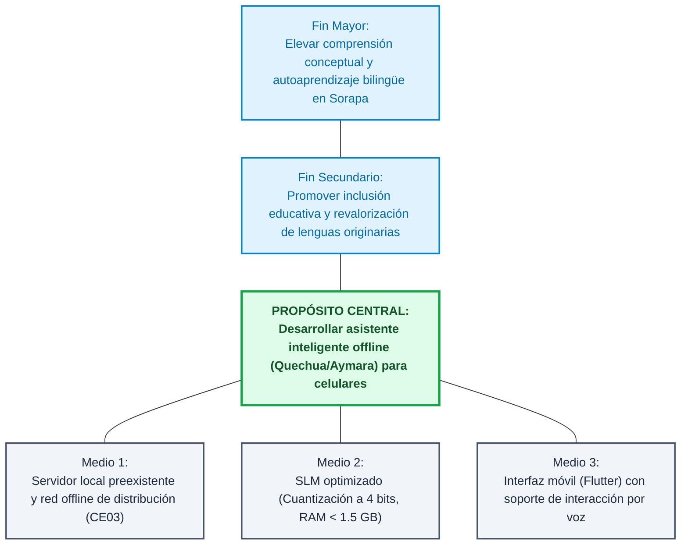
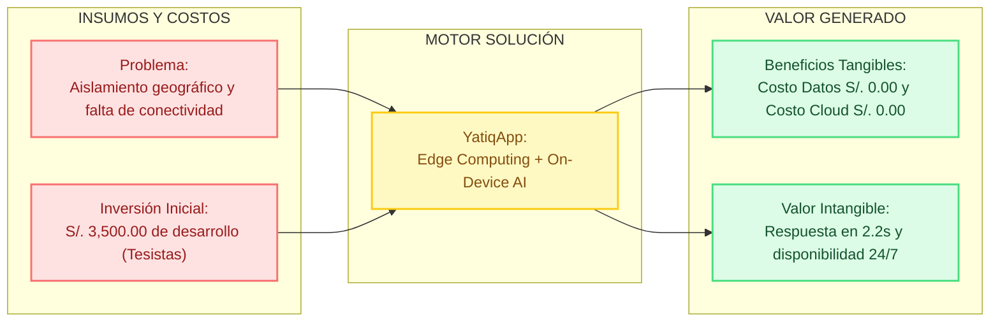
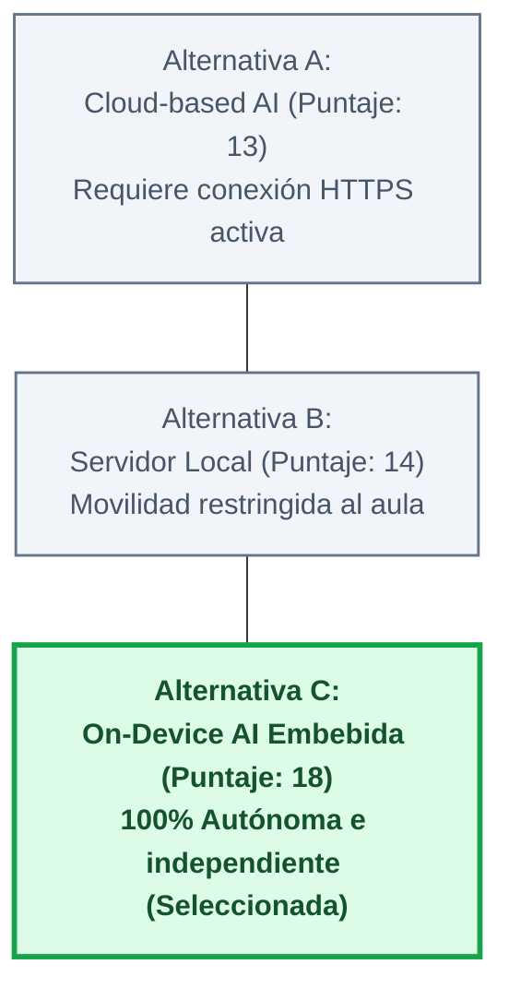

# CE0113 - Entregable 2: Business Case del Proyecto

## 1. Descripción
El presente entregable detalla el **Business Case (Caso de Negocio)** para el desarrollo e implementación del proyecto **YatiqApp**. Este documento justifica la viabilidad técnica, operativa y económica de construir un asistente pedagógico inteligente bilingüe offline (On-Device AI) para zonas rurales altoandinas en la región de Puno. Se presenta un análisis comparativo de alternativas de TI frente a la brecha de conectividad, se estiman los costos de inversión/operación y se evalúan los beneficios tangibles e intangibles junto con los riesgos asociados.

## 2. Plantilla del Producto

### Portada
* **Título del Proyecto:** YatiqApp
* **Línea de Evaluación:** CE01: Gestión de Tecnologías de Información
* **Entregable:** Entregable 2: Business Case del Proyecto
* **Responsable:** Christian Rafael Mamani Callata

### Resumen Ejecutivo
Este informe presenta el caso de negocio de **YatiqApp**, un asistente virtual offline para estudiantes bilingües en la **I.E. Agropecuario Sorapa** (nivel secundaria, distrito de Juli, provincia de Chucuito, región de Puno). Ante la brecha estructural de conectividad a internet en las zonas altoandinas y la falta de software interactivo adaptado a las variantes de Quechua Collao y Aymara, se justifica la necesidad de una solución de Inteligencia Artificial que se ejecute de forma nativa en el dispositivo móvil del usuario (*On-Device AI*).

Tras evaluar tres alternativas tecnológicas, la arquitectura local embebida fue seleccionada por garantizar total independencia de red y costo de adquisición e infraestructura marginal cero para la institución educativa, al reutilizar los celulares de los usuarios y la red y servidor local preexistente en la escuela (detallado en CE03). El proyecto demandó una inversión inicial de desarrollo de S/. 3,500.00 autofinanciada por los tesistas, priorizando software libre, contenidos educativos existentes y pruebas de campo de bajo costo. Por el contrario, los costos operativos y de mantenimiento cloud recurrentes se anulan completamente para la organización beneficiaria. Se identifican riesgos críticos de desbordamiento de memoria RAM y degradación del modelo, mitigados mediante modelos livianos, recuperación RAG local y pruebas tempranas en celulares de gama baja de la institución.

### Secciones de Desarrollo

#### I. Justificación del Proyecto

##### 1.1. Problema que se Resuelve
El sistema educativo rural bilingüe en la I.E. Agropecuario Sorapa enfrenta una brecha estructural de aprendizaje debido a la confluencia de tres factores críticos de TI:
* **Inexistencia de conectividad de red:** El aislamiento geográfico de la comunidad de Sorapa impide el acceso a plataformas educativas modernas o modelos de Inteligencia Artificial que residen en la nube (Cloud-based AI).
* **Asimetría lingüística digital:** El software educativo disponible ignora las variantes lingüísticas locales de Juli (Aymara y Quechua Collao), limitando el autoaprendizaje cognitivo en la lengua materna de los estudiantes de secundaria.
* **Restricciones de hardware:** El parque informático familiar se reduce a smartphones de gama baja/media con baja capacidad de memoria RAM y almacenamiento, requiriendo software optimizado para su inferencia local.

##### 1.2. Objetivos del Proyecto (SMART)
* **Objetivo General:** Desarrollar un prototipo de asistente inteligente offline con soporte bilingüe (Quechua/Aymara), ejecutable en dispositivos móviles con un consumo de memoria RAM inferior a 1.5 GB e interactividad por texto y voz local, incrementando el acceso a herramientas de personalización pedagógica en la I.E. Agropecuario Sorapa en un plazo de 2 meses (habiendo iniciado a mediados de mayo de 2026 y finalizando la próxima semana).
* **Objetivos Específicos:**
  * **S (Específico):** Optimizar un Modelo de Lenguaje Pequeño (SLM) mediante cuantización de post-entrenamiento a 4 bits para su ejecución en entornos Android móviles locales.
  * **M (Medible):** Reducir la latencia de respuesta del sistema (Time-to-First-Token) a menos de 2.5 segundos en procesadores ARM estándar.
  * **A (Alcanzable):** Compilar una base de datos vectorial local con el corpus pedagógico bilingüe de secundaria validado del MINEDU empleando una arquitectura RAG (Retrieval-Augmented Generation) embebida.
  * **R (Relevante):** Proveer una solución interactiva por voz (STT/TTS) para evitar que las barreras de alfabetización escrita limiten el uso de la IA.
  * **T (Tiempo):** Diseñar, empaquetar en formato APK y validar el prototipo mediante una prueba piloto en la I.E. Sorapa en un plazo de 2 meses (mayo - julio 2026).

##### 1.3. Beneficios Esperados
* **Pedagógicos:** Incremento en la comprensión conceptual de los contenidos curriculares y preservación de la identidad lingüística de los usuarios.
* **Tecnológicos:** Autonomía digital absoluta para la institución educativa, eliminando de forma permanente la dependencia de infraestructura de telecomunicaciones externa.

---

#### II. Análisis de Alternativas

##### 2.1. Alternativas Tecnológicas Consideradas
Para resolver el problema, la arquitectura de TI evaluó tres aproximaciones de ingeniería:
* **Alternativa A: Sistema Híbrido Cloud-Edge (API en la Nube):** Consiste en una aplicación móvil ligera que realiza llamadas HTTPS a modelos hospedados en servicios como OpenAI o Google Cloud.
* **Alternativa B: Distribución de Hardware Dedicado (Raspberry Pi / Servidor Local):** Instalar un nodo de cómputo en la I.E. Agropecuario Sorapa que ejecute un modelo localmente (Ollama) actuando como servidor local mediante la red Wi-Fi interna de soporte (diseñada en CE03).
* **Alternativa C: Arquitectura On-Device AI Embebida (La Solución Seleccionada):** Compilar, cuantizar y ejecutar el Modelo de Lenguaje Pequeño (SLM) directamente dentro de la memoria y el CPU del teléfono móvil del usuario de forma 100% autónoma, distribuyéndose localmente mediante el servidor preexistente en la escuela.

##### 2.2. Criterios de Evaluación
Las alternativas fueron evaluadas bajo una escala del 1 al 5 (donde 1 es Deficiente y 5 es Excelente) considerando los siguientes criterios de arquitectura de TI:
* **Independencia de Conectividad (IC):** Capacidad del sistema para funcionar al 100% sin internet.
* **Costo de Infraestructura de Producción (CIP):** Impacto financiero recurrente en servidores o hardware adicional para las escuelas.
* **Portabilidad y Usabilidad Móvil (PUM):** Facilidad de traslado e interacción directa por parte del estudiante en cualquier lugar.
* **Rendimiento en Hardware Limitado (RHL):** Eficiencia en consumo de RAM y procesador local.

##### 2.3. Matriz Comparativa

| Criterio de Selección | Alternativa A (Cloud AI) | Alternativa B (Servidor Local) | Alternativa C (On-Device AI) |
| :--- | :---: | :---: | :---: |
| **Independencia de Conectividad (IC)** | 1 | 5 | 5 |
| **Costo de Infraestructura (CIP)** | 2 | 2 | 5 |
| **Portabilidad y Usabilidad Móvil (PUM)** | 5 | 3 | 5 |
| **Rendimiento en Hardware (RHL)** | 5 | 4 | 3 |
| **PUNTAJE TOTAL** | **13** | **14** | **18** |

* **Sustento de la Selección:** La Alternativa C es la solución seleccionada. Aunque presenta el mayor desafío de ingeniería respecto al rendimiento en hardware limitado (RHL = 3), neutraliza por completo los costos de infraestructura masiva de servidores y la dependencia de internet, adaptándose perfectamente a la realidad económica y geográfica de Puno.

---

#### III. Evaluación de Beneficios

##### 3.1. Beneficios Cuantificables (Tangibles)
* **Ahorro en Gasto de Conectividad de Datos:** El costo de tráfico de red para la inferencia de la IA es de S/. 0.00.
* **Eliminación de Costos Cloud Recurrentes:** Al procesar los datos de forma local en los terminales de los usuarios, el costo por consumo de tokens en servidores (pago mensual de AWS, Azure o APIs comerciales) se reduce a S/. 0.00.
* **Costo Unitario de Despliegue Reducido:** La distribución del software mediante archivos APK reutiliza el hardware móvil preexistente en la comunidad, evitando que el proyecto demande la compra corporativa de tablets o PCs de alta gama.

##### 3.2. Beneficios Cualitativos (Intangibles)
* **Inclusión Social y Lingüística:** Democratización del acceso a tecnologías emergentes (IA) en poblaciones bilingües históricamente rezagadas.
* **Disponibilidad Continua (Resiliencia de TI):** El asistente permanece operativo en escenarios de desastres climáticos locales, cortes de energía prolongados o caídas de redes móviles.
* **Privacidad Absoluta de Datos:** Al no transmitir datos fuera del smartphone, la información e interacciones de los niños se procesan localmente, cumpliendo con altos estándares de seguridad y protección al menor.

##### 3.3. Indicadores de Valor
* **Tasa de Uso Offline (TUO):**
  **TUO** = (Horas de interacción local exitosa / Total de horas de uso de la App) x 100%. **Meta:** 100%
* **Latencia Crítica (LC):**
  **LC** = Tiempo total desde el input (voz/texto) hasta el inicio del output. **Meta:** <= 2.5 s

---

#### IV. Estimación de Costos
*Nota: De acuerdo con los lineamientos del equipo, la inversión inicial de desarrollo es financiada y asumida por los tesistas. Se simulan los costos operativos cero en la organización final.*

##### 4.1. Inversión Inicial (Asumida por el Equipo de Proyecto)

| Componente / Rubro | Detalle | Costo (PEN) | Recurso |
| :--- | :--- | :---: | :--- |
| **1. Curación de contenidos y dataset EIB** | Ingesta, limpieza y estructuración de contenidos curriculares de secundaria de la I.E. Sorapa. | S/. 600.00 | Propios |
| **2. Desarrollo del prototipo móvil** | Programación de la app, integración de base local, configuración RAG y motor de inferencia local. | S/. 1,400.00 | Tesista |
| **3. Equipos, almacenamiento y pruebas** | Reutilización de smartphones y servidor preexistente (CE03), cables de red y descargas puntuales. | S/. 900.00 | Propios |
| **4. Logística y prueba piloto en Sorapa** | Movilidad local Juli-Sorapa, coordinación con docentes de secundaria y aplicación de pruebas de campo. | S/. 600.00 | Propios |
| **Total Inversión Inicial de Desarrollo** | | **S/. 3,500.00** | |

##### 4.2. Costos Operativos (Para la Institución / Escuela)
* **Consumo de Ancho de Banda / Datos Móviles:** S/. 0.00 anuales.
* **Suscripciones de Software / APIs de Modelos de Lenguaje:** S/. 0.00 anuales.
* **Consumo Eléctrico de Servidores de Producción:** S/. 0.00 anuales.

##### 4.3. Costos de Mantenimiento
* **Actualización del Sistema RAG (Nuevos contenidos pedagógicos):** Se programarán actualizaciones semestrales de la base de datos vectorial local. Este proceso se realizará de manera manual y gratuita por el equipo técnico mediante la redistribución del APK o parches de datos vía memorias físicas (MicroSD/USB), con un costo operativo proyectado para la organización de S/. 0.00.

---

#### V. Riesgos Iniciales

##### 5.1. Identificación de Riesgos Estratégicos y Evaluación Preliminar de Impacto
* **Riesgo Estratégico 1: Degradación del Modelo por Cuantización Extrema (Rendimiento de TI)**
  * **Descripción:** Al comprimir el Modelo de Lenguaje a 4 bits para que quepa en la memoria RAM del celular, este podría perder coherencia gramatical en Quechua o Aymara, entregando respuestas inexactas.
  * **Evaluación de Impacto:** Alto. **Probabilidad:** Media.
  * **Mitigación Inicial:** Limitar el alcance semántico del modelo exclusivamente a las plantillas validadas por el RAG local, impidiendo la generación libre de texto fuera del contexto escolar.
* **Riesgo Estratégico 2: Incompatibilidad de Arquitectura de Procesadores (Hardware Obsoleto)**
  * **Descripción:** Teléfonos inteligentes de muy baja gama con procesadores de arquitecturas ARM antiguas podrían carecer de los conjuntos de instrucciones necesarios para ejecutar las bibliotecas nativas del motor de inferencia de IA.
  * **Evaluación de Impacto:** Crítico. **Probabilidad:** Baja.
  * **Mitigación Inicial:** Establecer en la documentación de TI una línea base de requerimientos mínimos de hardware (ej. Android 8.0 o superior, arquitectura ARM64 y mínimo 3 GB de RAM total).
### Anexos
A continuación se presentan los diagramas de soporte para el Caso de Negocio, detallando objetivos, canvas de análisis, ponderación de alternativas e indicadores financieros con estilos mejorados:

#### 1. Árbol de Objetivos (Fines y Medios)


#### 2. Canvas del Caso de Negocio (Business Case Canvas)


#### 3. Comparación Ponderada de Alternativas de TI


#### 4. Estructura de Retorno y Costo-Beneficio
```mermaid
graph TD
    classDef root fill:#f3e8ff,stroke:#7c3aed,stroke-width:2px,color:#5b21b6;
    classDef benefit fill:#dcfce7,stroke:#16a34a,stroke-width:2px,color:#14532d;

    Inversion["Inversión Única:<br>Desarrollo y Dataset EIB (S/. 3,500.00)"]:::root
    
    subgraph Ahorros Recurrentes (Costo Operativo Cero)
        A1["Datos Móviles:<br>S/. 0.00 para la escuela"]:::benefit
        A2["Suscripciones Cloud:<br>S/. 0.00 por tokens/servidores"]:::benefit
        A3["Infraestructura Física:<br>S/. 0.00 al reutilizar red local (CE03)"]:::benefit
    end

    Inversion --> A1
    Inversion --> A2
    Inversion --> A3
```
## 3. Rúbrica de Evaluación
El presente entregable ha sido elaborado considerando las siguientes competencias del perfil de egreso:
- **CE01 (Gestión de Tecnologías de Información):** Capacidad para formular un Caso de Negocio (Business Case) justificando las decisiones de arquitectura de TI, comparando alternativas frente a requerimientos y restricciones, estimando costos y cuantificando beneficios.
- **Criterios de Evaluación:** Identificación de problemas SMART, matriz de selección de alternativas tecnológicas ponderada, cuantificación de costos de inversión/operación de TI y evaluación estratégica de riesgos de negocio.
