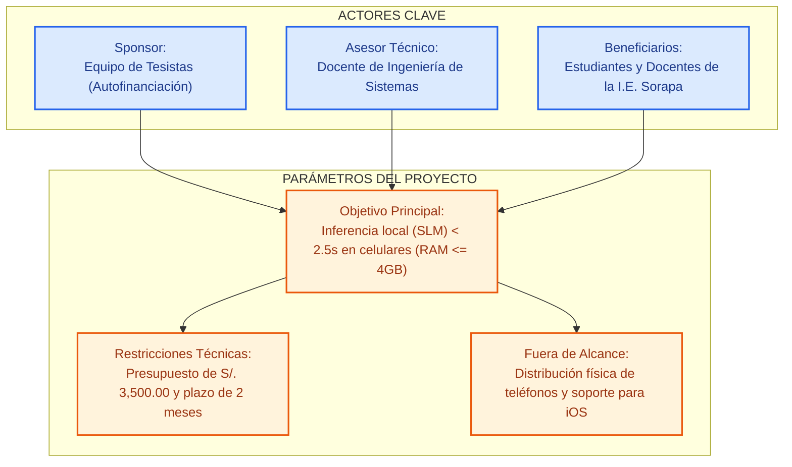
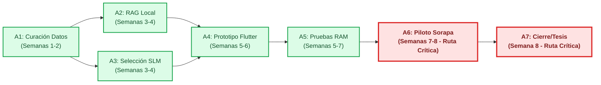
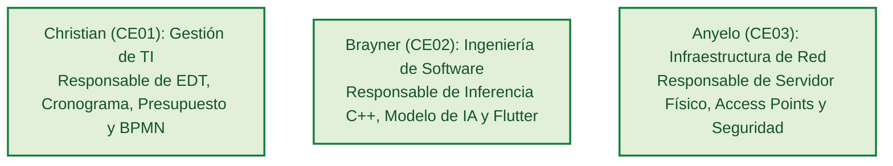
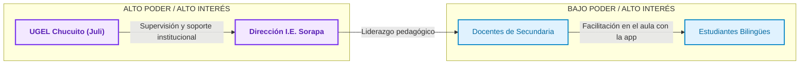

# CE0121-CE0125 - Entregable 3: Plan de Gestión del Proyecto

## 1. Descripción
El presente entregable detalla el **Plan de Gestión del Proyecto** para **YatiqApp** bajo un enfoque híbrido de gestión. Combina las metodologías predictivas (PMI/PMBOK) para el control riguroso del alcance, cronograma y presupuesto, con prácticas ágiles (Scrum) para la ingeniería del software y la optimización de la Inteligencia Artificial (STT/TTS local y RAG offline). Se incluye el Project Charter, la WBS (EDT), el cronograma detallado, Gantt, presupuesto por rubros y plan de riesgos.

## 2. Plantilla del Producto

### Portada
* **Título del Proyecto:** YatiqApp
* **Línea de Evaluación:** CE01: Gestión de Tecnologías de Información
* **Entregable:** CE0125 - Entregable 3: Plan de Gestión del Proyecto
* **Responsable:** Christian Rafael Mamani Callata

### Resumen Ejecutivo
Este informe presenta el plan de gestión del proyecto **YatiqApp** para el desarrollo del prototipo de asistente bilingüe offline, enfocado en la **I.E. Agropecuario Sorapa** (nivel secundaria, distrito de Juli, provincia de Chucuito, región de Puno). Utilizando un enfoque híbrido, se establecen mecanismos de control predictivo para el alcance, cronograma y presupuesto, junto con prácticas ágiles organizadas en 4 iteraciones de dos semanas para construir, probar y ajustar la solución en condiciones rurales.

La Estructura de Desglose del Trabajo (EDT) organiza las fases clave de curación del corpus lingüístico, configuración RAG local, desarrollo móvil y validación en campo. El cronograma registra la entrega final del Mínimo Producto Viable (MVP) para la próxima semana (Semana 8). El plan de costos del proyecto de desarrollo estima una inversión máxima de S/. 3,500.00 financiada por los tesistas, ya que la infraestructura de soporte (computadora servidor, switch, APs, UPS) es parte de la plataforma preexistente de la escuela (CE03).

### Secciones de Desarrollo

#### I. Project Charter (Acta de Constitución del Proyecto)

##### 1.1. Sponsor e Interesados Clave
* **Sponsor del Proyecto:** Equipo de Tesistas / Desarrolladores (Autofinanciado).
* **Asesor Metodológico/Técnico:** Docente de la Carrera de Ingeniería de Sistemas.
* **Usuarios / Beneficiarios:** Estudiantes, docentes de Instituciones Educativas EIB y especialistas de las UGELs de la región Puno.

##### 1.2. Objetivos del Proyecto
* **Objetivo Técnico:** Lograr la inferencia local de un Modelo de Lenguaje Pequeño (SLM) cuantizado a 4 bits con una latencia inferior a 2.5 s en un smartphone estándar de gama baja/media de los estudiantes de Sorapa.
* **Objetivo de Gestión:** Entregar el prototipo de software (APK), el dataset bilingüe estructurado de secundaria y el informe técnico en un periodo de 2 meses (mayo - julio 2026), respetando el presupuesto asignado.

##### 1.3. Alcance Preliminar
El proyecto abarca el diseño, entrenamiento por RAG, cuantización, desarrollo de la aplicación móvil Android y validación en campo de un asistente virtual offline bilingüe para educación secundaria en la I.E. Agropecuario Sorapa. Queda fuera del alcance el desarrollo para sistemas operativos iOS, la provisión física de smartphones a las escuelas y la actualización curricular de los contenidos del MINEDU.

##### 1.4. Restricciones y Supuestos
* **Restricciones:** Presupuesto de desarrollo limitado (máximo S/. 3,500.00), plazo de entrega de 2 meses (iniciado a mediados de mayo de 2026 y finalizando la próxima semana) y el software debe operar en hardware móvil con <= 4 GB de RAM sin conexión a internet.
* **Supuestos:** Acceso a los textos escolares del MINEDU en Quechua Collao y Aymara, disponibilidad de la infraestructura local de red y servidor preexistente de la escuela (CE03), y viabilidad para ingresar a Sorapa (Juli) para el piloto de campo.

---

#### II. Gestión del Alcance

##### 2.1. Estructura de Desglose del Trabajo (EDT / WBS)
La EDT se organiza en 5 componentes principales del ciclo de vida del proyecto:
```
1.0 ASISTENTE INTELIGENTE OFFLINE (EIB-PUNO)
   ├── 1.1 Ingesta y Gestión de Datos (Corpus)
   │     ├── 1.1.1 Recopilación de textos oficiales MINEDU (Quechua/Aymara)
   │     └── 1.1.2 Limpieza, Tokenización y Formateo de Data
   ├── 1.2 Ingeniería de IA y Optimización
   │     ├── 1.2.1 Configuración de Embeddings y Base Vectorial Local
   │     └── 1.2.2 Cuantización del SLM a 4 bits (GGUF/Nativo)
   ├── 1.3 Desarrollo de Software Móvil (Android)
   │     ├── 1.3.1 Arquitectura del Motor de Inferencia local (C++/Bindings)
   │     ├── 1.3.2 Implementación de Módulos de Voz (STT/TTS)
   │     └── 1.3.3 Diseño de Interfaz de Usuario Gamificada (UI/UX)
   ├── 1.4 Pruebas, Despliegue y Validación
   │     ├── 1.4.1 Pruebas de estrés de Hardware (RAM/Batería)
   │     └── 1.4.2 Prueba Piloto en Comunidad Rural de Puno
   └── 1.5 Gestión del Proyecto y Tesis
         ├── 1.5.1 Redacción del Perfil e Informe Final de Tesis
         └── 1.5.2 Sustentación y Aprobación
```

##### 2.2. Diccionario de Entregables Críticos
* **Paquete 1.1.2 (Dataset Estructurado):** Archivos en formato JSON/Markdown con el contenido pedagógico indexado y alineado bilingüemente.
* **Paquete 1.2.2 (Modelo SLM Optimizado):** Archivo binario del modelo cuantizado comprimido a menos de 1.8 GB listo para la inferencia local.
* **Paquete 1.3.3 (Aplicación Móvil - APK):** Instalable nativo de Android que empaqueta la interfaz, la base de datos vectorial y el motor de IA.

---

#### III. Gestión del Cronograma
El proyecto se planificó para un periodo total de 8 semanas (2 meses). Habiéndose iniciado el **18 de mayo de 2026**, actualmente se encuentra en su octava semana (fase final de cierre) y tiene programada su entrega final la próxima semana (mediados de julio de 2026).

##### 3.1. Lista de Actividades e Hitos Principales
| ID Actividad | Descripción de la Actividad | Predecesora | Fechas de Ejecución | Duración | Estado Actual |
| :---: | :--- | :---: | :---: | :---: | :--- |
| **A1** | Curación y estructuración de contenidos EIB | — | 18 - 29 Mayo 2026 | 2 sem | Completado |
| **A2** | Configuración de base local y recuperación RAG | A1 | 1 - 12 Junio 2026 | 2 sem | Completado |
| **A3** | Selección de modelo liviano y pruebas de respuesta | A1 | 1 - 12 Junio 2026 | 2 sem | Completado |
| **A4** | Desarrollo del prototipo móvil Android (Flutter) | A2, A3 | 15 - 26 Junio 2026 | 2 sem | Completado |
| **A5** | Pruebas de rendimiento en celulares de la I.E. | A4 | 22 Jun - 3 Jul 2026 | 2 sem | Completado |
| **A6** | Piloto en la I.E. Sorapa y ajustes finales | A5 | 29 Jun - 17 Jul 2026 | 2 sem | **En ejecución** |
| **A7** | Documentación final y sustentación académica | A6 | 13 - 17 Julio 2026 | 1 sem | **Programado (Próx. sem.)** |

* **Hito 1 (Semana 2 - 29 de Mayo):** Base de conocimientos de secundaria organizada y validada. (Alcanzado)
* **Hito 2 (Semana 4 - 12 de Junio):** Motor RAG local funcionando en estación de pruebas. (Alcanzado)
* **Hito 3 (Semana 6 - 26 de Junio):** APK funcional compilada para celulares de prueba de la I.E. (Alcanzado)
* **Hito 4 (Semana 8 - 17 de Julio):** Piloto en Juli (Sorapa) finalizado y versión técnica concluida. (Por entregar)

##### 3.2. Diagrama de Gantt con Calendario de Ejecución
| Actividad | Fechas Reales | S1 | S2 | S3 | S4 | S5 | S6 | S7 | S8 | Estado |
| :--- | :---: | :---: | :---: | :---: | :---: | :---: | :---: | :---: | :---: | :--- |
| A1: Contenidos EIB | 18 - 29 Mayo | X | X |  |  |  |  |  |  | Completado |
| A2: Base local/RAG | 1 - 12 Junio |  | X | X | X |  |  |  |  | Completado |
| A3: Modelo liviano | 1 - 12 Junio |  |  | X | X |  |  |  |  | Completado |
| A4: Prototipo móvil | 15 - 26 Junio |  |  |  | X | X | X |  |  | Completado |
| A5: Pruebas en celulares | 22 Jun - 3 Jul |  |  |  |  | X | X | X |  | Completado |
| A6: Piloto en Sorapa | 29 Jun - 17 Jul |  |  |  |  |  |  | X | X | **En ejecución** |
| A7: Documentación final | 13 - 17 Julio |  |  |  |  |  |  |  | X | **Programado** |

---

#### IV. Gestión de Costos

##### 4.1. Presupuesto Detallado de TI (Financiado por el Equipo)
*Nota: La adquisición de la infraestructura de red local y computo (servidor, router, switch, UPS y APs) no genera gasto al proyecto por ser **inventario tecnológico preexistente** en la I.E. Agropecuario Sorapa (detallado en CE03). El presupuesto detalla únicamente la inversión de desarrollo asumida por los tesistas.*

| Ítem | Descripción Recurso | Unidad | Cant. | Total (PEN) |
| :---: | :--- | :---: | :---: | :---: |
| **1.0** | **Hardware e Infraestructura de TI** | | | |
| 1.1 | Computadoras y servidores locales de la I.E. Sorapa (CE03) | Global | 1 | S/. 0.00 |
| 1.2 | Conectividad eventual, descargas de modelos y energía | Global | 1 | S/. 450.00 |
| **2.0** | **Ingeniería y Trabajo de Campo** | | | |
| 2.1 | Curación del dataset de secundaria con docentes de Sorapa | Global | 1 | S/. 600.00 |
| 2.2 | Accesorios y adaptadores para pruebas en smartphones | Global | 1 | S/. 850.00 |
| 2.3 | Movilidad rural Juli - Sorapa (2 viajes de campo) | Ruta | 2 | S/. 600.00 |
| **3.0** | **Gestión y Recursos Humanos** | | | |
| 3.1 | Desarrollo de software móvil y documentación técnica | Meses | 2 | S/. 1,000.00 |
| **Total**| **Costo Total de Desarrollo de TI** | | | **S/. 3,500.00** |

##### 4.2. Línea Base de Costos (Curva S Proyectada por Mes)
El gasto acumulado a lo largo de los 2 meses de ejecución del proyecto sigue la siguiente distribución financiera:
* **Mes 1 (Curación, base local y configuración RAG - Mayo/Junio):** S/. 1,450.00 acumulados (Gastado).
* **Mes 2 (Prototipo móvil, piloto en Sorapa y documentación - Junio/Julio):** S/. 3,500.00 acumulados (Fase final de ejecución).

---

#### V. Gestión de Riesgos (Estado de Mitigaciones en Semana 8)

##### 5.1. Identificación y Análisis Cualitativo
* **Riesgo 1: Alucinación Crítica del Modelo (Probabilidad: Media \| Impacto: Alto):** El modelo entrega conceptos erróneos fuera del temario de secundaria en la I.E. Sorapa.
* **Riesgo 2: Cuello de botella en STT/TTS local (Probabilidad: Alta \| Impacto: Medio):** Los celulares Android de baja gama de los estudiantes se congelan o presentan latencias altas al procesar voz.
* **Riesgo 3: Descoordinación con la Comunidad Rural de Sorapa (Probabilidad: Baja \| Impacto: Alto):** Problemas de acceso, huelgas o resistencia de los padres impiden las pruebas del piloto de campo.

##### 5.2. Plan de Respuesta y Estado de Cierre de Riesgos
* **Para Riesgo 1 (Mitigado en Semana 3-4):** Inyección forzada de contexto mediante la base vectorial RAG. Si la duda del estudiante no coincide con el corpus de secundaria indexado, la app ejecuta un fallback controlado: "No tengo esa información en mi base local". Las pruebas en la Semana 7 no registraron alucinaciones.
* **Para Riesgo 2 (Mitigado en Semana 5-6):** Se utilizó Whisper Tiny cuantizado a 4 bits y se restringió la grabación de audio a fragmentos de 5s máximo. La latencia media registrada en celulares de prueba fue de 2.2 segundos.
* **Para Riesgo 3 (Cerrado en Semana 7):** Se contó con el apoyo oficial del Director de la I.E. Agropecuario Sorapa y docentes bilingües. Las visitas de campo en Juli se realizaron con éxito y sin contratiempos.

---

#### VI. Gestión Ágil (Aplica para las Fases 2 y 3: Construcción de Software)
El ciclo de desarrollo core del backend de IA y de la app móvil se gestionará bajo un enfoque ágil, organizando el trabajo en 4 iteraciones de 2 semanas.

##### 6.1. Product Backlog Inicial (Historias de Usuario Críticas)
* **HU01:** Como estudiante rural, quiero interactuar con el asistente usando comandos de voz en Quechua/Aymara para que la falta de escritura fluida no frene mi aprendizaje.
* **HU02:** Como docente de la escuela, quiero que la aplicación funcione en mi celular sin necesidad de conectarme a una red móvil o Wi-Fi para usarla dentro del aula aislada.
* **HU03:** Como administrador del sistema (tesista), quiero compilar el contenido del MINEDU en vectores dentro de una base local para controlar que las respuestas de la IA sean correctas.

##### 6.2. Sprint Planning y Estructura de Incrementos
* **Sprint 1 - IA Core:** Procesamiento del corpus bilingüe, generación del almacén de vectores y configuración inicial del SLM base.
* **Sprint 2 - Cuantización:** Compresión del modelo a 4 bits y validación de la inferencia matemática en la estación local.
* **Sprint 3 - App Bridge:** Configuración del proyecto móvil (Flutter/Native) y linking de las librerías nativas C++ para correr el binario del modelo.
* **Sprint 4 - Voice & UI:** Integración de los modelos Whisper Tiny / TTS locales y diseño de las pantallas interactivas para los niños.
* **Incremento de Producto Esperado (Mínimo Producto Viable - MVP):** Al finalizar el Sprint 4, el equipo dispondrá de un archivo `.apk` compilado y estable, capaz de ejecutarse en frío dentro de un dispositivo Android de pruebas, procesar una pregunta por voz en lengua originaria, buscar la respuesta semánticamente en su base local y reproducir la respuesta mediante audio, todo sin emitir un solo byte de datos a internet.

### Anexos
A continuación se presentan los diagramas de soporte para la planificación y gestión del proyecto, diseñados con estilos mejorados y colores distintivos en notación Mermaid:

#### 1. Estructura del Project Charter (Acta de Constitución)


#### 2. Estructura de Desglose del Trabajo (WBS / EDT)

```mermaid
graph TD
    classDef root fill:#f3e8ff,stroke:#7c3aed,stroke-width:3px,color:#5b21b6,font-weight:bold;
    classDef phase fill:#e0f2fe,stroke:#0284c7,stroke-width:2px,color:#0369a1;
    classDef task fill:#f1f5f9,stroke:#64748b,stroke-width:1.5px,color:#1e293b;

    WBS["1.0 ASISTENTE OFFLINE YATIQAPP"]:::root
    
    W1["1.1 Ingesta de Datos (EIB)"]:::phase
    W2["1.2 Ingeniería de IA"]:::phase
    W3["1.3 Desarrollo de Software"]:::phase
    W4["1.4 Pruebas y Despliegue"]:::phase
    W5["1.5 Gestión del Proyecto"]:::phase

    WBS --> W1
    WBS --> W2
    WBS --> W3
    WBS --> W4
    WBS --> W5

    W1 --> W11["1.1.1 Ingesta de textos MINEDU"]:::task
    W1 --> W12["1.1.2 Limpieza y tokenización"]:::task

    W2 --> W21["1.2.1 Embeddings RAG local"]:::task
    W2 --> W22["1.2.2 Cuantización SLM (4 bits)"]:::task

    W3 --> W31["1.3.1 Bindings C++ nativos"]:::task
    W3 --> W32["1.3.2 Módulos STT / TTS locales"]:::task
    W3 --> W33["1.3.3 Interfaz Flutter Android"]:::task

    W4 --> W41["1.4.1 Pruebas de estrés y RAM"]:::task
    W4 --> W42["1.4.2 Prueba piloto en Sorapa"]:::task

    W5 --> W51["1.5.1 Informes de Tesis"]:::task
    W5 --> W52["1.5.2 Sustentación Final"]:::task
```


#### 3. Red de Actividades y Ruta Crítica


#### 4. Roles y Responsabilidades del Equipo de Tesis (CE01, CE02, CE03)


#### 5. Matriz de Interesados (Stakeholders)

