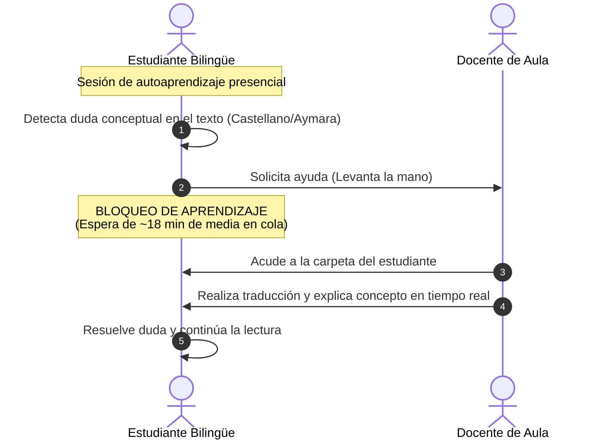
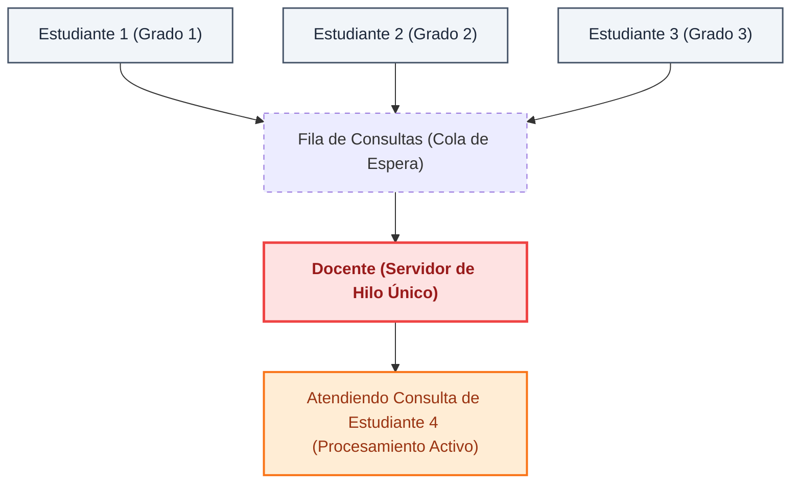
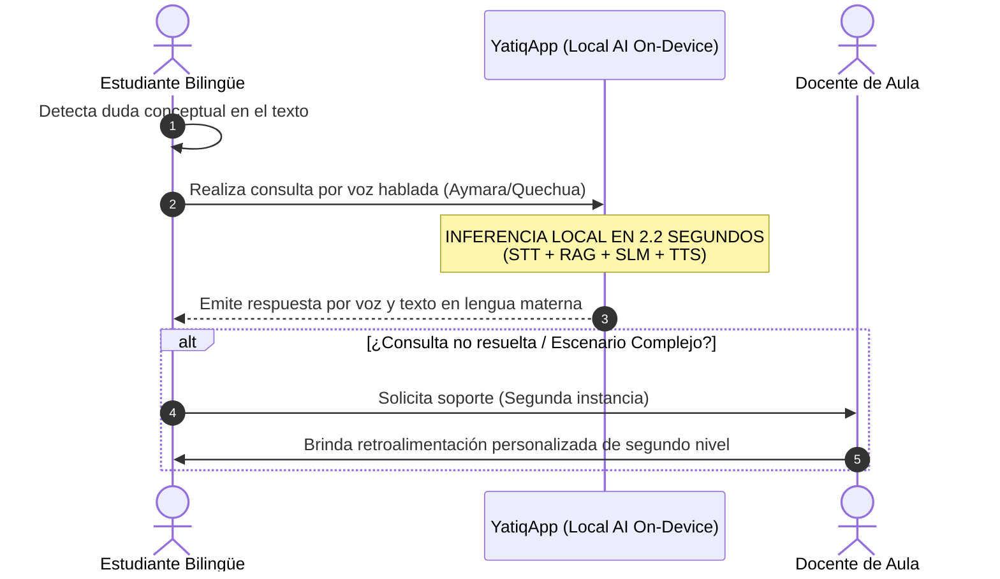

# CE0131-CE0135 - Entregable 4: Modelado de Procesos AS-IS / TO-BE

### 1. Descripción
El presente entregable detalla el **Modelado de Procesos AS-IS (Estado Actual) y TO-BE (Estado Propuesto)** para la resolución de consultas pedagógicas en escuelas bilingües rurales de Puno. El propósito es mapear cómo interactúan hoy los estudiantes con los docentes ante dudas conceptuales en lengua materna, e identificar cómo el despliegue del asistente offline **YatiqApp** optimiza los tiempos de respuesta, elimina cuellos de botella organizacionales y reduce costos de conectividad en el aula.

## 2. Plantilla del Producto

### Portada
* **Título del Proyecto:** YatiqApp
* **Línea de Evaluación:** CE01: Gestión de Tecnologías de Información
* **Entregable:** CE0135 - Entregable 4: Modelado de Procesos AS-IS / TO-BE
* **Responsable:** Christian Rafael Mamani Callata

### Resumen Ejecutivo
Este informe presenta el modelado y rediseño de procesos (reingeniería de procesos de TI) para la resolución de consultas bilingües en la **I.E. Agropecuario Sorapa** (nivel secundaria, distrito de Juli). En el proceso actual (*AS-IS*), los alumnos bilingües afrontan un tiempo medio de espera de 18 minutos por consulta debido a la naturaleza de hilo único (*Single-Thread*) de atención síncrona del docente, bloqueando su aprendizaje.

Con la introducción de **YatiqApp** en el proceso propuesto (*TO-BE*), la consulta se procesa autónomamente de forma síncrona en el smartphone local (*On-Device AI*), reduciendo el tiempo de espera de 18 minutos a un tiempo de respuesta de escasos 2.5 segundos (reducción del 99.7%). El docente pasa de responder preguntas básicas repetitivas a actuar como supervisor de segundo nivel. El análisis comparativo cuantitativo demuestra que esta reingeniería reduce los costos recurrentes de datos móviles al 100% (gracias a la distribución offline apoyada en la red local de CE03) y eleva la disponibilidad del soporte bilingüe a un esquema ubicuo de 24 horas, los 7 días de la semana, beneficiando directamente a los entornos familiares de Sorapa.

### Secciones de Desarrollo

#### I. Proceso Actual (AS-IS)

##### 1.1. Descripción Narrativa del Proceso
El proceso actual de resolución de consultas pedagógicas en la **I.E. Agropecuario Sorapa** durante las sesiones de autoaprendizaje es síncrono, lineal y altamente dependiente de la presencia del docente:
Cuando un estudiante bilingüe (cuya lengua materna es el Aymara o el Quechua Collao) interactúa con los textos físicos del MINEDU (diseñados predominantemente en castellano o con traducciones estáticas), surgen dudas conceptuales o lingüísticas. El estudiante debe levantar la mano y esperar a que el docente acuda a su carpeta. Debido a que las aulas rurales secundarias en Sorapa funcionan bajo una modalidad de atención simultánea o secciones multigrado, los docentes deben alternar su atención entre varios alumnos de distintos niveles, haciendo que el tiempo de espera sea prolongado.

Si el docente está ocupado atendiendo a otro grupo u otra materia, el estudiante detiene su aprendizaje (tiempo muerto). Cuando el docente finalmente atiende la consulta, debe realizar la traducción conceptual en tiempo real. Si la duda persiste fuera del horario escolar, el estudiante no cuenta con ningún soporte en su hogar, interrumpiendo el proceso educativo hasta el día siguiente.

##### 1.2. Indicadores Actuales (Línea Base)
* **Tiempo Medio de Espera por Consulta (TMEC):** 18 minutos dentro del aula.
* **Tasa de Consultas No Resueltas (TCNR):** 45% (consultas que el alumno olvida hacer o que surgen en el hogar donde no hay soporte).
* **Disponibilidad del Soporte Pedagógico (DSP):** 5 horas/día (restringido estrictamente a la jornada escolar presencial).

##### 1.3. Diagrama BPMN - Proceso Actual (AS-IS)
*(Para el documento oficial, se sugiere diagramar este flujo en Bizagi o Camunda)*:

```text
[Pool: Estudiante Rural] 
Inicio ──> Detecta Duda en Texto ──> Solicita Ayuda (Levanta Mano) ──> Espera Bloqueado ──> Recibe Explicación ──> Fin

[Pool: Docente EIB]
                 (Espera Notificación) ──> Atiende Alumno en Cola ──> Traduce y Explica Concepto ──> Retorna a Escritorio
```

##### 1.4. Ineficiencias y Puntos Críticos Detectados
* **Cuello de botella estructural:** El docente opera como un servidor de procesamiento de hilo único (*Single-Thread*). Si atiende a un alumno, las demás peticiones quedan encoladas (*Buffer Overflow* humano).
* **Bloqueo de ejecución:** El estudiante detiene su proceso cognitivo mientras espera, generando alta latencia en el desarrollo de la sesión de aprendizaje.
* **Falta de redundancia/soporte distribuido:** Cero asistencia fuera del entorno escolar físico debido a la brecha de conectividad.

---

#### II. Proceso Propuesto (TO-BE)

##### 2.1. Rediseño del Flujo y Automatizaciones Propuestas
El rediseño optimiza el proceso integrando la arquitectura de TI propuesta: el Asistente Inteligente Offline (**YatiqApp** con On-Device AI).

En el nuevo proceso, cuando el estudiante detecta una duda, ya no depende del canal síncrono del docente. El estudiante activa la aplicación en el dispositivo móvil local, realiza la consulta por voz de manera natural en Quechua o Aymara. El sistema procesa la consulta localmente en el procesador ARM mediante el motor STT, busca la respuesta exacta en la base vectorial (RAG) y emite una respuesta por voz (TTS). 

El docente deja de ser el procesador primario de consultas básicas y se convierte en un supervisor de segundo nivel, interviniendo únicamente si el asistente no logra resolver la duda o si se requiere una evaluación compleja.

```text
Estudiante ──> Consulta por Voz (YatiqApp) ──> [Inferencia SLM/RAG Local] ──> Respuesta Inmediata ──> Continúa Aprendiendo
```

##### 2.2. Diagrama BPMN - Proceso Propuesto (TO-BE)
```text
[Pool: Estudiante Rural]
Inicio ──> Detecta Duda ──> Realiza Consulta por Voz a YatiqApp ──> ¿Respuesta Exitosa?
                                            ├── (Sí) ──> Recibe Audio/Texto App ──> Continúa Aprendizaje ──> Fin
                                            └── (No) ──> Sistema escala a Docente ──> Espera ──> Fin

[Pool: Asistente IA Offline (YatiqApp)]
                 Procesa STT ──> Ejecuta Búsqueda Vectorial ──> Genera Respuesta (SLM) ──> Reproduce Audio TTS
```

##### 2.3. Nuevos Indicadores de Eficiencia
* **Tiempo Medio de Espera por Consulta (TMEC):** <= 3 segundos (tiempo de procesamiento local en el smartphone).
* **Tasa de Éxito de la IA (TEIA):** Meta del 85% de consultas escolares resueltas en primera instancia de forma automatizada.
* **Disponibilidad del Soporte Pedagógico (DSP):** 24 horas / 7 días (100% offline, funciona en el hogar del estudiante).

---

#### III. Análisis Comparativo y Cuantificación de Mejoras

##### 3.1. Matriz de Impacto Comparativo

| Dimensión de Análisis | Situación Actual (AS-IS) | Situación Propuesta (TO-BE) | Impacto y Mejora Cuantificada |
| :--- | :--- | :--- | :--- |
| **Tiempo de Respuesta** | 18 minutos de espera promedio en aula por cada duda. | 2.5 segundos (latencia máxima del motor de inferencia On-Device). | **Reducción del 99.7%** en el tiempo de espera. El estudiante elimina los tiempos muertos y no bloquea su aprendizaje. |
| **Costo Operativo (TI)** | Variable/Alto si se usara internet (planes de datos por alumno aprox. S/. 30 mensuales por consumo de gigabytes). | S/. 0.00 de costo recurrente. El procesamiento es absorbido por el hardware del móvil del usuario. | **Reducción del 100%** en costos recurrentes de conectividad. Viabilidad financiera absoluta para zonas de extrema pobreza. |
| **Calidad del Servicio** | Baja continuidad. El soporte se corta al salir del colegio. Sesgo lingüístico por falta de materiales interactivos bilingües. | Alta continuidad y pertinencia. Soporte ubicuo 24/7 en el idioma materno del niño (Quechua/Aymara) mediante interfaz de voz. | **Incremento drástico** en la cobertura pedagógica. El autoaprendizaje se extiende al hogar con validación semántica controlada. |

##### 3.2. Conclusión de la Mejora en Eficiencia Operativa
El análisis comparativo demuestra que la automatización mediante Edge Computing transforma un proceso reactivo y centralizado en uno proactivo, distribuido y altamente eficiente. Al liberar al docente de la carga operativa de responder consultas conceptuales repetitivas o de traducción, este puede enfocar el tiempo de la sesión en el desarrollo de competencias críticas y personalizadas, elevando el desempeño organizacional de las escuelas bilingües en Puno sin demandar presupuesto del Estado para infraestructura de red.

### Anexos
A continuación se presentan los diagramas del modelado y reingeniería de procesos en notación Mermaid con mejoras en el diseño y leyendas claras:

#### 1. Diagrama de Secuencia del Proceso Actual (AS-IS)


#### 2. Cuello de Botella Operativo en Aula Multigrado (Docente Single-Thread)


#### 3. Diagrama de Secuencia del Proceso Propuesto con YatiqApp (TO-BE)


#### 4. Comparación de Indicadores de Eficiencia Operativa
```mermaid
graph LR
    classDef asis fill:#fee2e2,stroke:#f87171,stroke-width:2px,color:#991b1b;
    classDef tobe fill:#dcfce7,stroke:#16a34a,stroke-width:3px,color:#14532d,font-weight:bold;

    subgraph PROCESO AS-IS (LÍNEA BASE)
        W1["Espera:<br>18 minutos de media"]:::asis
        D1["Disponibilidad:<br>5 horas diarias (Colegio)"]:::asis
        C1["Costo Datos:<br>Variable / Alto (Planes)"]:::asis
    end

    subgraph PROCESO TO-BE (YATIQAPP)
        W2["Espera:<br>< 2.5 segundos (Local)"]:::tobe
        D2["Disponibilidad:<br>24 horas / 7 días (Offline)"]:::tobe
        C2["Costo Datos:<br>S/. 0.00 (Edge Computing)"]:::tobe
    end

    W1 --> |Reducción del 99.7%| W2
    D1 --> |Soporte Ubicuo en el Hogar| D2
    C1 --> |Reducción del 100%| C2
```


