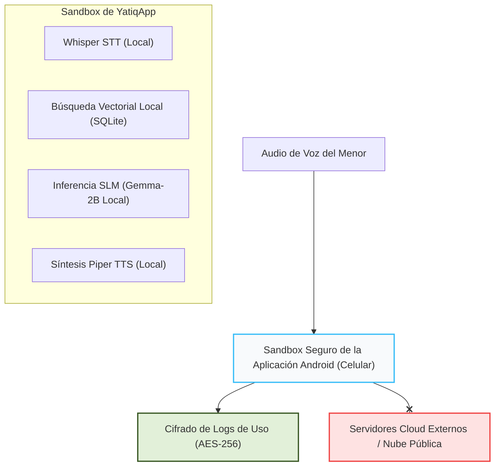

# CE0141-CE0145 - Entregable 5: Propuesta de Solución TIC Integrada

## 1. Descripción
El presente entregable detalla la **Propuesta de Solución TIC Integrada** al ecosistema de sistemas de información institucionales para **YatiqApp**. Define la arquitectura conceptual basada en Edge Computing / On-Device AI, describe los componentes de procesamiento de voz y RAG, detalla los modelos de integración física de datos (*Sneakernet / Local Gateway*), y planifica el esquema de interoperabilidad diferida con sistemas oficiales del MINEDU como SIAGIE, PerúEduca y ESCALE. Además, aborda los controles de seguridad locales (AES-256) y el análisis de escalabilidad horizontal y sostenibilidad financiera.

## 2. Plantilla del Producto

### Portada
* **Título del Proyecto:** YatiqApp
* **Línea de Evaluación:** CE01: Gestión de Tecnologías de Información
* **Entregable:** CE0145 - Entregable 5: Propuesta de Solución TIC Integrada
* **Responsable:** Christian Rafael Mamani Callata

### Resumen Ejecutivo
Este informe presenta la propuesta de integración de la solución TIC **YatiqApp** en el ecosistema educativo, tomando como caso de estudio a la **I.E. Agropecuario Sorapa** (nivel secundaria, distrito de Juli, provincia de Chucuito, región de Puno). Ante la falta de conectividad constante, se adopta un paradigma de arquitectura híbrida On-Device descentralizada, donde la inferencia de Inteligencia Artificial (procesamiento del modelo de lenguaje, STT, TTS y búsquedas vectoriales RAG) se realiza localmente en el móvil del usuario.

La integración se complementa con un esquema de interoperabilidad diferida: inyección curricular de lecciones del MINEDU convertidas offline a bases vectoriales locales distribuidas por el servidor de la institución (CE03), y exportación diferida de logs analíticos cifrados en reposo (AES-256) recopilados localmente, impactando agregadamente en SIAGIE y ESCALE cuando el docente dispone de conectividad en una UGEL. El modelo demuestra gobernanza normativa mediante el cumplimiento estricto de la Ley N° 29733 de Protección de Datos Personales, y garantiza sostenibilidad financiera y escalabilidad horizontal ilimitada con costo de infraestructura marginal cero para el Estado.

### Secciones de Desarrollo

#### I. Arquitectura de la Solución

##### 1.1. Diagrama de Arquitectura Conceptual (On-Device Hybrid Architecture)
La solución adopta un enfoque de Edge Computing / On-Device AI para la capa de ejecución (inferencia) en caliente, combinada con un esquema de aprovisionamiento diferido o asíncrono para la actualización de la base de conocimientos y métricas de analítica.

La arquitectura se divide en tres capas desacopladas dentro del cliente móvil Android:
* **Capa de Presentación (UI/UX):** Interfaz móvil gamificada e interactiva desarrollada en Flutter o React Native. Captura los flujos de audio (Voz) o Texto del estudiante.
* **Capa de Inferencia Local (AI Engine):** Orquestada por bindings de bajo nivel (C++/JNI) a través de MediaPipe LLM Inference o LLaMA.cpp. Ejecuta localmente el SLM cuantizado (Gemma-2B o Phi-3-mini) y el backend de audio (Whisper-Tiny Quantized para STT y Piper para TTS).
* **Capa de Datos Embebida (Local Storage):** Motor SQLite con extensiones de vectores locales encargado de almacenar los embeddings semánticos (RAG) de las lecciones bilingües de forma local en el almacenamiento flash del smartphone.

##### 1.2. Componentes Principales
* **Pipeline de Procesamiento de Voz (Local STT/TTS):** Transforma la señal acústica de los estudiantes en texto plano en Quechua/Aymara, y sintetiza las respuestas de texto del modelo en audio hablado inteligible de forma 100% nativa en el dispositivo.
* **Módulo RAG Embebido (Retrieval-Augmented Generation):** Extrae mediante similitud de cosenos los fragmentos de texto educativo idóneos desde la base vectorial local (`.db`), inyectándolos como contexto rígido al prompt del SLM.
* **Motor de Sincronización Diferida (Offline Data Sync):** Componente secundario que almacena logs analíticos anonimizados del uso de la app en un búfer local encriptado, esperando un nodo de red físico para su descarga.

##### 1.3. Integraciones
Al operar en frío (offline), el sistema utiliza un modelo de integración por Pasarela de Transferencia Física de Datos (*Sneakernet / Local Gateway*). El software móvil se acopla a entornos de red locales de la I.E. Sorapa mediante dos mecanismos:
* **Sincronización y Descarga local en la Escuela (Local Gateway):** Los smartphones de los estudiantes y docentes se conectan por Wi-Fi a los Access Points locales para descargar la última APK y la base vectorial de contenidos desde la Computadora Servidor de la I.E. Sorapa (infraestructura preexistente de CE03), operando al 100% offline.
* **Sincronización P2P en el Aula:** La APK de la aplicación móvil y los archivos binarios del modelo optimizado (`.gguf`) se propagan de forma local entre terminales de los estudiantes mediante protocolos directos de alta velocidad (Wi-Fi Direct o Bluetooth de baja energía), evitando cualquier consumo de internet.
* **Sincronización manual en UGEL/Red Educativa:** El docente descarga las actualizaciones curriculares del servidor de la UGEL Chucuito (Juli) en su celular para luego inyectarlas al servidor local de la I.E. Sorapa.

---

#### II. Ecosistema de Sistemas de Información Institucionales

##### 2.1. Mapa de Sistemas Actuales del Sector Educativo (MINEDU)
El ecosistema de sistemas de información del sector educativo en el Perú cuenta con los siguientes sistemas core:
* **SIAGIE (Sistema de Información de Apoyo a la Gestión de la Institución Educativa):** Registro centralizado de matrículas, asistencias y evaluaciones oficiales de los estudiantes a nivel nacional.
* **Plataforma Aprendo en Casa / PerúEduca:** Repositorios centralizados basados en Cloud que distribuyen recursos pedagógicos digitales multiformato.
* **ESCALE (Estadística de Calidad Educativa):** Repositorio central de indicadores macro y micro del desempeño de las escuelas.

##### 2.2. Integración Propuesta e Interoperabilidad
Aunque el asistente interactúa de manera autónoma en el dispositivo móvil, la solución se acopla estratégicamente al ecosistema macro del MINEDU mediante el siguiente flujo de interoperabilidad diferida:

```text
+--------------------------+                         +---------------------------+
|    Sistemas MINEDU       |                         |    Asistente Inteligente  |
|  (Plataforma Centralizada)|                         |     (Dispositivo Móvil)   |
+--------------------------+                         +---------------------------+
             |                                                     |
             |  [Exportación Semestral]                            |
             V                                                     |
  Contenidos EIB Oficiales ────(Empaquetado offline en JSON)──────> | Instala Dataset Local
             |                                                     | (Base Vectorial RAG)
             |                                                     |
             |                                                     V
             |                                              Uso del Estudiante
             |                                              (Logs Anonimizados)
             |                                                     |
             |<───(Carga diferida vía Web de UGEL/DRE)─────────────+
             V
  Métricas en ESCALE / SIAGIE
```

* **Interoperabilidad de Entrada (Ingesta Curricular):** El contenido de la base de datos vectorial local se genera transformando los textos aprobados en PerúEduca y la Dirección de Educación Intercultural Bilingüe (DEIB) en archivos estructurados vectorizados (`.json` / `.gguf`).
* **Interoperabilidad de Salida (Analítica de Aprendizaje):** El asistente genera un archivo de log ligero, cifrado y anonimizado que resume las competencias más consultadas por los estudiantes. Cuando el docente visita un nodo con conectividad (UGEL o capital de distrito), este archivo se exporta e impacta de forma agregada mediante una API web en los tableros de control y toma de decisiones de la DRE Puno y el sistema ESCALE.

---

#### III. Seguridad y Gobernanza

##### 3.1. Gestión de Accesos (Autenticación Local)
Dado que el entorno de uso es compartido (comúnmente un celular familiar o del docente), el sistema implementa un modelo de autenticación simplificado y local basado en Perfiles de Usuario protegidos por un código PIN local numérico o patrón gráfico guardado de manera cifrada en las preferencias seguras de Android (`EncryptedSharedPreferences`). No requiere autenticación por servidores externos (OAuth/Active Directory).

##### 3.2. Protección de Datos (Privacidad desde el Diseño)
* **Aislamiento de Datos de Menores:** Cumpliendo rigurosamente con la Ley N° 29733 (Ley de Protección de Datos Personales en el Perú), el asistente procesa el audio y el texto dentro del sandbox del dispositivo móvil. Ningún dato de voz, transcripción o identidad del menor es transmitido a internet, anulando riesgos de interceptación de red o filtración en la nube.
* **Cifrado en Reposo:** Los logs de rendimiento académico y los datos de configuración del perfil del alumno se guardan con algoritmos de cifrado simétrico robusto AES-256 bits integrados nativamente en el almacenamiento local del aplicativo móvil.

##### 3.3. Cumplimiento Normativo y Gobernanza de TI
El ciclo de vida del software se rige bajo el marco de Gobernanza del MINEDU y las políticas de la Secretaría de Gobierno y Transformación Digital de la PCM. Toda actualización curricular inyectada en el RAG debe pasar por un control de versiones firmado digitalmente por los especialistas bilingües de la UGEL correspondiente, asegurando que la IA no entregue respuestas que contradigan las guías pedagógicas oficiales del Estado.

---

#### IV. Escalabilidad y Sostenibilidad

##### 4.1. Capacidad de Crecimiento (Escalabilidad Horizontal de TI)
Al contrario de los sistemas cloud tradicionales, donde un incremento masivo de usuarios degrada el rendimiento de los servidores y dispara los costos de infraestructura, esta solución presenta una escalabilidad lineal perfecta de costo marginal cero. Como la inferencia de la Inteligencia Artificial se ejecuta de forma descentralizada utilizando los recursos de hardware de cada smartphone cliente, añadir 10,000 estudiantes concurrentes no genera carga técnica ni financiera en los sistemas centrales del proyecto.

##### 4.2. Costos Futuros y Sostenibilidad Financiera
* **Infraestructura:** Proyección de gasto en servidores Cloud a futuro: S/. 0.00.
* **Sostenibilidad del Dataset (Mantenimiento Curricular):** El mantenimiento a largo plazo se limita al empaquetado semestral de nuevas lecturas o materias académicas en la base vectorial. Esto demanda únicamente las horas de ingeniería de un administrador de base de datos de la UGEL, quien compilará el archivo `.db` centralizado para su distribución masiva por canales físicos.

##### 4.3. Evolución Tecnológica (Ciclo de Vida)
El diseño modular de la aplicación móvil (utilizando abstracciones de software) garantiza que la capa de IA sea intercambiable en el futuro. Si la comunidad científica lanza un nuevo Modelo de Lenguaje Pequeño (SLM) más eficiente que Gemma o Phi-3 (por ejemplo, modelos de menos de 1B de parámetros con mayor compresión sintáctica para lenguas aglutinantes como el Quechua), la aplicación móvil podrá recibir dicho binario como una actualización de archivos transparente, extendiendo el ciclo de vida útil del sistema y permitiendo que opere en smartphones aún más antiguos o de especificaciones inferiores.

### Anexos
A continuación se presentan los diagramas de arquitectura, interoperabilidad y seguridad en notación Mermaid:

#### 1. Arquitectura On-Device de Tres Capas (YatiqApp)
```mermaid
graph TD
    subgraph Capa de Presentación (UI/UX)
        UI["Interfaz Móvil en Flutter (Captura de Voz y Renderizado de Texto)"]
    end

    subgraph Capa de Inferencia Local (AI Engine)
        Whisper["Whisper Tiny Quantized (ASR / STT)"]
        SLM["Gemma-2B / Phi-3-mini cuantizados a 4 bits"]
        Piper["Piper Speech (Synthesis / TTS)"]
    end

    subgraph Capa de Persistencia Embebida (Data)
        DB["SQLite Vectorial Embebida (Embeddings de Lecciones Escolares)"]
    end

    %% Flujo de datos
    UI --> |Audio WAV| Whisper
    Whisper --> |Texto Transcrito| SLM
    SLM --> |Búsqueda de Contexto| DB
    DB --> |Contexto Relevante (RAG)| SLM
    SLM --> |Respuesta Generada| Piper
    Piper --> |Audio WAV Sintetizado| UI

    style UI fill:#f1f5f9,stroke:#64748b;
    style DB fill:#fff3dc,stroke:#ea580c;
    style SLM fill:#d4f1f9,stroke:#00a3c4,stroke-width:2px;
```

#### 2. Interoperabilidad Diferida con el Ecosistema MINEDU (SIAGIE/ESCALE)
```mermaid
graph TD
    subgraph Ecosistema Centralizado (MINEDU)
        PE["PerúEduca / Repositorio EIB (Textos Curriculares)"]
        ES["Sistema ESCALE / Dashboard Regional DRE Puno"]
    end

    subgraph Ecosistema Local Offline (I.E. Sorapa)
        Server["Computadora Servidor Local (Repositorio Centralizado CE03)"]
        AP["Access Points Wi-Fi (VLAN Estudiantes/Docentes)"]
        App["Celulares de Estudiantes / Docentes (YatiqApp)"]
    end

    %% Ingesta (Entrada)
    PE --> |1. Exportación manual offline de textos a JSON/DB| Server
    Server --> |2. Distribución Wi-Fi LAN local| AP
    AP --> |3. Descarga de base de datos vectorial local| App

    %% Reporte (Salida)
    App --> |4. Logs analíticos cifrados en reposo (AES-256)| Server
    Server --> |5. Carga diferida manual en UGEL Chucuito (Juli)| ES
```

#### 3. Privacidad y Seguridad desde el Diseño (Sandbox Local y Ley N° 29733)


#### 4. Sostenibilidad y Escalabilidad Horizontal de TI
```mermaid
graph TD
    classDef node fill:#f1f5f9,stroke:#64748b;
    
    Server["Computadora Servidor (CE03) <br> Rol: Solo Repositorio y Hosting de APK <br> Carga de Procesador: Mínima"]:::node
    
    subgraph Nodos de Inferencia Descentralizados (Edge Computing)
        C1["Celular Estudiante 1 <br> Inferencia On-Device"]:::node
        C2["Celular Estudiante 2 <br> Inferencia On-Device"]:::node
        C3["Celular Estudiante N <br> Inferencia On-Device"]:::node
    end

    Server --> |Distribución Única de Archivos| C1
    Server --> |Distribución Única de Archivos| C2
    Server --> |Distribución Única de Archivos| C3

    %% Nota de escalabilidad
    Note["Escalabilidad Horizontal Infinita a Costo Marginal Cero: <br> El procesamiento de la IA es absorbido por los dispositivos de los usuarios. <br> Añadir 10,000 usuarios concurrentes no requiere servidores cloud adicionales."]
```

## 3. Rúbrica de Evaluación
El presente entregable ha sido elaborado considerando las siguientes competencias del perfil de egreso:
- **CE01 (Gestión de Tecnologías de Información):** Capacidad para proponer soluciones TIC integrales integradas al ecosistema de sistemas de información institucionales, diseñando la interoperabilidad de datos, los conroles de seguridad y gobernanza, y justificando la escalabilidad y sostenibilidad financiera de la arquitectura.
- **Criterios de Evaluación:** Calidad del diseño arquitectónico en el borde, coherencia del mapa de sistemas integrados de interoperabilidad (SIAGIE/ESCALE), solidez del marco de protección de datos personales y justificación de escalabilidad a costo marginal cero.
