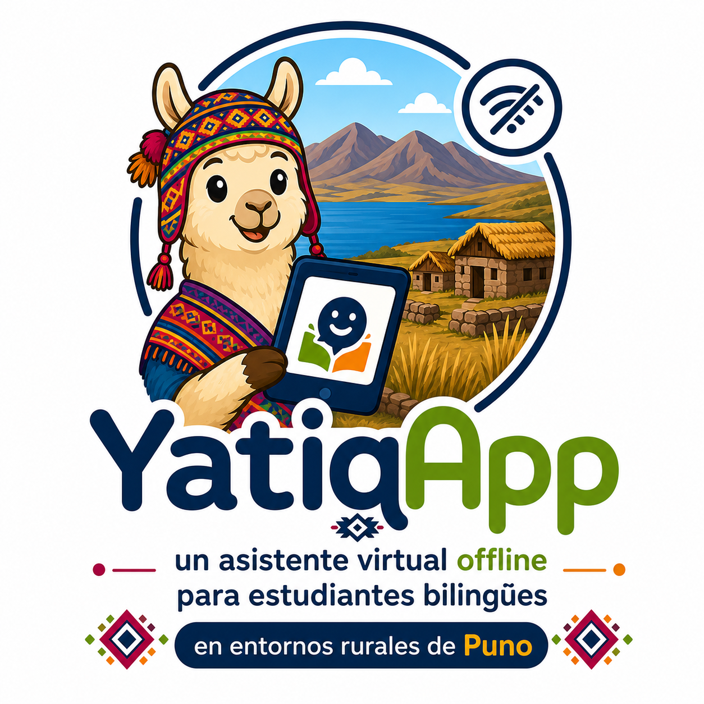

<section class="yatiq-hero">
  

    
  

  

    
Asistente virtual offline para educación rural

    <h1>YatiqApp</h1>
    

      Sistema educativo bilingüe diseñado para apoyar a estudiantes de zonas rurales de Puno,
      funcionando sin internet y con contenidos orientados a Quechua, Aymara y castellano.
    

    

      <a href="ChristianRafaelMamaniCallata/entregable1/" class="yatiq-button yatiq-button--primary">Gestión TI</a>
      <a href="BraynerAnibalMamaniCalcina/entregable1/" class="yatiq-button">Software</a>
      <a href="AnyeloJhansSarmientoLarico/entregable1/" class="yatiq-button">Infraestructura</a>
    

  

</section>

## Propuesta del Sistema

<section class="yatiq-grid yatiq-grid--features">
  <article class="yatiq-card">
    Offline
    <h3>Funciona sin internet</h3>
    
La arquitectura prioriza procesamiento local, contenidos embebidos y uso en comunidades con conectividad limitada o nula.

  </article>
  <article class="yatiq-card">
    Bilingüe
    <h3>Enfoque intercultural</h3>
    
El sistema considera estudiantes bilingües de Puno, con soporte pedagógico alineado a contextos Quechua y Aymara.

  </article>
  <article class="yatiq-card">
    Móvil
    <h3>Diseñado para celulares</h3>
    
La solución se orienta a equipos de gama baja/media, reutilizando dispositivos disponibles en familias y docentes.

  </article>
</section>

## Integrantes

<section class="yatiq-grid yatiq-grid--team">
  <article class="yatiq-member">
    CE01
    <h3>Christian Rafael Mamani Callata</h3>
    
Gestión de Tecnologías de Información

  </article>
  <article class="yatiq-member">
    CE02
    <h3>Brayner Anibal Mamani Calcina</h3>
    
Software

  </article>
  <article class="yatiq-member">
    CE03
    <h3>Anyelo Jhans Sarmiento Larico</h3>
    
Infraestructura

  </article>
</section>

## Estructura del Proyecto

| Área | Responsable | Enfoque |
| :--- | :--- | :--- |
| **CE01 - Gestión TI** | Christian Rafael Mamani Callata | Diagnóstico, caso de negocio, roadmap, procesos y solución TIC integrada. |
| **CE02 - Software** | Brayner Anibal Mamani Calcina | Requerimientos, datos, sistema funcional, calidad y evolución. |
| **CE03 - Infraestructura** | Anyelo Jhans Sarmiento Larico | Diseño de red, seguridad, centro de datos, implementación y monitoreo. |

<section class="yatiq-summary">
  <h2>Objetivo Central</h2>
  

    Presentar una solución tecnológica viable, económica y contextualizada para fortalecer el aprendizaje de estudiantes bilingües
    en entornos rurales de Puno mediante un asistente virtual offline.
  

</section>
